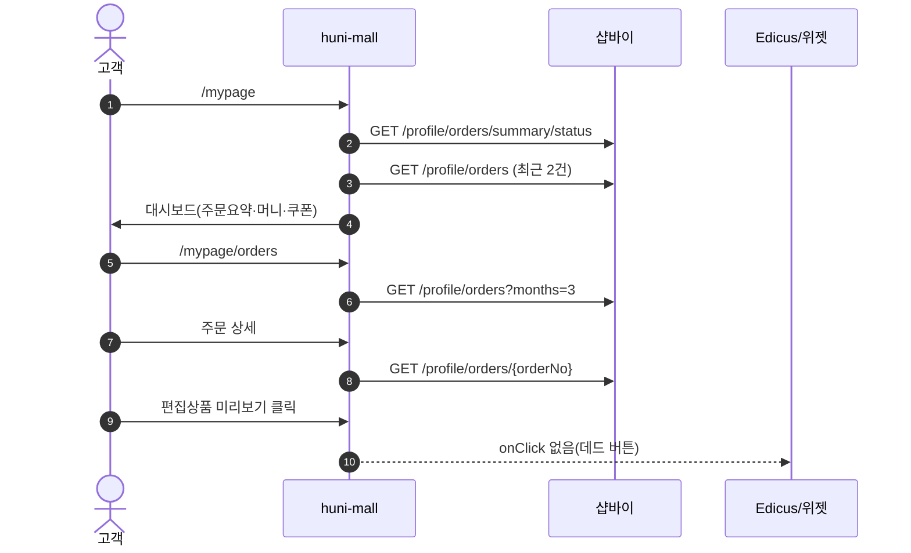
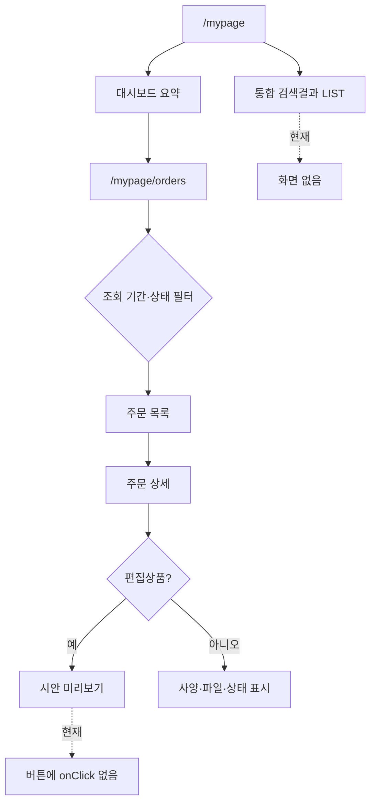

# P08 마이페이지 주문 조회·상세

> 카드 `t62` · L1 **마이페이지** · L2 **주문** · 기능 행 6개

## 1. 한줄정의 · 시작/끝 · 등장인물

**한줄정의** — 회원이 마이페이지에서 내 주문을 목록·상세로 확인하고, 편집상품이면 만든 시안을 다시 보는 흐름.

- **시작**: 로그인 후 `/mypage` 진입
- **끝**: 주문 상세(사양·파일·상태) 확인 또는 시안 미리보기

**등장인물**

- 고객
- huni-mall(`/mypage`·`/mypage/orders`)
- 샵바이(`/profile/orders`)
- 위젯/Edicus(시안)

## 2. 흐름(sequence)

## 3. 분기(flowchart) — 실패·비회원·취소 포함

## 4. 단계표

| 단계 | 시스템 | 담당자 | 원장 row_id | 상태 | 근거 |
|---|---|---|---|---|---|
| 1. 마이페이지 메인 대시보드 | huni-mall | 김동학 | `STD-MYP-017` | 부분 | L3/legacy-normalized.json#F-029,IA-029,SCOPE-029 · _workspace/huni-launch-scope/02_gap/fit-gap-matrix.csv:30 · docs/huni/후니프린팅_통합IA_일정_역할분담_260616.xlsx#02_IA마스터!A30:K30 · L2/as-is-inventory.csv#SB-044 huni-skin-shopby/src/components/mypage/dashboard-section.tsx:17-59 |
| 2. 마이페이지 서브메인(기능군 랜딩) | huni-mall | 김동학 | `STD-MYP-018` | 부분 | L3/legacy-normalized.json#F-030,IA-030,SCOPE-030 · _workspace/huni-launch-scope/02_gap/fit-gap-matrix.csv:31 · docs/huni/후니프린팅_통합IA_일정_역할분담_260616.xlsx#02_IA마스터!A31:K31 \|\| P1판정(260902): huni-skin-shopby/src/app/(main)/mypage/page.tsx:10 DashboardSection · layout.tsx (중첩 라우트 전환) |
| 3. 주문 목록 조회 | huni-mall → 샵바이 | 김동학 | `STD-MYP-001` | 부분 | huni-skin-shopby/src/lib/api/hooks/use-my-orders.ts:84 |
| 4. 주문 상세 조회(사양·파일·상태) | huni-mall → 샵바이 | 김동학 | `STD-MYP-002` | 부분 | huni-skin-shopby/src/lib/api/hooks/use-my-orders.ts:84 (목록/상세) |
| 5. 편집상품 미리보기 | huni-mall + 위젯/Edicus | 서희항+김동학 | `STD-MYP-003` ↔ t63 원고·파일(에디터·시안) | 미착수 | SB-020 stub — huni-skin-shopby/src/components/product/configurator-actions.tsx:170-176 (onClick 없음) |
| 6. 마이페이지 통합 검색결과 LIST | huni-mall | 김동학 | `STD-MYP-019` | 미착수 | L3/legacy-normalized.json#F-031,IA-031,SCOPE-031 · _workspace/huni-launch-scope/02_gap/fit-gap-matrix.csv:32 · docs/huni/후니프린팅_통합IA_일정_역할분담_260616.xlsx#02_IA마스터!A32:K32 \|\| P1판정(260902): huni-skin-shopby 전수 grep 'mypage.*search' 0건(260902) — 마이페이지 통합 검색 라우트 없음 |

## 5. 빠진 곳

| 종류 | 내용 | 제안 담당 | 선행 |
|---|---|---|---|
| **다 — 코드는 있는데 연결 안 됨** | 편집상품 미리보기 버튼이 데드 버튼이다 — `configurator-actions.tsx:170-176` 에 `onClick` 이 없다. 미리보기 산출물 자체는 Edicus/위젯 몫이라 양쪽이 끊겨 있다. | 김동학 + 서희항 | Edicus 미리보기 URL 계약 확정 |
| **나 — 행은 있는데 코드 0** | 마이페이지 통합 검색결과 LIST 화면(`STD-MYP-019`)의 코드를 찾지 못했다. | 김동학 | IA 확정 |
| **라 — 결정 미정** | 주문 상세에 "사양"(위젯 옵션 조합)을 어디서 읽어올지 — 샵바이 주문 옵션인지 webadmin 위젯 주문인지 확정되지 않았다. | 김동학·서희항 | order/register 경로 선택(t61 결정 안건) |

## 6. 채우는 방법

- 서희항: Edicus 시안 미리보기 URL(또는 썸네일) 계약을 제시한다.
- 김동학: 그 계약으로 `configurator-actions.tsx` 버튼을 배선하고, 주문 상세에 사양 블록을 붙인다.

## 7. 확인 못 한 것

- 통합 검색 대상이 주문만인지 쿠폰·문의까지인지 — IA 원본을 확인하지 못했다.
