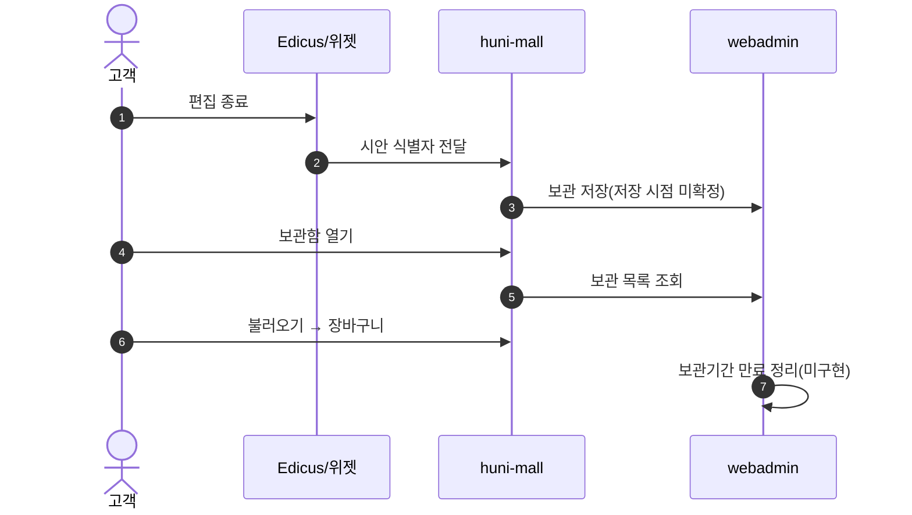
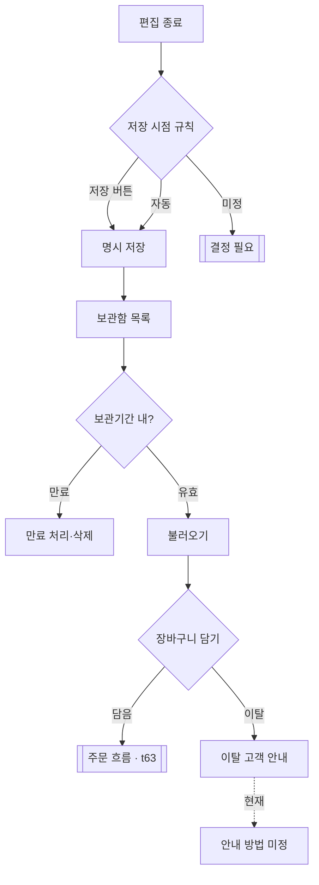

# P09 편집 디자인·옵션 보관함

> 카드 `t62` · L1 **마이페이지** · L2 **보관함** · 기능 행 6개

## 1. 한줄정의 · 시작/끝 · 등장인물

**한줄정의** — 고객이 에디터에서 만든 시안과 견적 옵션 조합을 저장해 두었다가 나중에 불러와 장바구니로 잇는 흐름.

- **시작**: 에디터 편집 종료 또는 위젯 옵션 선택 완료
- **끝**: 보관함에서 불러와 장바구니 담기 또는 보관기간 만료

**등장인물**

- 고객
- huni-mall(보관함 화면)
- 위젯/webadmin(옵션·시안 원천)
- Edicus(편집 산출물)

## 2. 흐름(sequence)

## 3. 분기(flowchart) — 실패·비회원·취소 포함

## 4. 단계표

| 단계 | 시스템 | 담당자 | 원장 row_id | 상태 | 근거 |
|---|---|---|---|---|---|
| 1. 편집 디자인 보관함(편집 종료 후 보관) | huni-mall + 위젯 | 김동학+서희항 | `STD-MYP-030` ↔ t63 원고·파일(에디터·업로드) | 부분 | 후니정기미팅 정리260915.html §디자인 상품·편집기·보관함 · 확정 7 / 후니-오픈잔여작업-실무진안내_260909.html §항목 11 · ④ 완료 기준 |
| 2. 보관함 저장 시점 결정 | 결정(신우진) | 신우진 | `STD-MYP-031` | 미착수 | 후니정기미팅 정리260915.html §디자인 상품·편집기·보관함 · 미결 2 |
| 3. 옵션보관함 저장/불러오기 | huni-mall | 김동학 | `STD-MYP-004` | 미착수 | [L4b보강] huni-skin-shopby/src/components/cart/cart-page.tsx:6 ('shopby 장바구니에는 보관함(draft) 개념이 없어 단일 목록으로 렌더') |
| 4. 보관 기간 정책 적용·만료 처리 | huni-mall/webadmin | 김동학 | `STD-MYP-005` | 미착수 | print-kb/wiki/policy/mypage.md#MYP-01 3개월 권장 · L4 사유: new — 보관 만료 정책은 화면이 아니라 배치 규칙이라 legacy 화면 분모에 수록된 적 없음. 근거 print-kb/mypage.md(ia.md 오염 아님). |
| 5. 편집 후 이탈 고객 안내 방법 | huni-mall | 김동학 | `STD-MYP-032` | 미착수 | 후니정기미팅 정리260915.html §디자인 상품·편집기·보관함 · 미결 3 |
| 6. 보관함을 일반 상품까지 확대할지 | 결정(신우진) | 신우진 | `STD-MYP-033` | 미착수 | 후니정기미팅 정리260915.html §디자인 상품·편집기·보관함 · 미결 6 |

## 5. 빠진 곳

| 종류 | 내용 | 제안 담당 | 선행 |
|---|---|---|---|
| **라 — 결정 미정** | 저장 시점(저장 버튼 vs 편집 종료 자동)·확대 범위(편집상품만 vs 일반상품)가 모두 미결이다. 두 결정이 없으면 화면을 그릴 수 없다. | 신우진 | 없음 |
| **나 — 행은 있는데 코드 0** | 보관함 저장·조회를 받을 API·테이블을 huni-mall·webadmin 어디에서도 찾지 못했다. | 김동학·서희항 | 저장 시점 결정 |
| **가 — 원장에 행 없음** | 보관기간 만료 사전 안내(만료 D-N 알림) 행이 원장에 없다. | 최숙진 | 보관 기간 정책 확정 |

## 6. 채우는 방법

- 신우진: 저장 시점·확대 범위 2건을 결정한다.
- 서희항: 보관 대상(시안 식별자·옵션 조합 JSON)의 저장 그릇을 webadmin 에 제안한다.
- 김동학: 보관함 화면과 불러오기 → 장바구니 배선을 만든다.

## 7. 확인 못 한 것

- 현재 에디터 산출물이 어디에 남는지(Edicus 계정 저장소 vs 후니 S3) 확인하지 못했다 — t63/t64 범위와 겹친다.
