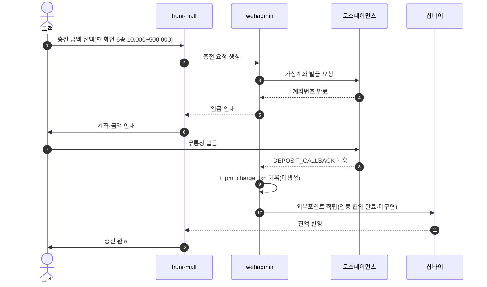
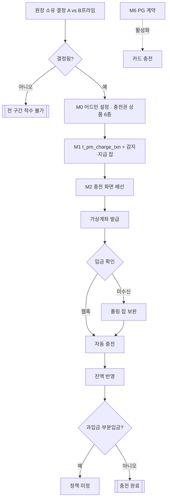

# P10 프린팅머니 충전(무통장·가상계좌)

> 카드 `t62` · L1 **마이페이지** · L2 **적립금** · 기능 행 16개

## 1. 한줄정의 · 시작/끝 · 등장인물

**한줄정의** — 고객이 프린팅머니를 충전하려고 금액을 고르고, 가상계좌에 입금하고, 자동으로 잔액이 오르기까지의 한 흐름 — 현 시점 후니 런칭의 가장 큰 미개발 덩어리.

- **시작**: 고객이 `/mypage/money` 또는 `/mypage/point/charge` 에서 충전 클릭
- **끝**: 입금 확인 → 잔액 증가 → 충전 내역 기록

**등장인물**

- 고객
- huni-mall(`/mypage/money`·`/mypage/point`)
- 샵바이(적립금·외부포인트)
- webadmin(`t_pm_charge_txn` — 미생성)
- 토스페이먼츠(가상계좌)
- 운영자

## 2. 흐름(sequence)

## 3. 분기(flowchart) — 실패·비회원·취소 포함

## 4. 단계표

| 단계 | 시스템 | 담당자 | 원장 row_id | 상태 | 근거 |
|---|---|---|---|---|---|
| 0-1. 원장 소유 결정 — A(샵바이 적립금) vs B′(후니 원장+외부포인트) | 결정(지니) | 지니 | `STD-MYP-051` | 미착수 | _workspace/huni-shopby/17_prepaid-money/prepaid-money-design-260915.md:303 |
| 0-2. 프린트머니 정책 — 소멸기한 없음·충전 1:1·추가 적립 없음 | 결정(신우진) | 신우진 | `STD-MYP-025` | 미착수 | 후니정기미팅 정리260915.html §프린팅머니 · 확정 3 |
| 0-3. 충전 단위·최소/최대 유지 여부 | 결정(지니) | 지니 | `STD-MYP-049` | 미착수 | _workspace/huni-shopby/17_prepaid-money/prepaid-money-design-260915.md:299 |
| 0-4. 충전 전용 입금계좌 분리·과입금/부분입금 정책 | 결정(지니) | 지니 | `STD-MYP-052` | 미착수 | _workspace/huni-shopby/17_prepaid-money/prepaid-money-design-260915.md:306 |
| 0-5. 개발 주체·화면 배치 확정 | 결정(신우진) | 신우진 | `STD-MYP-022` | 미착수 | 후니정기미팅 정리260915.html §개발 역할 분담 · 미결 2 |
| 0-6. 토스 가상계좌 API 연동 담당 확정 | 결정(미정) | 미정 | `STD-MYP-023` | 미착수 | 후니정기미팅 정리260915.html §개발 역할 분담 · 미결 3 |
| 1. 샵바이 외부포인트 연동 협의 | 샵바이 | 외부(샵바이(NHN커머스)) | `STD-MYP-027` | 구현-미검증 | 후니정기미팅 정리260915.html §프린팅머니 · 확정 6 |
| 2. M0 — 어드민 설정 + 충전권 상품 6종 + 실측 V1~V8 | 운영자/webadmin | 미정 | `STD-MYP-042` | 미착수 | _workspace/huni-shopby/17_prepaid-money/prepaid-money-design-260915.md:288 |
| 3. M1 — `t_pm_charge_txn` + 감지·지급 잡(폴링) | webadmin | 미정 | `STD-MYP-043` | 미착수 | _workspace/huni-shopby/17_prepaid-money/prepaid-money-design-260915.md:289 |
| 4. 충전 입금 확인 = 토스 가상계좌 직접 발급 | webadmin → 토스 | 미정 | `STD-MYP-028` | 미착수 | 후니정기미팅 정리260915.html §프린팅머니 · 확정 8 |
| 5. 입금 확인 자동화 — DEPOSIT_CALLBACK 웹훅 | webadmin | 미정 | `STD-MYP-029` | 미착수 | 후니정기미팅 정리260915.html §프린팅머니 · 확정 9(「입금 확인은 가상계좌 입금 알림으로 자동 처리」까지) · DEPOSIT_CALLBACK 명칭 출처: _workspace/huni-shopby/17_prepaid-money/prepaid-money-design-260915.md:316 |
| 6. M2 — 충전 화면 배선(useChargePoint → 충전권 주문서) | huni-mall | 미정 | `STD-MYP-044` | 미착수 | _workspace/huni-shopby/17_prepaid-money/prepaid-money-design-260915.md:290 |
| 7. 프린팅머니 충전(PG 결제→적립 전환) | huni-mall | 김동학 | `STD-MYP-007` ↔ t63 결제(PG·결제수단) | 부분 | SB-051 stub — huni-skin-shopby/src/components/mypage/point-section.tsx:11-14 → src/lib/legacy-data/hooks.ts:423-432 (no-op) |
| 8. 프린팅머니 잔액·내역 조회 | huni-mall → 샵바이 | 김동학 | `STD-MYP-006` | 부분 | huni-skin-shopby/src/lib/api/hooks/use-points.ts:22 |
| 9. M6 — PG 계약 후 카드 충전 활성 | huni-mall | 미정 | `STD-MYP-048` | 미착수 | _workspace/huni-shopby/17_prepaid-money/prepaid-money-design-260915.md:294 |
| 10. 테스트몰 실측 12항 | webadmin/huni-mall | 미정 | `STD-MYP-053` | 미착수 | _workspace/huni-shopby/HANDOFF.md:16 |

## 5. 빠진 곳

| 종류 | 내용 | 제안 담당 | 선행 |
|---|---|---|---|
| **라 — 결정 미정** | 원장 소유(A vs B′)가 미결이다 — 이 하나가 M0~M6 전부의 선행이다. 결정 전에는 어느 시스템에 그릇을 만들지조차 정할 수 없다. | 지니 | 없음 |
| **라 — 결정 미정** | 토스 가상계좌 연동 담당이 `미정`, M0~M6 6개 마일스톤의 담당도 모두 `미정` 이다. | 신우진 | 원장 소유 결정 |
| **다 — 코드는 있는데 연결 안 됨** | 충전 화면은 있으나 `useChargePoint` 가 `null` 을 반환하는 no-op mock 이다 — `legacy-data/hooks.ts:423-431`. 화면만 있고 아무 일도 일어나지 않는다. | 김동학 | M1 원장 생성 |
| **다 — 코드는 있는데 연결 안 됨** | `/mypage/money` 는 "UI 전용(정적)"이고 잔액이 상수 `0` 이다 — `money-section.tsx:8,52`. 같은 몰 안에 `/mypage/point`(샵바이 적립금 실연동)와 둘로 갈려 있다. | 김동학 | `STD-MYP-054` 메뉴 중복 정리 |
| **나 — 행은 있는데 코드 0** | `t_pm_charge_txn` 이 webadmin 저장소 전체에서 0건이다 — 원장 그릇 자체가 없다. | 서희항 | 원장 소유 결정 |
| **라 — 결정 미정** | 과입금·부분입금·충전 전용 계좌 분리 정책이 미결이라 웹훅 처리 분기를 확정할 수 없다. | 지니·최숙진 | 없음 |

## 6. 채우는 방법

- 지니: 원장 소유 A/B′, 충전 단위, 계좌 분리·과입금 정책 3건을 결정한다(`STD-MYP-051`·`049`·`052`).
- 신우진: 결정 직후 M0~M6 담당과 토스 연동 담당을 배정한다.
- 서희항: B′ 확정 시 `t_pm_charge_txn` DDL + 감지·지급 잡(폴링)과 웹훅 수신 엔드포인트를 webadmin 에 만든다.
- 김동학: `useChargePoint` mock 을 실제 충전권 주문서 호출로 교체하고, `/mypage/money` 잔액을 원장 조회로 잇는다.
- 최숙진: 테스트몰에서 실측 12항(전액결제 payType 조합·externalKey 유일성·웹훅 페이로드 등)을 돌려 전제를 확정한다.

## 7. 확인 못 한 것

- 샵바이 외부포인트 연동이 "협의 완료"로 판정돼 있으나(`STD-MYP-027` 구현-미검증) 실제 계약·키 발급 상태를 확인하지 못했다.
- 토스페이먼츠 가상계좌 계약이 체결돼 있는지 확인하지 못했다.
