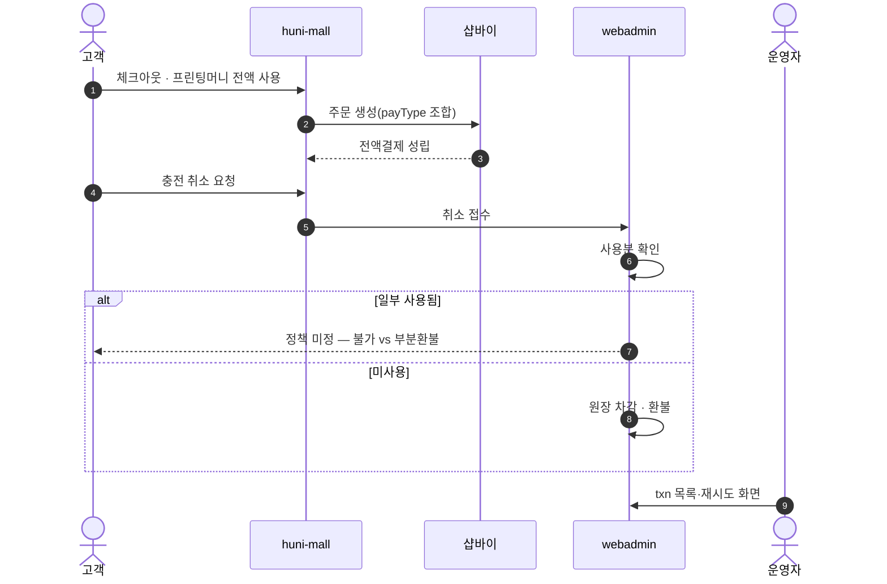
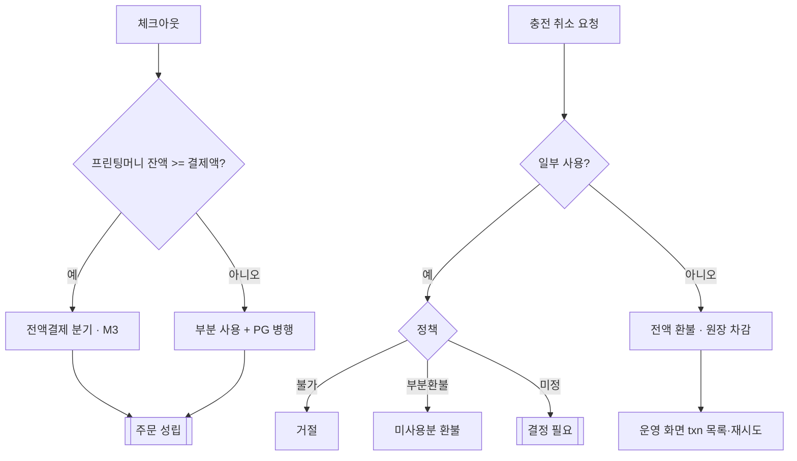

# P11 프린팅머니 사용·충전 취소·환불

> 카드 `t62` · L1 **마이페이지** · L2 **적립금** · 기능 행 3개

## 1. 한줄정의 · 시작/끝 · 등장인물

**한줄정의** — 충전해 둔 프린팅머니로 주문을 전액 결제하고, 필요하면 충전을 취소하거나 환불받는 흐름.

- **시작**: 체크아웃에서 프린팅머니 선택 또는 충전 취소 요청
- **끝**: 전액결제 성립 또는 환불·원장 차감

**등장인물**

- 고객
- huni-mall(체크아웃)
- 샵바이(주문·결제)
- webadmin(원장·운영 화면)
- 운영자

## 2. 흐름(sequence)

## 3. 분기(flowchart) — 실패·비회원·취소 포함

## 4. 단계표

| 단계 | 시스템 | 담당자 | 원장 row_id | 상태 | 근거 |
|---|---|---|---|---|---|
| 1. M3 — 체크아웃 전액결제 분기 | huni-mall | 미정 | `STD-MYP-045` ↔ t63 결제 · t65 클레임(환불) | 미착수 | _workspace/huni-shopby/17_prepaid-money/prepaid-money-design-260915.md:291 |
| 2. M4 — 충전 취소/환불 처리 + 운영 화면(txn 목록·재시도) | webadmin | 미정 | `STD-MYP-046` | 미착수 | _workspace/huni-shopby/17_prepaid-money/prepaid-money-design-260915.md:292 |
| 3. 일부 사용 후 충전 취소 정책 결정 | 결정(지니) | 지니 | `STD-MYP-050` | 미착수 | _workspace/huni-shopby/17_prepaid-money/prepaid-money-design-260915.md:300 |

## 5. 빠진 곳

| 종류 | 내용 | 제안 담당 | 선행 |
|---|---|---|---|
| **라 — 결정 미정** | 일부 사용 후 취소 정책(불가 vs 미사용분 부분 환불)이 미결이다 — M4 구현 분기를 정할 수 없다. | 지니 | P10 원장 소유 결정 |
| **나 — 행은 있는데 코드 0** | 전액결제 분기(M3)·취소/환불(M4) 모두 담당이 `미정` 이고 코드를 찾지 못했다. | 신우진 | P10 M1·M2 완료 |

## 6. 채우는 방법

- 지니: 취소 정책을 결정한다.
- 김동학: 체크아웃에 프린팅머니 전액결제 분기를 넣는다(실측 12항의 payType 조합 결과 반영).
- 서희항: webadmin 에 충전 txn 목록·재시도·환불 운영 화면을 만든다.

## 7. 확인 못 한 것

- 샵바이가 적립금 전액결제(결제수단 0원 주문)를 허용하는지 — 실측 12항의 항목이며 아직 측정되지 않았다.
