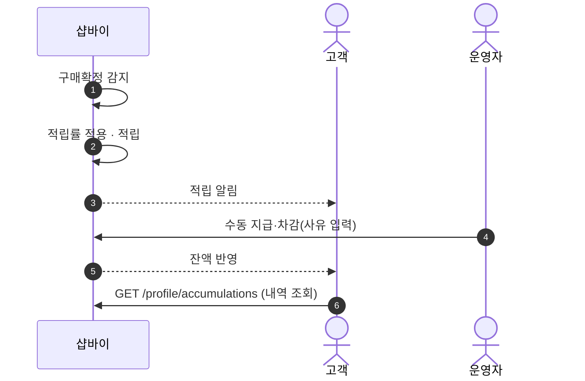
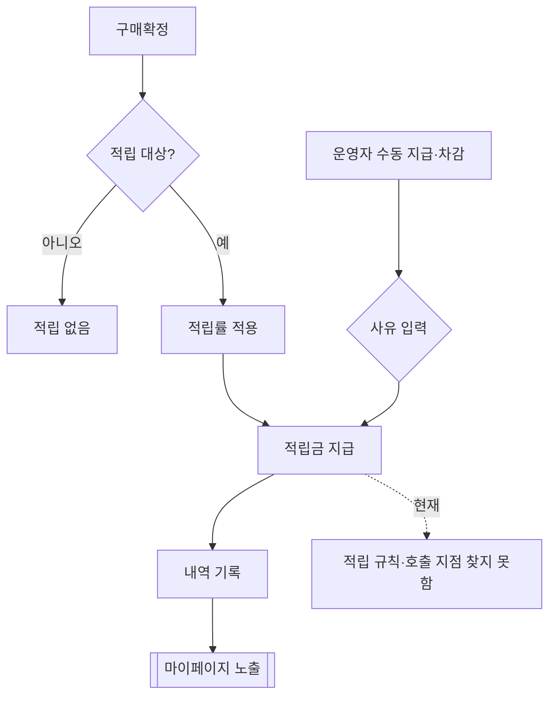

# P12 적립금 적립·운영자 수동 지급

> 카드 `t62` · L1 **마이페이지** · L2 **적립금** · 기능 행 2개

## 1. 한줄정의 · 시작/끝 · 등장인물

**한줄정의** — 주문이 구매확정되면 적립금이 자동으로 붙고, 필요할 때 운영자가 직접 지급·차감하는 흐름.

- **시작**: 구매확정 또는 운영자 지급 요청
- **끝**: 적립금 잔액 반영·내역 기록

**등장인물**

- 고객
- 샵바이(`/accumulations`)
- 운영자(셀러어드민·webadmin)

## 2. 흐름(sequence)

## 3. 분기(flowchart) — 실패·비회원·취소 포함

## 4. 단계표

| 단계 | 시스템 | 담당자 | 원장 row_id | 상태 | 근거 |
|---|---|---|---|---|---|
| 1. 구매확정 적립금 자동 지급 | 샵바이 | 최숙진 | `STD-MYP-008` ↔ t63 장바구니·주문(구매확정) | 미착수 | SB-030 partial — huni-skin-shopby/src/components/checkout/checkout-form.tsx:52 (조회는 실API·적립/충전은 mock) |
| 2. 프린팅머니 수동 지급·차감 | 운영자(셀러어드민/webadmin) | 서희항 | `STD-ADC-004` | 미착수 | print-quote/04_design/ia.md §2.3 SM-A-42 · L4 사유: 프린팅머니가 샵바이 적립금 재해석인지 별도 원장인지 미결(X-DEC-PRINTMONEY). 고객측 충전도 no-op(SB-051 stub) |

## 5. 빠진 곳

| 종류 | 내용 | 제안 담당 | 선행 |
|---|---|---|---|
| **나 — 행은 있는데 코드 0** | 구매확정 적립 규칙(적립률·대상)이 셀러어드민 설정인지 별도 잡인지 확인하지 못했다 — 호출 지점을 찾지 못했다. | 최숙진 | 적립 정책 확정 |
| **라 — 결정 미정** | 수동 지급·차감을 셀러어드민(샵바이 적립금)에서 할지 webadmin(후니 원장)에서 할지는 P10 의 원장 소유 결정에 딸려 있다. | 지니 | `STD-MYP-051` |

## 6. 채우는 방법

- 최숙진: 셀러어드민 적립금 설정 화면에서 적립률·대상 설정을 캡처해 확정한다.
- 서희항: B′ 확정 시 webadmin 에 수동 지급·차감 화면을 만든다.

## 7. 확인 못 한 것

- 적립금과 프린팅머니가 같은 잔액인지 다른 잔액인지 — `STD-MYP-054` 가 열려 있어 현재 두 개다.
