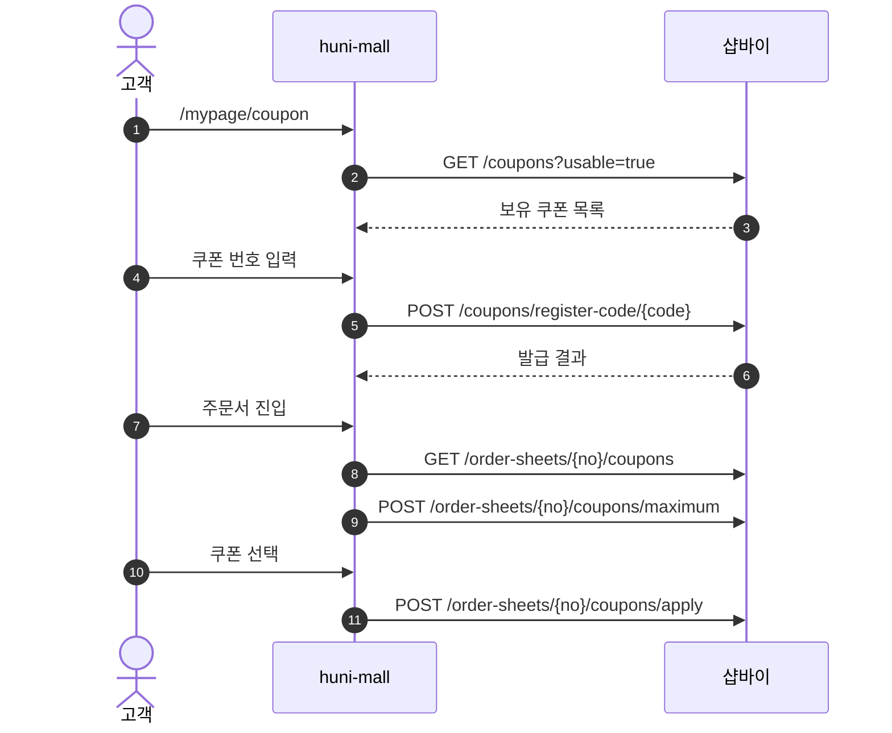
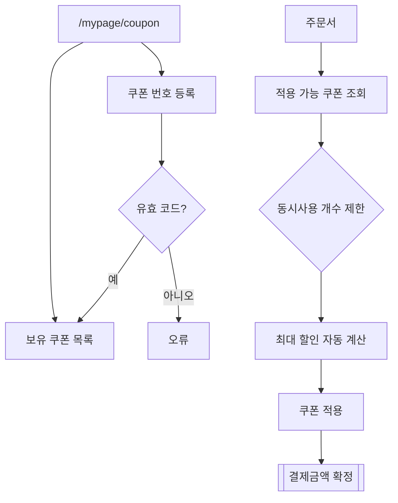

# P13 쿠폰 보유·등록·주문 적용(고객)

> 카드 `t62` · L1 **마이페이지** · L2 **쿠폰** · 기능 행 3개

## 1. 한줄정의 · 시작/끝 · 등장인물

**한줄정의** — 고객이 받은 쿠폰을 확인하고, 쿠폰 번호를 직접 등록하고, 주문서에서 적용해 할인을 받는 흐름.

- **시작**: `/mypage/coupon` 진입 또는 주문서 진입
- **끝**: 쿠폰 적용된 결제금액 확정

**등장인물**

- 고객
- huni-mall(`/mypage/coupon`)
- 샵바이(`/coupons`·`/order-sheets/{no}/coupons`)

## 2. 흐름(sequence)

## 3. 분기(flowchart) — 실패·비회원·취소 포함

## 4. 단계표

| 단계 | 시스템 | 담당자 | 원장 row_id | 상태 | 근거 |
|---|---|---|---|---|---|
| 1. 보유 쿠폰 목록 | huni-mall → 샵바이 | 김동학 | `STD-MYP-010` | 부분 | huni-skin-shopby/src/lib/api/hooks/use-coupons.ts:71 |
| 2. 쿠폰 번호 등록 | huni-mall → 샵바이 | 김동학 | `STD-MYP-011` | 부분 | huni-skin-shopby/src/lib/api/hooks/use-coupons.ts:71 |
| 3. 장바구니/주문서 쿠폰 적용 | huni-mall → 샵바이 | 김동학 | `STD-PRM-007` ↔ t63 장바구니·주문 · 결제 | 부분 | huni-skin-shopby/src/lib/api/hooks/use-order-coupons.ts:34 |

## 5. 빠진 곳

| 종류 | 내용 | 제안 담당 | 선행 |
|---|---|---|---|
| **다 — 코드는 있는데 연결 안 됨** | 쿠폰 적용은 주문서 화면에 붙어 있으나, 적용 결과가 위젯 계산가(webadmin `price-calc`)와 어떻게 합쳐지는지 확인하지 못했다 — 인쇄 상품은 가격이 샵바이 `salePrice` 가 아니다. | 김동학·서희항 | order/register 경로 선택 |

## 6. 채우는 방법

- 김동학: 위젯 계산가 주문에 쿠폰이 적용될 때의 기준 금액을 서희항과 합의해 명시한다.

## 7. 확인 못 한 것

- 쿠폰 적용 대상 금액이 상품가인지 총 결제액인지 — 인쇄 상품 특수성 때문에 t63 과 함께 봐야 확정된다.
