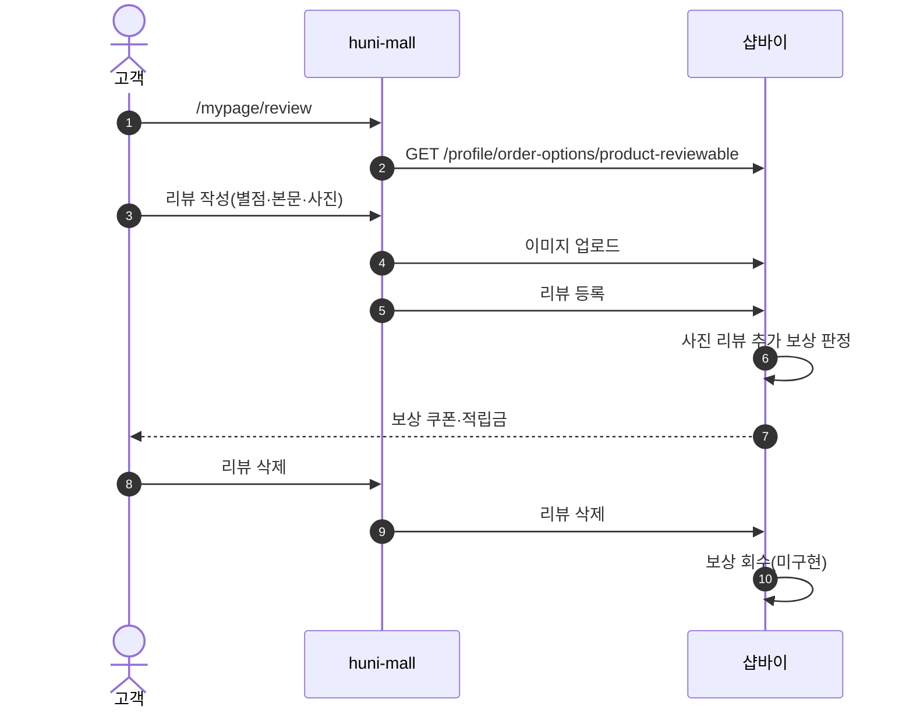
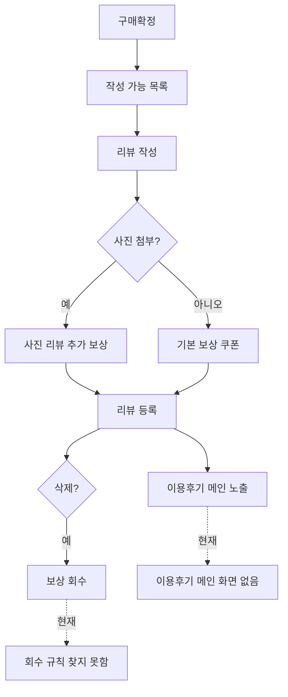

# P14 리뷰 작성·보상

> 카드 `t62` · L1 **마이페이지** · L2 **리뷰** · 기능 행 5개

## 1. 한줄정의 · 시작/끝 · 등장인물

**한줄정의** — 고객이 받은 상품에 리뷰를 쓰고 사진을 올리면 보상 쿠폰·적립금이 붙고, 리뷰를 지우면 보상이 회수되는 흐름.

- **시작**: 구매확정 후 "리뷰 쓰기"
- **끝**: 리뷰 등록 + 보상 지급(또는 삭제 시 회수)

**등장인물**

- 고객
- huni-mall(`/mypage/review`)
- 샵바이(`/profile/product-reviews`·`/reviews`)
- 운영자(블라인드 — P28)

## 2. 흐름(sequence)

## 3. 분기(flowchart) — 실패·비회원·취소 포함

## 4. 단계표

| 단계 | 시스템 | 담당자 | 원장 row_id | 상태 | 근거 |
|---|---|---|---|---|---|
| 1. 내 리뷰 작성·조회 | huni-mall → 샵바이 | 김동학 | `STD-MYP-012` | 부분 | huni-skin-shopby/src/lib/api/hooks/use-review-write.ts:38 · use-my-reviews.ts:84 |
| 2. 사진 리뷰 추가 보상 | 샵바이 | 최숙진 | `STD-PRM-009` ↔ P28 이용후기 관리·블라인드 | 작동 | https://service.shopby.co.kr/accumulation/setting@2026-09-16 21:33 |
| 3. 리뷰 작성 보상 쿠폰 발행 | 샵바이 | 최숙진 | `STD-PRM-002` | 미착수 | print-kb/wiki/policy/coupon.md#CPN-02 · L4 사유: new — 리뷰 보상 쿠폰은 legacy 3원 어디에도 없음. 근거 print-kb/coupon.md#CPN-02(ia.md 오염 아님). |
| 4. 리뷰 삭제 시 보상 회수 | 샵바이 | 최숙진 | `STD-PRM-008` | 미착수 | print-kb/wiki/policy/review.md#RVW-03 · L4 사유: new — 리뷰 삭제 시 보상 회수 규칙 미수록. 근거 print-kb/review.md#RVW-03(오염 아님). |
| 5. 이용후기 메인(전체 리뷰 모아보기) | huni-mall | 김동학 | `STD-PRM-016` | 미착수 | https://shopby.huniprinting.co.kr/ @ 2026-09-16 21:26 |

## 5. 빠진 곳

| 종류 | 내용 | 제안 담당 | 선행 |
|---|---|---|---|
| **라 — 결정 미정** | headless 전제 충돌 — `STD-PRM-009`(사진 리뷰 보상)는 "샵바이 몰에서 쓴다"를 전제로 `작동` 판정인데, 리뷰 작성 화면은 huni-mall 몫(`STD-MYP-012`)이다. API 로 등록한 리뷰에 보상이 붙는지 확인되지 않았다. | 최숙진(샵바이 회신 확인) | 없음 |
| **나 — 행은 있는데 코드 0** | 리뷰 삭제 시 보상 회수(`STD-PRM-008`) 규칙·호출 지점을 찾지 못했다. | 최숙진 | 보상 정책 확정 |
| **나 — 행은 있는데 코드 0** | 이용후기 메인(`STD-PRM-016`) 화면의 코드를 찾지 못했다. | 김동학 | IA 확정 |

## 6. 채우는 방법

- 최숙진: 샵바이에 "shop API 로 등록한 리뷰에 사진리뷰 보상이 붙는가"를 문의하고 회신을 원장에 남긴다.
- 김동학: 이용후기 메인 화면을 만들고 `/reviews` 목록에 잇는다.

## 7. 확인 못 한 것

- 보상 지급 시점(등록 즉시 vs 운영자 승인 후)이 셀러어드민 설정에 있는지 확인하지 못했다.
