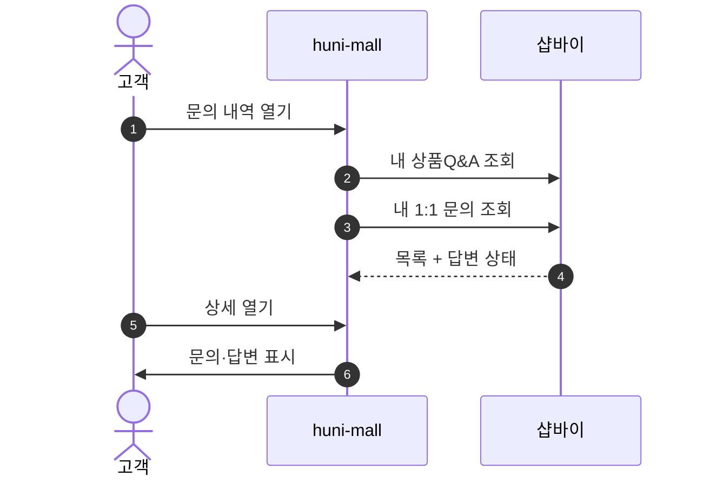
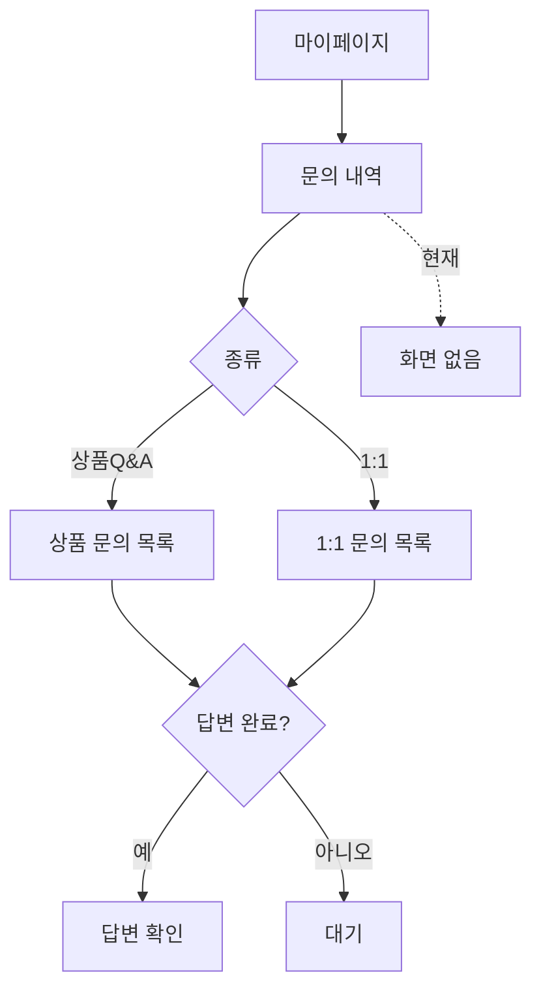

# P15 내 문의 조회(상품Q&A·1:1)

> 카드 `t62` · L1 **마이페이지** · L2 **문의** · 기능 행 1개

## 1. 한줄정의 · 시작/끝 · 등장인물

**한줄정의** — 고객이 남긴 상품 문의와 1:1 문의, 그리고 그 답변을 한 곳에서 확인하는 흐름.

- **시작**: `/mypage` → 문의 내역
- **끝**: 문의·답변 확인

**등장인물**

- 고객
- huni-mall(마이페이지)
- 샵바이(`/inquiry`·manage `/inquiries`)
- 운영자(답변 — P28)

## 2. 흐름(sequence)

## 3. 분기(flowchart) — 실패·비회원·취소 포함

## 4. 단계표

| 단계 | 시스템 | 담당자 | 원장 row_id | 상태 | 근거 |
|---|---|---|---|---|---|
| 1. 내 상품Q&A / 1:1문의 조회 | huni-mall → 샵바이 | 김동학 | `STD-MYP-013` ↔ P28 게시판·문의 응대 운영 | 미착수 | SB-056 absent — huni-skin-shopby/src/app/(main) 하위 inquiry/qna 라우트 부재 |

## 5. 빠진 곳

| 종류 | 내용 | 제안 담당 | 선행 |
|---|---|---|---|
| **나 — 행은 있는데 코드 0** | 화면·호출을 찾지 못했다. 샵바이에는 display `/inquiry`(상품문의)와 manage `/inquiries`(1:1)가 따로 있어 두 원천을 합쳐야 한다. | 김동학 | 문의 유형 체계 확정(P28) |
| **가 — 원장에 행 없음** | 문의 답변 등록 시 고객 알림(메일·알림톡) 발송이 원장에 행으로 없다. | 최숙진 | 알림 채널 확정(P22) |

## 6. 채우는 방법

- 김동학: 두 원천을 합친 "내 문의" 화면을 만든다.
- 최숙진: 답변 알림 채널을 정해 gaps 제안을 원장 행으로 올린다.

## 7. 확인 못 한 것

- 1:1 문의 유형(inquiry types)이 셀러어드민에 어떻게 설정돼 있는지 확인하지 못했다.
