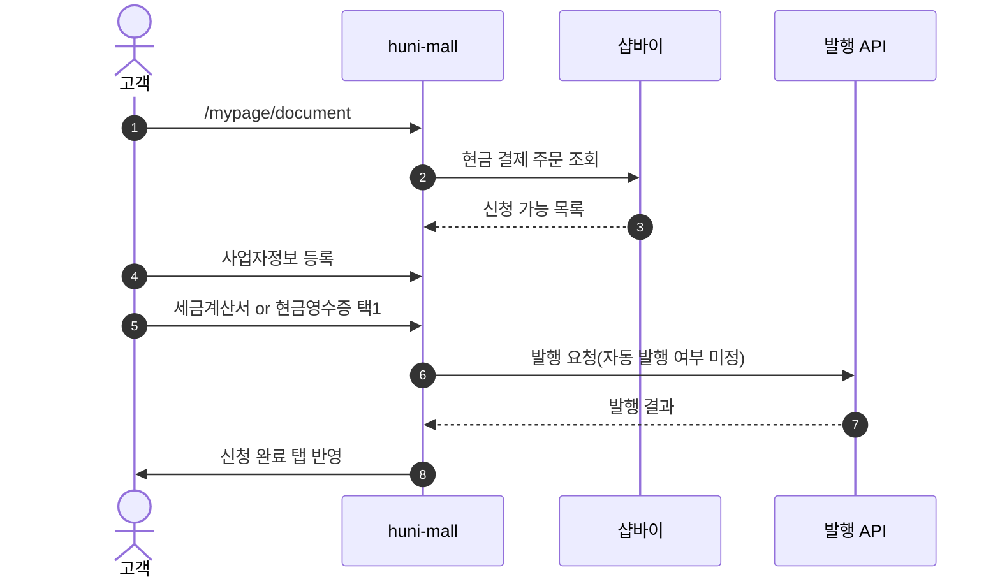
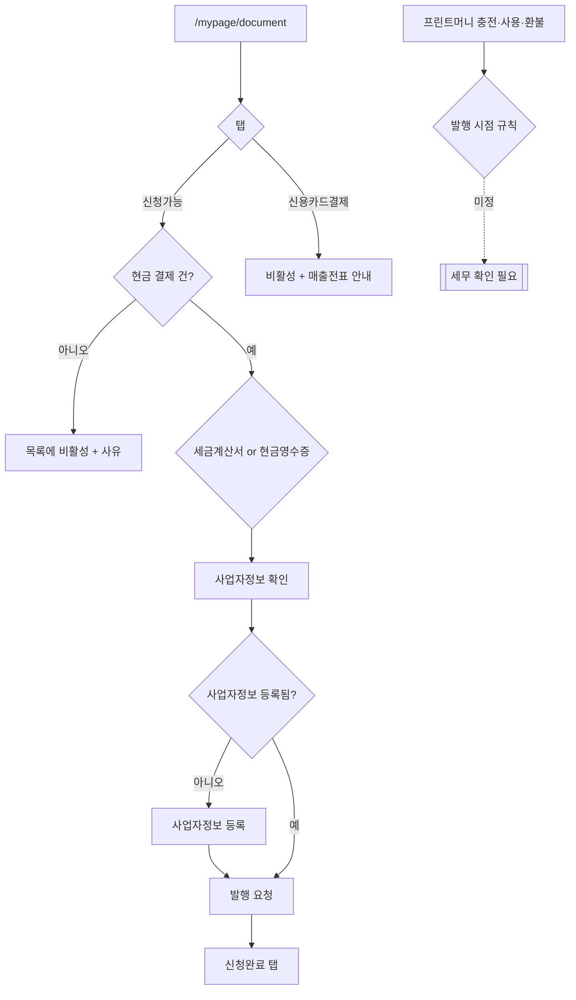

# P16 증빙서류 발급(세금계산서·현금영수증)

> 카드 `t62` · L1 **마이페이지** · L2 **증빙** · 기능 행 11개

## 1. 한줄정의 · 시작/끝 · 등장인물

**한줄정의** — 고객이 현금으로 결제한 건에 대해 세금계산서나 현금영수증 중 하나를 신청하고 발급받는 흐름 — 프린팅머니 충전·사용분의 발행 시점이 아직 정해지지 않았다.

- **시작**: `/mypage/document` 진입
- **끝**: 증빙 발행 완료·발급내역 기록

**등장인물**

- 고객
- huni-mall(`/mypage/document`)
- 샵바이(주문·결제 원천)
- 운영자
- 세무(외부 발행 API)

## 2. 흐름(sequence)

## 3. 분기(flowchart) — 실패·비회원·취소 포함

## 4. 단계표

| 단계 | 시스템 | 담당자 | 원장 row_id | 상태 | 근거 |
|---|---|---|---|---|---|
| 1. 증빙 신청 탭 3개(신청가능/신청완료/신용카드결제) | huni-mall | 김동학 | `STD-MYP-034` | 미착수 | 후니정기미팅 정리260915.html §증빙서류 · 확정 3 |
| 2. 현금 결제 건만 신청 대상 — 세금계산서·현금영수증 택1 | huni-mall | 김동학 | `STD-MYP-035` | 미착수 | 후니정기미팅 정리260915.html §증빙서류 · 확정 4 |
| 3. 카드 결제·발행 완료 건은 비활성 + 사유 표시 | huni-mall | 김동학 | `STD-MYP-036` | 미착수 | 후니정기미팅 정리260915.html §증빙서류 · 확정 5 |
| 4. 사업자정보 목록 | huni-mall | 김동학 | `STD-MYP-020` | 미착수 | https://www.huniprinting.com/mypage/tax01.asp @ 2026-09-16 21:33 |
| 5. 사업자정보 등록(쓰기) | huni-mall | 김동학 | `STD-MYP-021` | 미착수 | https://www.huniprinting.com/mypage/tax01.asp @ 2026-09-16 21:33 |
| 6. 현금영수증 정보 관리 | huni-mall → 샵바이 | 김동학 | `STD-MYP-015` | 미착수 | SB-053 stub — document-section.tsx:1-6 · D-18 호출 지점 없음 |
| 7. 증빙서류 발급내역 조회 | huni-mall | 김동학 | `STD-MYP-014` | 미착수 | SB-053 stub — huni-skin-shopby/src/components/mypage/document-section.tsx:1-6 (정적 표 UI·API 호출 0) · D-18 endpoint='(호출 지점 없음)' |
| 8. 프린트머니 증빙 발행 규칙(충전액·실결제액·마이너스 계산서) | 결정+구현 | 김동학 | `STD-MYP-037` | 미착수 | 후니정기미팅 정리260915.html §증빙서류 · 확정 7 |
| 9. 프린트머니 증빙 발행 시점 세무 확인(충전 시 vs 사용 시) | 결정(미정) | 미정 | `STD-MYP-038` | 미착수 | 후니정기미팅 정리260915.html §증빙서류 · 미결 1 |
| 10. 세금계산서 API 자동 발행 여부 결정 | 결정(최숙진·신우진) | 최숙진+신우진 | `STD-MYP-039` | 미착수 | 후니정기미팅 정리260915.html §증빙서류 · 미결 2 |
| 11. 세금계산서 일괄 발행(B2B) | 운영자 — P26 과 공유 | 미정 | `STD-B2B-012` ↔ P26 B2B 정산·거래처 원장 | 미착수 | SB-053 stub — document-section.tsx:1-6 · D-18 endpoint='(호출 지점 없음)' |

## 5. 빠진 곳

| 종류 | 내용 | 제안 담당 | 선행 |
|---|---|---|---|
| **다 — 코드는 있는데 연결 안 됨** | `/mypage/document` 는 구 화면(`fe_source mypage.jsx`)을 1:1 로 옮긴 정적 화면이다 — 탭·표·안내문만 있고 데이터 호출이 없다(`document-section.tsx`). | 김동학 | 발행 방식 결정(`STD-MYP-039`) |
| **라 — 결정 미정** | 프린트머니 증빙 발행 시점(충전 시 vs 사용 시)이 세무 확인 전이라 미정이고 담당도 `미정` 이다. | 신우진 | P10 원장 소유 결정 |
| **라 — 결정 미정** | 세금계산서 API 자동 발행 여부가 미결이다 — 수동이면 운영 화면이, 자동이면 외부 API 계약이 필요하다. | 최숙진·신우진 | 세무 확인 |
| **나 — 행은 있는데 코드 0** | 사업자정보 등록·목록(`STD-MYP-020`·`021`)의 저장처를 찾지 못했다 — 샵바이 `/companies/business-exist` 는 존재 확인용이라 저장 그릇이 아니다. | 김동학 | 발행 방식 결정 |

## 6. 채우는 방법

- 최숙진: 세무 담당에게 프린트머니 충전·사용의 증빙 발행 시점을 확인받는다.
- 신우진: 자동 발행 API 도입 여부를 결정하고 담당을 배정한다.
- 김동학: 결정 후 `/mypage/document` 를 실데이터에 잇고 사업자정보 저장 그릇을 정한다.

## 7. 확인 못 한 것

- 현재 현금영수증이 PG(토스) 발행인지 몰 자체 발행인지 확인하지 못했다.
- 발행 완료 이력을 어디에 남기는지 확인하지 못했다.
