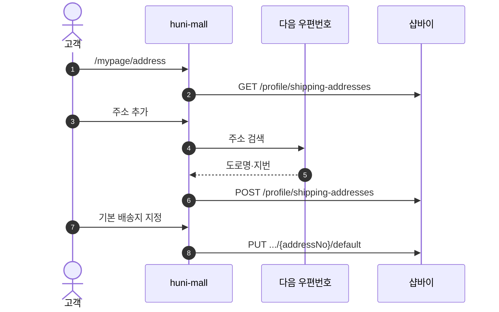
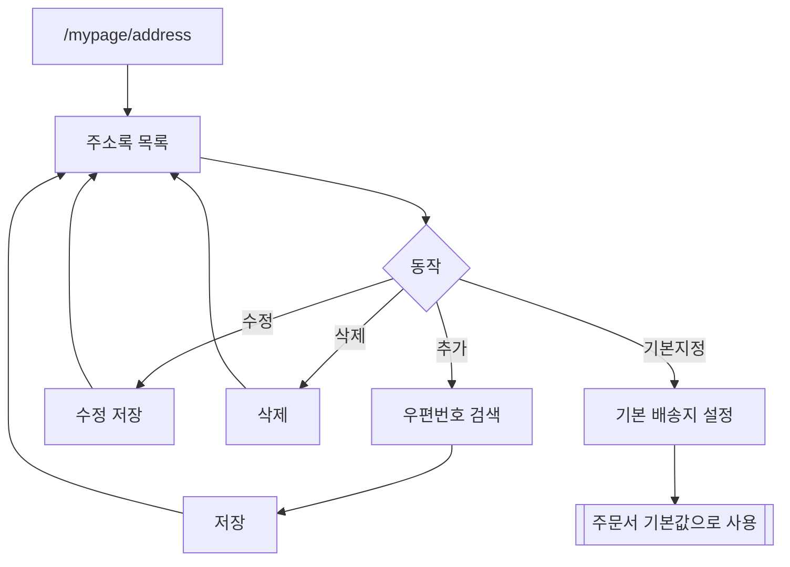

# P17 배송지 주소록 관리

> 카드 `t62` · L1 **마이페이지** · L2 **배송지** · 기능 행 1개

## 1. 한줄정의 · 시작/끝 · 등장인물

**한줄정의** — 고객이 자주 쓰는 배송지를 저장·수정·삭제하고 기본 배송지를 정하는 흐름.

- **시작**: `/mypage/address` 진입 또는 주문서에서 주소록 열기
- **끝**: 주소록 갱신·기본 배송지 설정

**등장인물**

- 고객
- huni-mall(`/mypage/address`)
- 샵바이(`/profile/shipping-addresses`)
- 다음 우편번호 서비스

## 2. 흐름(sequence)

## 3. 분기(flowchart) — 실패·비회원·취소 포함

## 4. 단계표

| 단계 | 시스템 | 담당자 | 원장 row_id | 상태 | 근거 |
|---|---|---|---|---|---|
| 1. 배송지 주소록 관리 | huni-mall → 샵바이 | 김동학 | `STD-MYP-016` ↔ t63 배송(주문서 배송지 선택) | 부분 | SB-048 done — huni-skin-shopby/src/lib/api/hooks/use-shipping-address.ts:65-125 · SB-028 src/components/checkout/address-modal.tsx:1 |

## 5. 빠진 곳

| 종류 | 내용 | 제안 담당 | 선행 |
|---|---|---|---|
| **라 — 결정 미정** | 주소록 최대 저장 개수·"최근 배송지" 노출 규칙이 정해져 있지 않다. | 최숙진 | 없음 |

## 6. 채우는 방법

- 김동학: 저장 개수 상한과 최근 배송지 노출 규칙을 확정해 반영한다.

## 7. 확인 못 한 것

- 해외 배송지를 받는지 — 주문·배송은 t63 범위라 확인하지 않았다.
