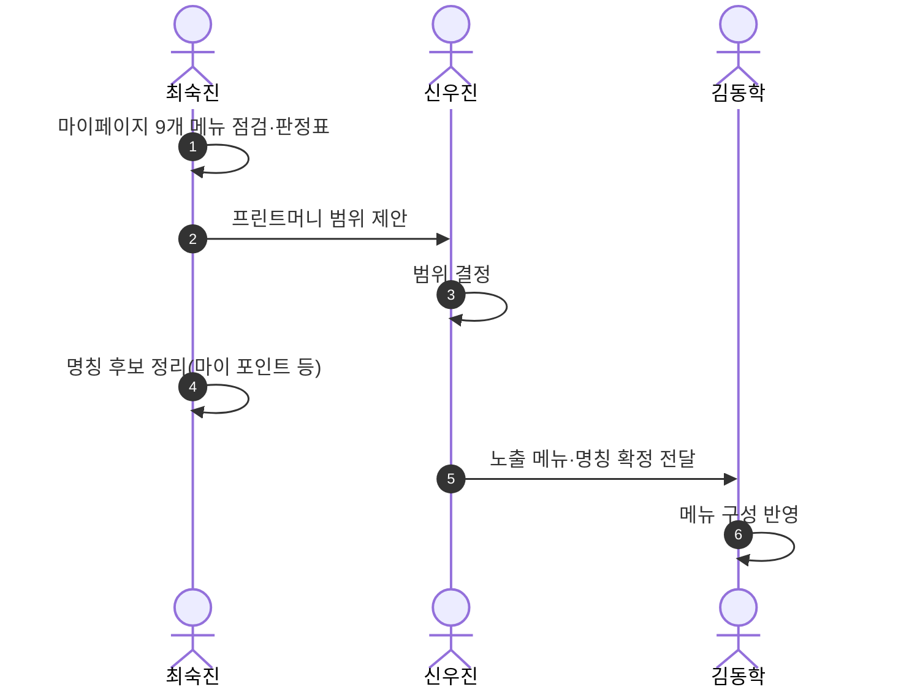
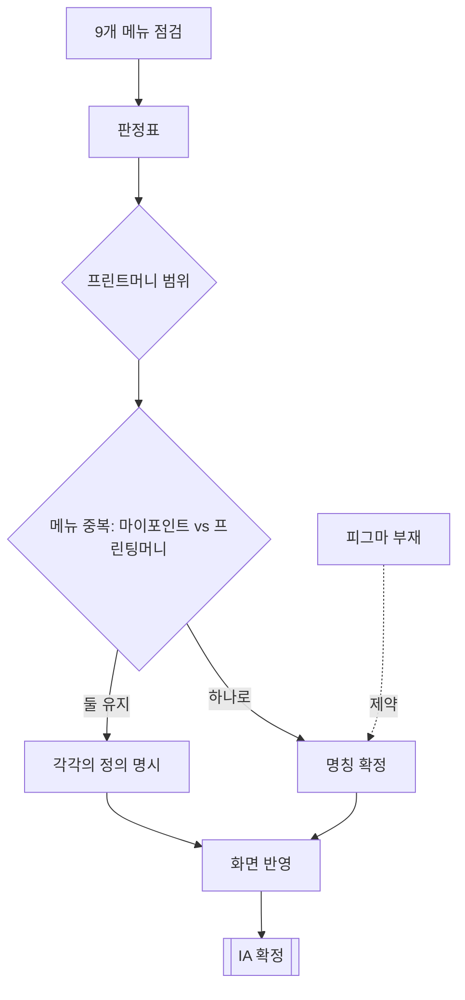

# P18 마이페이지 정보구조 정비

> 카드 `t62` · L1 **마이페이지** · L2 **IA·정책** · 기능 행 3개

## 1. 한줄정의 · 시작/끝 · 등장인물

**한줄정의** — 마이페이지 메뉴가 무엇으로 구성되고, 적립금이 "마이포인트"인지 "프린팅머니"인지 하나로 정리하는 흐름 — 화면을 그리기 전에 끝나야 하는 일.

- **시작**: 마이페이지 9개 메뉴 점검
- **끝**: 노출 메뉴·명칭·범위 확정

**등장인물**

- 운영자(최숙진)
- PM(신우진)
- huni-mall(김동학)
- 지니

## 2. 흐름(sequence)

## 3. 분기(flowchart) — 실패·비회원·취소 포함

## 4. 단계표

| 단계 | 시스템 | 담당자 | 원장 row_id | 상태 | 근거 |
|---|---|---|---|---|---|
| 1. 마이페이지 9개 메뉴 점검·판정표 + 프린트머니 범위 결정 | 운영자·PM | 최숙진+신우진 | `STD-MYP-040` | 부분 | 후니정기미팅 정리260915.html §일정·설계 · 미결 3 / 후니-오픈잔여작업-실무진안내_260909.html §항목 4 · ④ 완료 기준 |
| 2. 프린트머니 화면 피그마 부재·명칭 미정 | 운영자(최숙진) | 최숙진 | `STD-MYP-041` | 미착수 | 후니정기미팅 정리260915.html §일정·설계 · 미결 4 |
| 3. 마이포인트(/mypage/point)와 프린팅머니(/mypage/money) 메뉴 중복 정리 | huni-mall + 정책 | 김동학 | `STD-MYP-054` ↔ P10 프린팅머니 충전 | 미착수 | huni-skin-shopby/src/components/mypage/mypage-shared.tsx:14-15 NAV 두 항목 · commit 2092b12 |

## 5. 빠진 곳

| 종류 | 내용 | 제안 담당 | 선행 |
|---|---|---|---|
| **라 — 결정 미정** | 같은 몰에 `/mypage/point`(샵바이 적립금 실연동)와 `/mypage/money`(UI 전용 정적)가 동시에 있다 — 고객에게 잔액이 둘로 보인다. 노출 메뉴·명칭이 미확정. | 최숙진·지니 | P10 원장 소유 결정 |
| **라 — 결정 미정** | 프린트머니 화면의 피그마가 없어 디자인 기준이 없다. | 최숙진 | 명칭·범위 확정 |

## 6. 채우는 방법

- 최숙진: 9개 메뉴 판정표를 완성하고 명칭 후보를 지니에게 올린다.
- 지니: 명칭과 노출 메뉴를 확정한다.
- 김동학: 확정된 메뉴로 `/mypage` 내비게이션과 두 라우트를 정리한다.

## 7. 확인 못 한 것

- 피그마 원본이 정말 없는지, 다른 파일에 있는지 확인하지 못했다.
