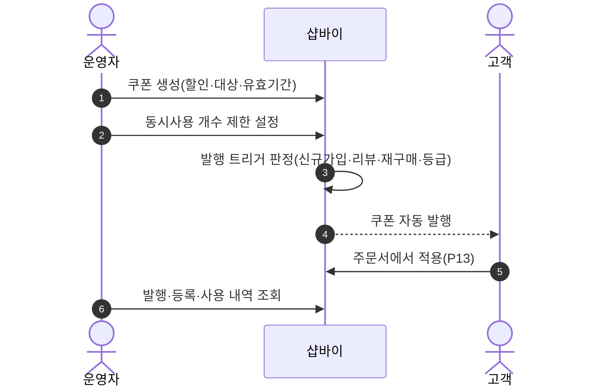
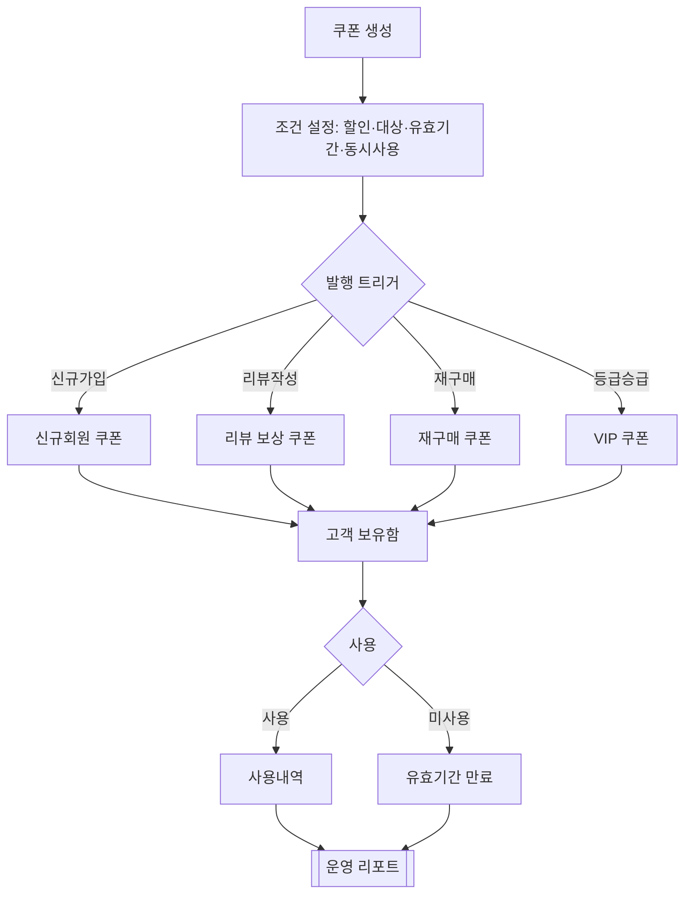

# P19 쿠폰 기획·발행·소진(운영자)

> 카드 `t62` · L1 **프로모션** · L2 **쿠폰** · 기능 행 10개

## 1. 한줄정의 · 시작/끝 · 등장인물

**한줄정의** — 운영자가 쿠폰을 만들고 조건(신규·리뷰·재구매·등급)에 따라 자동 발행하고, 발행·등록·사용 내역을 확인하는 흐름.

- **시작**: 운영자가 쿠폰 생성
- **끝**: 쿠폰 소진(사용·만료)까지의 내역 확인

**등장인물**

- 운영자(셀러어드민)
- 샵바이(`/coupons`·`/coupons/issues`)
- 고객
- huni-mall(주문서 적용 — P13)

## 2. 흐름(sequence)

## 3. 분기(flowchart) — 실패·비회원·취소 포함

## 4. 단계표

| 단계 | 시스템 | 담당자 | 원장 row_id | 상태 | 근거 |
|---|---|---|---|---|---|
| 1. 쿠폰 생성·발행 관리 | 운영자(셀러어드민) | 김동학 | `STD-ADC-005` | 미착수 | print-quote/04_design/ia.md §2.3 SM-A-43 · L4 사유: 고객측 쿠폰 조회/등록은 done(SB-049)이나 운영자 발행 화면 근거 없음 |
| 2. 쿠폰 유효기간 관리 | 운영자(셀러어드민) | 최숙진 | `STD-PRM-006` | 미착수 | print-kb/wiki/policy/coupon.md#CPN-06 · L4 사유: 쿠폰 발행·유효기간 관리 화면 L2 무근거(F-126 돈·L). |
| 3. 쿠폰 동시사용 개수 제한 | 샵바이 설정 | 최숙진 | `STD-PRM-005` | 부분 | SB-029 done — huni-skin-shopby/src/lib/api/hooks/use-order-coupons.ts:34 (최대할인 계산) |
| 4. 신규회원 쿠폰 자동발행 | 샵바이 | 최숙진 | `STD-PRM-001` | 미착수 | print-kb/wiki/policy/coupon.md#CPN-01 · L4 사유: 돈 걸림(F-156). 자동발행 트리거 L2 무근거. |
| 5. 재구매 쿠폰 발행 | 샵바이 | 최숙진 | `STD-PRM-003` | 미착수 | print-kb/wiki/policy/coupon.md#CPN-03 · L4 사유: new — 재구매 쿠폰 미수록. 근거 print-kb/coupon.md#CPN-03(오염 아님). |
| 6. 회원등급(VIP) 쿠폰 발행 | 샵바이 | 최숙진 | `STD-PRM-004` ↔ P06 회원등급 · STD-PRM-001 → P01 가입 | 미착수 | print-kb/wiki/policy/coupon.md#CPN-04 · L4 사유: 회원등급(STD-MEM-018) 종속. 돈 걸림. |
| 7. [구IA#76] 쿠폰관리(발행/매칭/사용내역) | 운영자 | 최숙진 | `STD-PRM-018` | 미실측 | IA No.76 쿠폰관리 · 샵바이 쿠폰(R1d) |
| 8. [구IA#77] 쿠폰등록내역 | 운영자 | 최숙진 | `STD-PRM-019` | 미실측 | IA No.77 쿠폰등록내역 · 샵바이(R1d) |
| 9. [구IA#78] 쿠폰사용내역 | 운영자 | 최숙진 | `STD-PRM-020` | 미실측 | IA No.78 쿠폰사용내역 · 샵바이(R1d) |
| 10. 쿠폰 등록·사용 내역 조회 | 운영자(셀러어드민) | 최숙진 | `STD-ADC-006` | 작동 | https://service.shopby.co.kr/promotion/coupon/list@2026-09-16 |

## 5. 빠진 곳

| 종류 | 내용 | 제안 담당 | 선행 |
|---|---|---|---|
| **나 — 행은 있는데 코드 0** | 자동발행 4종(신규·리뷰·재구매·등급) 모두 발행 트리거의 설정 지점·호출 지점을 찾지 못했다. 샵바이 server API `/coupons/issues` 는 있다. | 최숙진 | 쿠폰 정책(금액·조건) 확정 |
| **라 — 결정 미정** | 쿠폰 종류·할인 폭·유효기간 같은 실제 프로모션 정책을 원장 131행과 t61 결정 문서에서 찾지 못했다 — 기능 행만 있고 내용이 비어 있다. | 지니·최숙진 | 없음 |
| **나 — 행은 있는데 코드 0** | 구IA 3행(`STD-PRM-018`~`020`)은 `미실측` 이다 — 셀러어드민의 어느 화면이 대응하는지 대조하지 못했다. | 최숙진 | 셀러어드민 접근 |

## 6. 채우는 방법

- 최숙진: 셀러어드민 쿠폰 메뉴를 전수 캡처해 구IA 3행과 1:1 대조하고 `미실측` 을 닫는다.
- 지니·최숙진: 런칭 프로모션 정책(쿠폰 종류·금액·기간)을 정한다.
- 최숙진: 자동발행 4종이 셀러어드민 설정으로 가능한지 확인하고, 불가한 것만 `/coupons/issues` 호출 잡으로 요청한다.

## 7. 확인 못 한 것

- 재구매 쿠폰의 "재구매" 정의(기간·횟수)를 원장·결정 문서에서 찾지 못했다.
