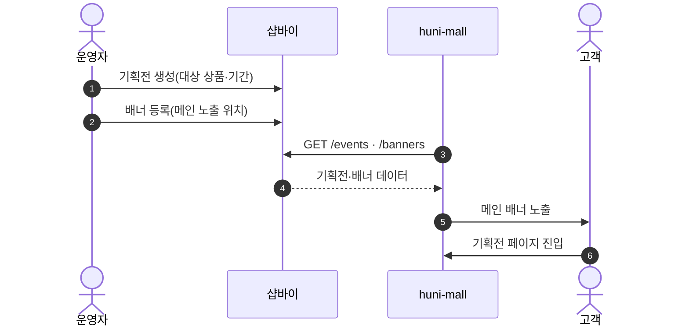
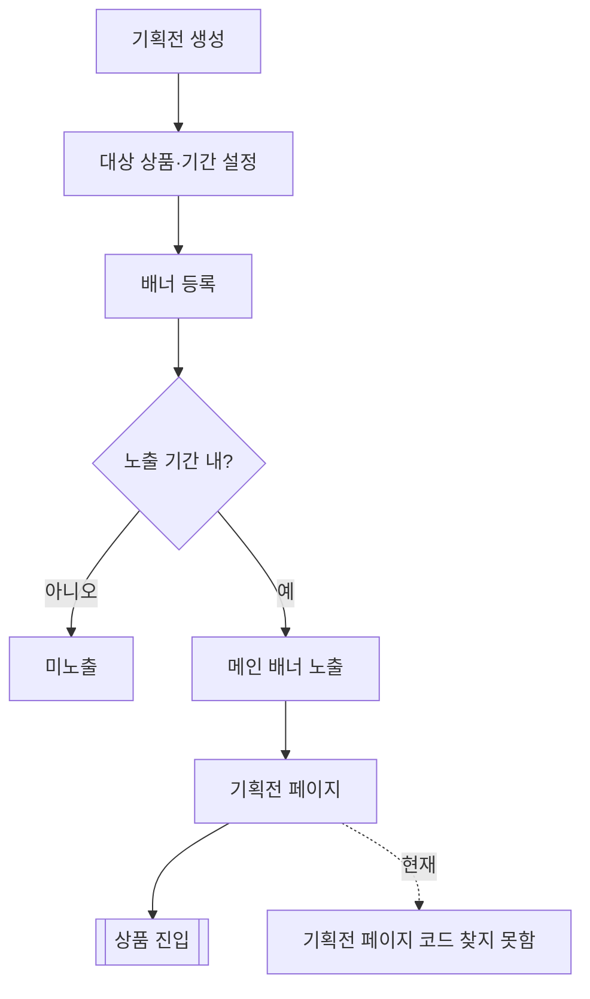

# P20 기획전·배너 운영

> 카드 `t62` · L1 **프로모션** · L2 **기획전** · 기능 행 2개

## 1. 한줄정의 · 시작/끝 · 등장인물

**한줄정의** — 운영자가 기획전을 만들고 메인 배너에 걸어 고객이 기획전 페이지로 들어오게 하는 흐름.

- **시작**: 운영자가 기획전 생성
- **끝**: 고객이 기획전 페이지에서 상품 진입

**등장인물**

- 운영자(셀러어드민)
- 샵바이(`/events`·`/banners`)
- huni-mall(메인·기획전 페이지)
- 고객

## 2. 흐름(sequence)

## 3. 분기(flowchart) — 실패·비회원·취소 포함

## 4. 단계표

| 단계 | 시스템 | 담당자 | 원장 row_id | 상태 | 근거 |
|---|---|---|---|---|---|
| 1. 기획전/할인 이벤트 페이지 | huni-mall → 샵바이 | 김동학 | `STD-PRM-010` ↔ t63 상품·카탈로그(기획전 상품 리스팅) | 미착수 | SB-001 partial — huni-skin-shopby/src/lib/legacy-data/hooks.ts:352-360 (프로모 데이터원 legacy mock 빈배열) |
| 2. 메인/기획전 배너 관리 | 운영자(셀러어드민) | 김동학 | `STD-ADC-013` | 미착수 | print-quote/04_design/ia.md §2.1 메인 · L4 사유: 메인 배너·BEST 큐레이션의 데이터원이 legacy mock 빈배열/정적 상수(SB-002 stub·SB-003 partial) — 운영자가 바꿀 자리가 없다 |

## 5. 빠진 곳

| 종류 | 내용 | 제안 담당 | 선행 |
|---|---|---|---|
| **나 — 행은 있는데 코드 0** | 기획전 페이지 라우트를 huni-mall 에서 찾지 못했다 — `mega-menu.tsx` 에 "기획전" 문구만 있다. 샵바이 display `/events`·`/banners` 는 있다. | 김동학 | 기획전 IA·디자인 |
| **라 — 결정 미정** | 런칭 시 기획전을 쓸지 자체가 결정되지 않았다(1차 범위 여부). | 신우진·지니 | 없음 |

## 6. 채우는 방법

- 신우진: 1차 런칭에 기획전을 포함할지 결정한다.
- 김동학: 포함 시 `/events` 목록·상세 라우트를 만들고 메인 배너와 잇는다.

## 7. 확인 못 한 것

- 배너 노출 영역(메인 상단·중단)의 디자인 기준을 확인하지 못했다.
