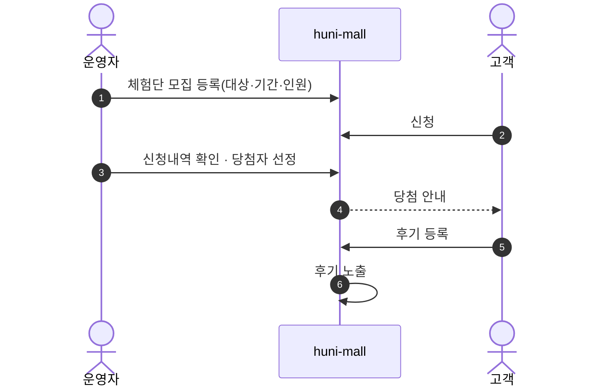
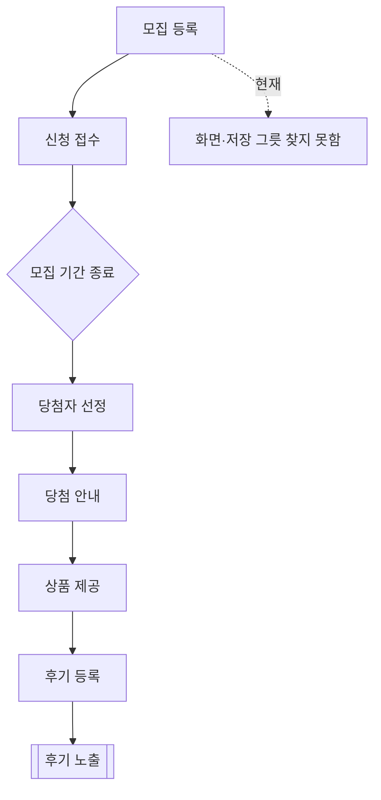

# P21 체험단 모집·운영

> 카드 `t62` · L1 **프로모션** · L2 **체험단** · 기능 행 3개

## 1. 한줄정의 · 시작/끝 · 등장인물

**한줄정의** — 운영자가 체험단을 모집하고 고객이 신청·당첨되어 후기를 남기기까지의 흐름.

- **시작**: 운영자가 체험단 모집 등록
- **끝**: 당첨자 후기 등록·노출

**등장인물**

- 운영자
- huni-mall(체험단 화면)
- 샵바이(게시판/이벤트)
- 고객

## 2. 흐름(sequence)

## 3. 분기(flowchart) — 실패·비회원·취소 포함

## 4. 단계표

| 단계 | 시스템 | 담당자 | 원장 row_id | 상태 | 근거 |
|---|---|---|---|---|---|
| 1. 체험단 모집·신청·당첨·후기 | huni-mall | 김동학 | `STD-PRM-011` ↔ P14 리뷰(후기) · P28 게시판 운영 | 미착수 | print-kb/wiki/policy/custom-dev.md#CST-05 · L4 사유: 체험단 native 지원 범위 미확인. 3차 후보. |
| 2. [구IA#71] 체험단관리(등록/수정/신청내역) | 운영자 | 김동학 | `STD-PRM-017` | 미실측 | IA No.71 체험단관리 · 신규 어디에도 없음 @ 2026-09-16 21:28 |
| 3. 체험단 모집·신청내역 관리(운영자) | 운영자 | 김동학 | `STD-ADC-016` | 미착수 | L3/legacy-normalized.json#F-121,IA-121,SCOPE-121 · _workspace/huni-launch-scope/02_gap/fit-gap-matrix.csv:122 · docs/huni/후니프린팅_통합IA_일정_역할분담_260616.xlsx#02_IA마스터!A122:K122 \|\| P1판정(260902): huni-skin-shopby 전수 grep '체험단' 0건 |

## 5. 빠진 곳

| 종류 | 내용 | 제안 담당 | 선행 |
|---|---|---|---|
| **나 — 행은 있는데 코드 0** | 고객 화면·운영자 화면·저장 그릇 모두 찾지 못했다. 샵바이 명세 20개 yml 전수 검색에서 "체험단"·"서포터즈" 0건이라 대응 API 도 찾지 못했다 — 게시판(`/boards`)을 빌려 쓰거나 직접 만들어야 한다. | 김동학 | 1차 런칭 포함 여부 결정 |
| **라 — 결정 미정** | 1차 런칭 범위인지 미결이다. 구 사이트 기능(구IA#71)을 그대로 옮길지 결정이 없다. | 신우진·지니 | 없음 |

## 6. 채우는 방법

- 신우진: 1차 범위 포함 여부를 결정한다.
- 김동학: 포함 시 샵바이 게시판 기반으로 갈지 자체 구현할지 설계안을 낸다.

## 7. 확인 못 한 것

- 구 사이트 체험단의 실제 운영 규모(월 몇 건)를 확인하지 못해 우선순위를 판단할 근거가 없다.
