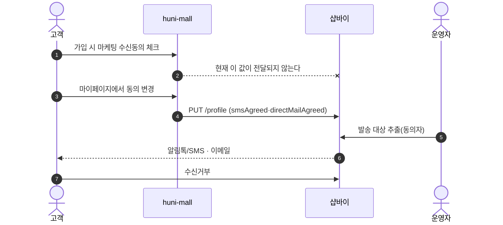
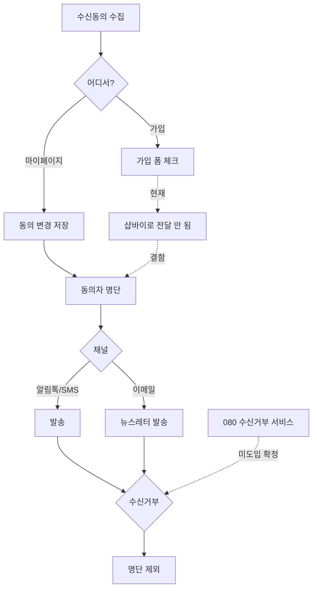

# P22 마케팅 발송·수신동의 관리

> 카드 `t62` · L1 **프로모션** · L2 **알림·수신동의** · 기능 행 5개

## 1. 한줄정의 · 시작/끝 · 등장인물

**한줄정의** — 고객이 동의한 채널(SMS·알림톡·이메일)로 마케팅을 보내고, 동의·거부 상태를 관리하는 흐름.

- **시작**: 고객의 수신동의 수집(가입 시 또는 마이페이지)
- **끝**: 동의자 대상 발송·수신거부 반영

**등장인물**

- 고객
- huni-mall(가입·마이페이지 동의)
- 샵바이(`smsAgreed`·`directMailAgreed`·`/kakao/send`)
- 운영자

## 2. 흐름(sequence)

## 3. 분기(flowchart) — 실패·비회원·취소 포함

## 4. 단계표

| 단계 | 시스템 | 담당자 | 원장 row_id | 상태 | 근거 |
|---|---|---|---|---|---|
| 1. 마케팅 수신동의 관리 | huni-mall → 샵바이 | 김동학 | `STD-PRM-014` ↔ P01 회원가입(동의 수집 지점) | 작동 | https://shopby.huniprinting.co.kr/signup@2026-09-16 21:27 |
| 2. 알림톡/SMS 마케팅 발송 | 운영자 → 샵바이 | 최숙진 | `STD-PRM-012` | 미착수 | print-kb/wiki/policy/membership-auth.md#MEM-02 알림톡 계약 필요 · L4 사유: 알림톡/SMS 계약 미체결 — 1차 영향·조기 필요. |
| 3. 이메일 뉴스레터 발송 | 운영자 → 샵바이 | 최숙진 | `STD-PRM-013` | 미착수 | print-quote/04_design/ia.md §2.1 고객센터 파생 · L4 사유: new(★ia.md 오염) — 근거출처가 print-quote/04_design/ia.md 파생이라 §4-1 상 「독립 발견」으로 신뢰하면 과대평가. 후니 IA 계보 안에서 파생된 항목. |
| 4. 080 수신거부 서비스 미도입 확정 | 결정(신우진) | 신우진 | `STD-PRM-021` | 구현-미검증 | 후니정기미팅 정리260915.html §회원·로그인·인증 · 확정 4 |
| 5. (IA r59 기능명 공란 — 무슨 일인지 미상) | 미상 | 신우진 | `STD-PRM-015` | 미실측 | docs/huni/후니프린팅_IA.xlsx:IA 확인!r59 (기능명 없음) |

## 5. 빠진 곳

| 종류 | 내용 | 제안 담당 | 선행 |
|---|---|---|---|
| **다 — 코드는 있는데 연결 안 됨** | `STD-PRM-014` 는 `작동` 판정이지만, 가입 폼이 수집한 `mkt.sms`·`mkt.email` 이 가입 요청에 실리지 않는다(`signup-form.tsx:51,135`·`api/auth/signup/route.ts` 본문 필드 5개). 가입 시점 동의가 저장되지 않는다. | 김동학 | 없음 |
| **나 — 행은 있는데 코드 0** | 알림톡·뉴스레터 발송의 운영 화면·호출 지점을 찾지 못했다. 샵바이 manage `/kakao/send` 는 있다. | 최숙진 | 발송 채널 계약 |
| **라 — 결정 미정** | `STD-PRM-015` 는 IA 원본(`후니프린팅_IA.xlsx` r59)의 기능명이 공란이라 무슨 일인지조차 미상이다. 실측 전 배정 불가. | 신우진 | IA 원본 재확인 |

## 6. 채우는 방법

- 김동학: 가입 요청에 `smsAgreed`·`directMailAgreed` 를 추가한다(P01 과 같은 수정).
- 신우진: IA r59 를 원본에서 다시 읽어 `STD-PRM-015` 의 정체를 확정하거나 행을 폐기한다.
- 최숙진: 알림톡 발신프로필·템플릿 심사 상태를 확인한다.

## 7. 확인 못 한 것

- 알림톡 발신프로필이 등록돼 있는지 확인하지 못했다.
- `STD-PRM-015` 가 무엇인지 — IA 원본에 기능명이 없다.
