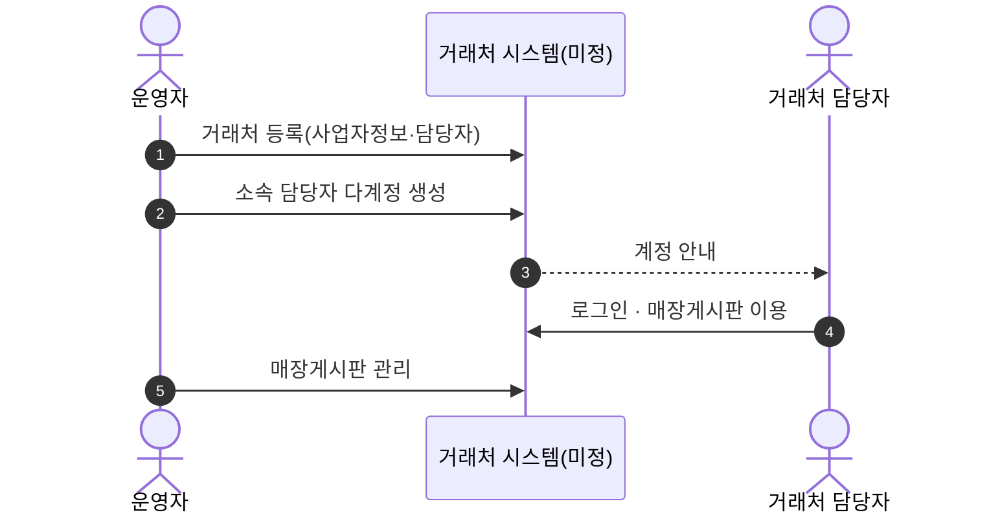
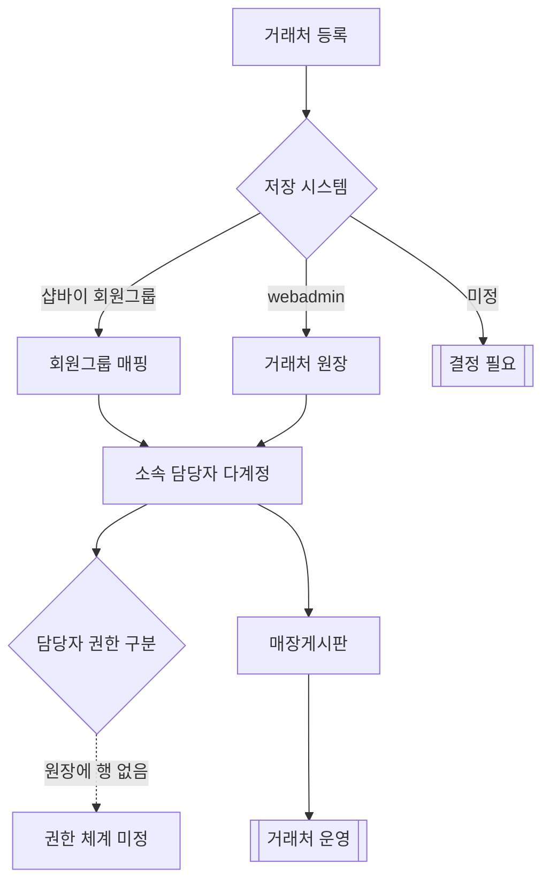

# P23 거래처(기업회원) 등록·관리

> 카드 `t62` · L1 **B2B** · L2 **거래처** · 기능 행 5개

## 1. 한줄정의 · 시작/끝 · 등장인물

**한줄정의** — 오프라인으로 거래하던 업체를 거래처로 등록하고, 그 업체 소속 담당자들에게 계정을 열어주고, 전용 게시판으로 소통하는 흐름.

- **시작**: 운영자가 거래처 등록
- **끝**: 거래처 소속 담당자 계정 활성 + 매장게시판 운영

**등장인물**

- 운영자
- 샵바이(회원 그룹)
- webadmin 또는 신규 시스템(거래처 원장)
- 거래처 담당자

## 2. 흐름(sequence)

## 3. 분기(flowchart) — 실패·비회원·취소 포함

## 4. 단계표

| 단계 | 시스템 | 담당자 | 원장 row_id | 상태 | 근거 |
|---|---|---|---|---|---|
| 1. 거래처(기업회원) 등록·관리 | 미정(webadmin 또는 샵바이 회원그룹) | 서희항 | `STD-B2B-001` | 부분 | WA-060 partial — raw/webadmin/webadmin/catalog/models.py:87 (TCusCustomers 모델만·전용 운영화면 urls.py 부재) |
| 2. 거래처 소속 담당자 다계정 | 미정 | 최숙진 | `STD-B2B-003` | 미착수 | WA-060 partial(모델만) |
| 3. [구IA#45] 거래처관리(등록/수정/처리) | 운영자 | 최숙진 | `STD-B2B-013` | 미실측 | docs/huni/후니프린팅_IA.xlsx 「IA 확인」 No.45 · webadmin 사이드바 33화면에 거래처 없음 @ 2026-09-16 21:28 · 셀러어드민 미확인(R1d) |
| 4. [구IA#46] 매장게시판 | 운영자(셀러어드민 게시판) | 최숙진 | `STD-B2B-014` | 미실측 | IA No.46 매장게시판 · webadmin 해당 없음 @ 2026-09-16 21:28 |
| 5. 매장(거래처) 게시판 관리 | 운영자 | 김동학 | `STD-ADC-015` ↔ P28 게시판 운영 | 미착수 | L3/legacy-normalized.json#F-096,IA-096,SCOPE-096 · _workspace/huni-launch-scope/02_gap/fit-gap-matrix.csv:97 · docs/huni/후니프린팅_통합IA_일정_역할분담_260616.xlsx#02_IA마스터!A97:K97 \|\| P1판정(260902): huni-skin-shopby 전수 grep '거래처 게시판\|매장' 0건 · 운영자 기능은 셀러어드민 소관 |

## 5. 빠진 곳

| 종류 | 내용 | 제안 담당 | 선행 |
|---|---|---|---|
| **나 — 행은 있는데 코드 0** | 샵바이 명세 20개 yml 전수에서 "거래처"·"기업회원" 0건 — 대응 API 를 찾지 못했다(`/partners` 는 입점사라 뜻이 다르다). webadmin 저장소 전수에서도 "거래처"·"여신"·"미수금" 0건이라 그릇을 찾지 못했다. | 신우진 | 시스템 경계 결정 |
| **라 — 결정 미정** | 거래처를 샵바이 회원그룹(`/member-groups`)으로 흉내 낼지, webadmin 에 원장을 만들지가 미결이다. | 신우진·지니 | 없음 |
| **가 — 원장에 행 없음** | 거래처 소속 담당자의 권한 구분(대표 vs 실무자·주문 승인권)이 원장에 행으로 없다. | 신우진 | 거래처 시스템 결정 |

## 6. 채우는 방법

- 신우진: 거래처를 어느 시스템에 둘지 결정한다(샵바이 회원그룹 vs webadmin 원장 vs 별도).
- 최숙진: 구IA#45·#46 의 구 사이트 화면을 캡처해 요구 범위를 확정한다(`미실측` 2행).

## 7. 확인 못 한 것

- 현재 거래처가 몇 곳인지, 오프라인으로 어떻게 관리되는지 확인하지 못했다.
