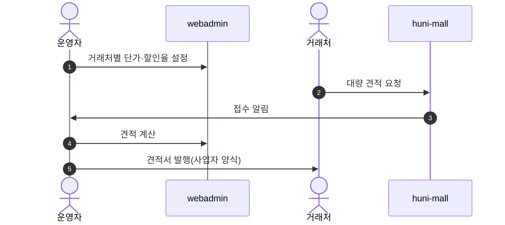
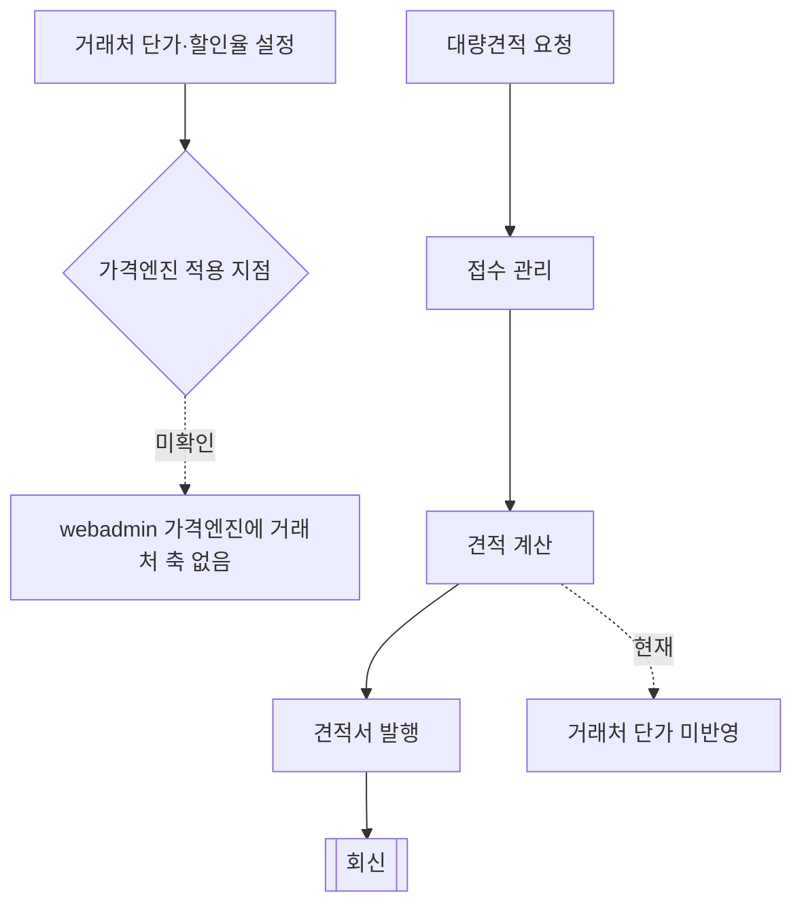

# P24 거래처 단가·대량견적

> 카드 `t62` · L1 **B2B** · L2 **단가·견적** · 기능 행 3개

## 1. 한줄정의 · 시작/끝 · 등장인물

**한줄정의** — 거래처마다 다른 단가를 걸어두고, 대량 견적 요청을 받아 견적서를 사업자 양식으로 회신하는 흐름.

- **시작**: 거래처 단가 설정 또는 고객의 대량견적 요청
- **끝**: 견적서 발행·회신

**등장인물**

- 운영자
- webadmin(가격엔진)
- huni-mall(견적 요청 폼)
- 거래처

## 2. 흐름(sequence)

## 3. 분기(flowchart) — 실패·비회원·취소 포함

## 4. 단계표

| 단계 | 시스템 | 담당자 | 원장 row_id | 상태 | 근거 |
|---|---|---|---|---|---|
| 1. 거래처별 단가/할인율 설정 | webadmin(가격엔진) | 최숙진 | `STD-B2B-002` ↔ t65 운영자·상품가격(가격엔진) | 미착수 | print-kb/wiki/huni/price-engine.md#PE-SOT-5 가격소스 우선순위 · L4 사유: 돈 걸림. 등급가 매핑 미결이 선행. |
| 2. 대량 견적 요청 접수·회신 | huni-mall + 운영자 | 최숙진 | `STD-B2B-010` | 미착수 | SB-056 absent(문의 라우트 부재) |
| 3. 견적서 발행(사업자 양식) | 운영자 | 최숙진 | `STD-B2B-011` | 미착수 | print-quote/04_design/ia.md §2.1 대량견적 파생 · L4 사유: F-051 견적서 생성·다운로드는 L4a 도메인 std 와도 물린다 — legacy 1:N 공유(§4-2). |

## 5. 빠진 곳

| 종류 | 내용 | 제안 담당 | 선행 |
|---|---|---|---|
| **나 — 행은 있는데 코드 0** | webadmin 저장소 전수에서 "거래처" 0건 — 거래처별 단가를 받을 축을 가격엔진(`use_dims`·단가행)에서 찾지 못했다. 그릇 신설이 필요하다. | 서희항 | P23 거래처 시스템 결정 |
| **나 — 행은 있는데 코드 0** | 대량견적 요청 폼·견적서 양식 모두 코드를 찾지 못했다. | 김동학·최숙진 | 없음 |
| **라 — 결정 미정** | 거래처 할인을 단가로 줄지 쿠폰/할인율로 줄지 미결이다 — 전자는 가격엔진, 후자는 샵바이 프로모션으로 시스템이 갈린다. | 지니·신우진 | 없음 |

## 6. 채우는 방법

- 지니·신우진: 거래처 할인의 구현 방식(단가 vs 할인율)을 결정한다.
- 서희항: 단가 방식이면 가격엔진에 거래처 축을 추가하는 설계안을 낸다.
- 김동학: 대량견적 요청 폼을 만들고 접수를 운영자에게 잇는다(P28 접수 관리와 한 화면).

## 7. 확인 못 한 것

- 현행 거래처 할인이 실제로 어떤 규칙인지(정률·정액·품목별) 확인하지 못했다.
