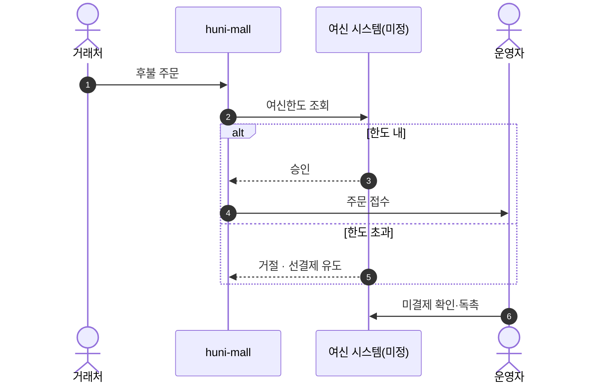
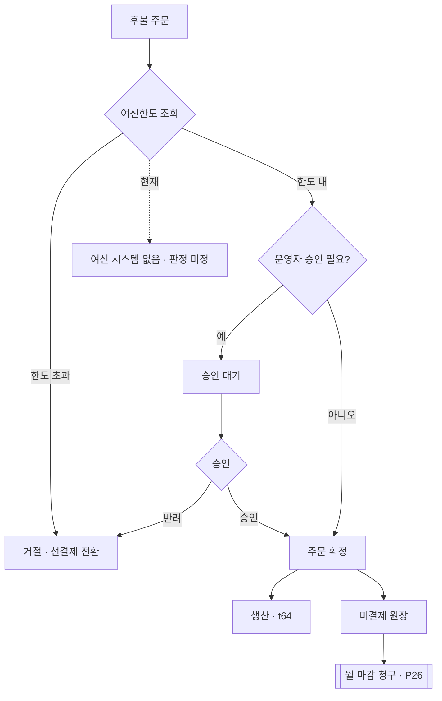

# P25 후불 주문·여신 관리

> 카드 `t62` · L1 **B2B** · L2 **후불** · 기능 행 3개

## 1. 한줄정의 · 시작/끝 · 등장인물

**한줄정의** — 거래처가 결제 없이 먼저 주문하고, 한도 안에서 승인받아 생산으로 넘기고, 미결제를 추적하는 흐름.

- **시작**: 거래처 후불 주문
- **끝**: 주문 승인 → 생산 · 미결제 원장 반영

**등장인물**

- 거래처
- huni-mall(주문)
- 샵바이(주문)
- webadmin/신규(여신 원장)
- 운영자

## 2. 흐름(sequence)

## 3. 분기(flowchart) — 실패·비회원·취소 포함

## 4. 단계표

| 단계 | 시스템 | 담당자 | 원장 row_id | 상태 | 근거 |
|---|---|---|---|---|---|
| 1. 후불 여신한도 설정 | 미정(t56 판정 미정) | 김동학 | `STD-B2B-004` | 미착수 | print-kb/wiki/policy/custom-dev.md#CST-07 · L4 사유: F-141 후불결제(돈·주문) 미착수. |
| 2. 후불 주문 승인·미결제 관리 | 미정 | 김동학+신우진 | `STD-B2B-005` ↔ t63 결제 · t64 주문운영(승인→생산) | 미착수 | print-kb/wiki/policy/order-mgmt.md#OMG-04 · L4 사유: 후불 승인·미결제 관리 L2 무근거. |
| 3. [구IA#91] 주문관리-후불결제 | 운영자 | 신우진 | `STD-B2B-015` | 미실측 | IA No.91 주문관리-후불결제 · 9/15 회의 결제수단 표(가상계좌 미신청·토스 제외) · webadmin 없음 |

## 5. 빠진 곳

| 종류 | 내용 | 제안 담당 | 선행 |
|---|---|---|---|
| **라 — 결정 미정** | t56 판정이 `미정` 이다 — 범위·시스템 경계가 확정되지 않았다(t61 결정 안건에도 같은 내용이 올라 있다). | 신우진·지니 | P23 거래처 시스템 결정 |
| **나 — 행은 있는데 코드 0** | 샵바이 명세 전수에서 "후불"은 `order-server-public.yml:5393,6368` 의 네이버페이 후불결제 금액 필드뿐이다 — B2B 여신 후불 결제 타입을 찾지 못했다. 후불을 쓰려면 0원 주문 + 외부 원장이 필요하다. | 서희항·김동학 | 여신 시스템 결정 |

## 6. 채우는 방법

- 신우진·지니: 1차 런칭에 후불을 넣을지, 넣는다면 어느 시스템에 여신 원장을 둘지 결정한다.
- 김동학: 결정 후 주문 흐름에 여신 조회·승인 분기를 넣는다.

## 7. 확인 못 한 것

- 현행 후불 거래처 수와 미결제 규모를 확인하지 못했다.
