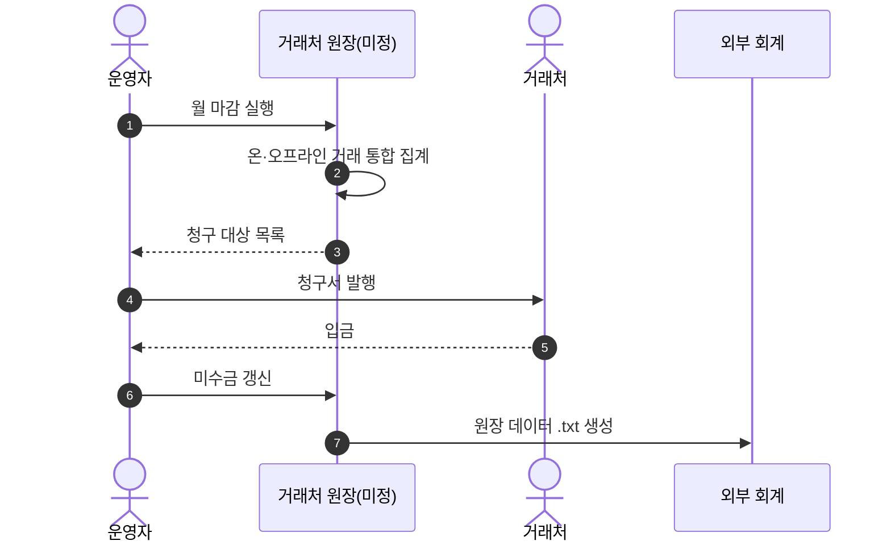
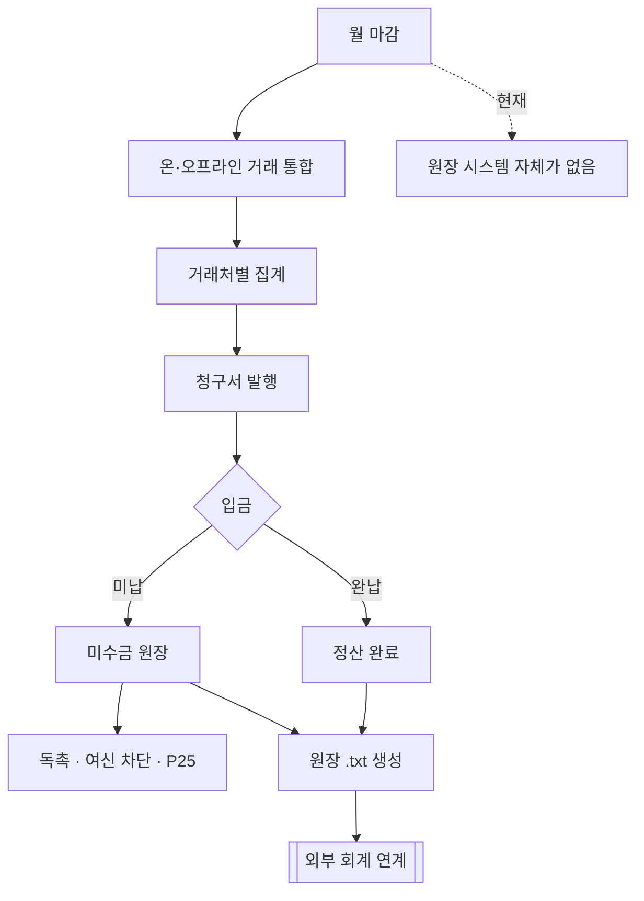

# P26 B2B 정산·거래처 원장

> 카드 `t62` · L1 **B2B** · L2 **정산·원장** · 기능 행 4개

## 1. 한줄정의 · 시작/끝 · 등장인물

**한줄정의** — 한 달 치 거래처 거래를 마감해 청구서를 내고, 미수금을 추적하고, 온·오프라인 거래를 하나의 원장으로 묶고, 외부 회계로 넘길 파일을 만드는 흐름.

- **시작**: 월 마감
- **끝**: 청구서 발행 · 미수금 원장 갱신 · `.txt` 연계 파일 생성

**등장인물**

- 운영자
- webadmin/신규(거래처 원장)
- 외부 회계 시스템(.txt 연계)
- 거래처

## 2. 흐름(sequence)

## 3. 분기(flowchart) — 실패·비회원·취소 포함

## 4. 단계표

| 단계 | 시스템 | 담당자 | 원장 row_id | 상태 | 근거 |
|---|---|---|---|---|---|
| 1. 월 마감 청구서 발행 | 미정 | 최숙진 | `STD-B2B-006` ↔ P16 증빙서류 발급(세금계산서) · t65 정산·통계 | 미착수 | print-kb/wiki/policy/operations.md#OPS-05 월단위 마감 · L4 사유: 돈 걸림(F-098). 원장 월마감 미구현. |
| 2. 업체별 미수금 관리 | 미정 | 최숙진 | `STD-B2B-007` | 미착수 | print-quote/04_design/ia.md §2.3 SM-A-06 · L4 사유: 돈 걸림(F-099). |
| 3. 거래처 원장(온·오프라인 통합) | 미정(t56 판정 미정) | 김동학 | `STD-B2B-008` | 미착수 | print-kb/wiki/policy/custom-dev.md#CST-06 · L4 사유: 온·오프라인 통합 원장 + 계좌관리. 전부 CUSTOM. |
| 4. 원장 데이터 파일 생성(.txt 연계) | 미정(t56 판정 미정) | 김동학 | `STD-B2B-009` | 미착수 | print-quote/04_design/ia.md §2.3 SM-A-02 .txt 생성 · L4 사유: .txt 연계 생성 미구현. |

## 5. 빠진 곳

| 종류 | 내용 | 제안 담당 | 선행 |
|---|---|---|---|
| **라 — 결정 미정** | `STD-B2B-008`·`009` 는 t56 판정이 `미정` 이다 — 원장을 어느 시스템에 둘지, `.txt` 를 받는 외부 시스템이 무엇인지 확정되지 않았다. | 신우진·지니 | P23 거래처 시스템 결정 |
| **나 — 행은 있는데 코드 0** | 청구서·미수금을 다룰 API·화면·테이블을 샵바이·webadmin 어디에서도 찾지 못했다. | 서희항 | 원장 시스템 결정 |
| **가 — 원장에 행 없음** | 오프라인 거래 입력 경로(운영자가 수기로 넣는 화면)가 원장에 행으로 없다 — "온·오프라인 통합"이 성립하려면 필요하다. | 신우진 | 원장 시스템 결정 |

## 6. 채우는 방법

- 신우진: `.txt` 를 받는 외부 회계 시스템의 이름과 포맷을 확인한다.
- 지니·신우진: 거래처 원장의 1차 런칭 포함 여부를 결정한다.
- 서희항: 포함 시 webadmin 에 거래처 원장 스키마를 제안한다.

## 7. 확인 못 한 것

- `.txt` 연계의 상대 시스템·포맷 규격을 확인하지 못했다 — 원장 행에 이름이 없다.
- 세금계산서 일괄 발행(`STD-B2B-012`)과 월 마감 청구가 같은 시점인지 다른지 확인하지 못했다.
