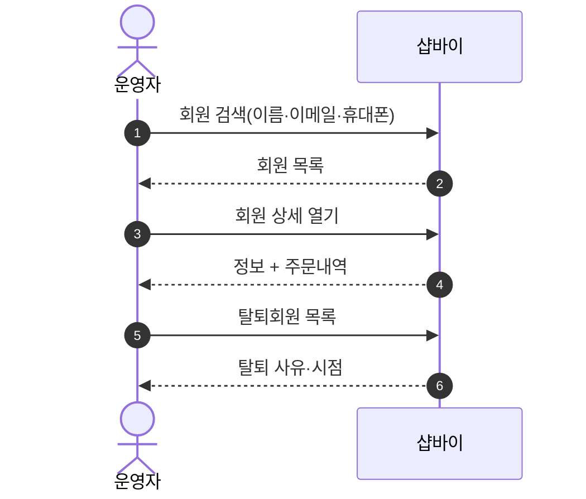
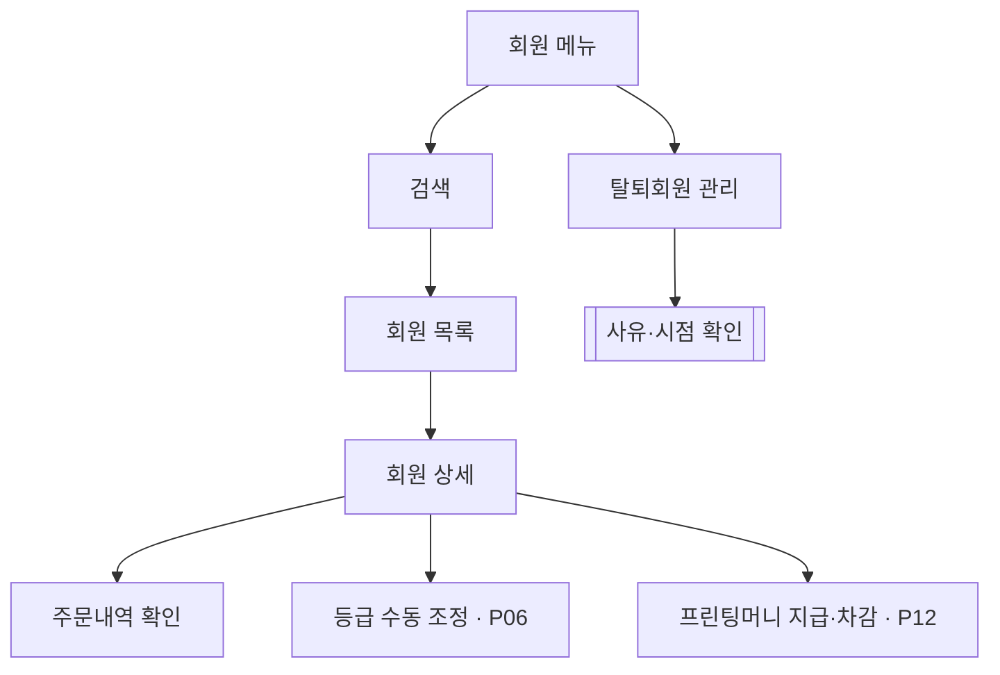

# P27 회원 운영(조회·탈퇴회원)

> 카드 `t62` · L1 **운영자·회원CS** · L2 **회원** · 기능 행 3개

## 1. 한줄정의 · 시작/끝 · 등장인물

**한줄정의** — 운영자가 회원을 찾아보고 상세를 확인하고, 탈퇴한 회원을 관리하는 일상 운영 흐름.

- **시작**: 운영자가 셀러어드민 회원 메뉴 진입
- **끝**: 회원 상세·주문내역 확인 또는 탈퇴회원 처리

**등장인물**

- 운영자(셀러어드민)
- 샵바이(`/members`·`/members/expelled-members`)

## 2. 흐름(sequence)

## 3. 분기(flowchart) — 실패·비회원·취소 포함

## 4. 단계표

| 단계 | 시스템 | 담당자 | 원장 row_id | 상태 | 근거 |
|---|---|---|---|---|---|
| 1. 회원 목록·검색·상세 | 운영자(셀러어드민) | 최숙진 | `STD-ADC-001` ↔ P06 등급 · P12 적립금 | 작동 | https://service.shopby.co.kr/member/list@2026-09-16 |
| 2. 탈퇴회원 관리 | 운영자(셀러어드민) | 최숙진 | `STD-ADC-003` | 작동 | https://service.shopby.co.kr/member/expel@2026-09-16 |
| 3. [구IA#73] 회원관리(주문내역/정보확인) | 운영자 | 최숙진 | `STD-ADC-017` | 미실측 | IA No.73 회원관리 · 샵바이 회원관리(R1d) |

## 5. 빠진 곳

| 종류 | 내용 | 제안 담당 | 선행 |
|---|---|---|---|
| **나 — 행은 있는데 코드 0** | 구IA#73(`STD-ADC-017`)은 `미실측` 이다 — 셀러어드민 회원 상세가 구 사이트의 "주문내역/정보확인"을 대체하는지 대조하지 못했다. | 최숙진 | 셀러어드민 접근 |
| **라 — 결정 미정** | 운영자 계정 권한 분리(회원 개인정보 열람 권한)가 원장에 없고 결정도 없다 — 개인정보 취급 범위 문제다. | 신우진·최숙진 | 없음 |

## 6. 채우는 방법

- 최숙진: 셀러어드민 회원 메뉴를 캡처해 구IA#73 과 1:1 대조하고 `미실측` 을 닫는다.
- 신우진: 운영자 권한 등급과 개인정보 열람 범위를 정한다.

## 7. 확인 못 한 것

- 비마스킹 조회(`/profile/non-masking`)를 누구에게 열지 확인하지 못했다.
