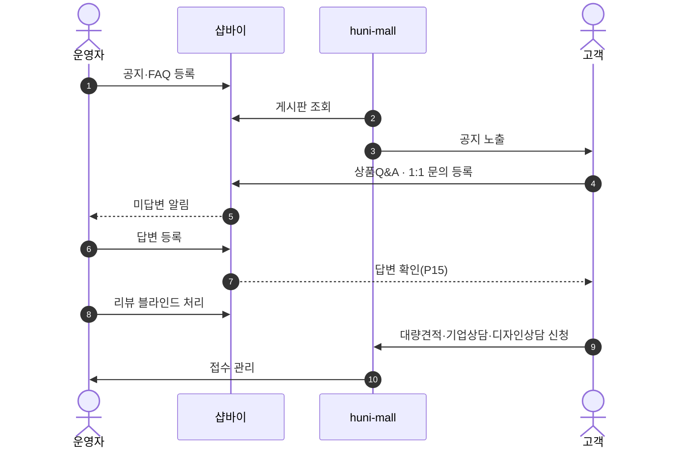
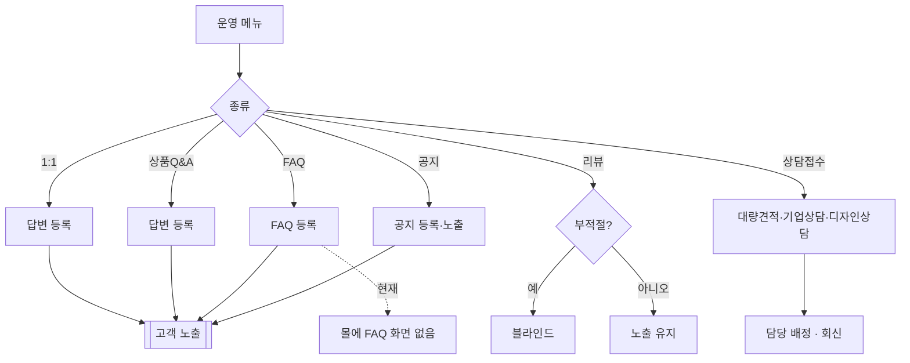

# P28 게시판·문의 응대 운영

> 카드 `t62` · L1 **운영자·회원CS** · L2 **게시판** · 기능 행 6개

## 1. 한줄정의 · 시작/끝 · 등장인물

**한줄정의** — 운영자가 공지·FAQ를 올리고, 상품Q&A·1:1문의·대량견적 접수에 답하고, 리뷰를 관리(블라인드)하는 하루 운영 흐름.

- **시작**: 운영자가 게시판·문의 메뉴 진입
- **끝**: 답변 등록·게시글 노출·부적절 리뷰 블라인드

**등장인물**

- 운영자(셀러어드민)
- 샵바이(`/boards`·`/inquiry`·manage `/inquiries`·display `/reviews`)
- huni-mall(노출 — `/notice`)
- 고객

## 2. 흐름(sequence)

## 3. 분기(flowchart) — 실패·비회원·취소 포함

## 4. 단계표

| 단계 | 시스템 | 담당자 | 원장 row_id | 상태 | 근거 |
|---|---|---|---|---|---|
| 1. 공지사항 관리 | 운영자(셀러어드민) → huni-mall `/notice` | 최숙진 | `STD-ADC-007` | 작동 | https://service.shopby.co.kr/board/article@2026-09-16 |
| 2. FAQ 관리 | 운영자(셀러어드민) | 최숙진 | `STD-ADC-008` | 작동 | https://service.shopby.co.kr/board@2026-09-16 |
| 3. 상품Q&A 답변 관리 | 운영자(셀러어드민) | 최숙진 | `STD-ADC-009` | 작동 | https://service.shopby.co.kr/product/inquiry@2026-09-16 |
| 4. 1:1 문의 답변 관리 | 운영자(셀러어드민) | 최숙진 | `STD-ADC-010` | 작동 | https://service.shopby.co.kr/inquiry@2026-09-16 |
| 5. 이용후기(리뷰) 관리·블라인드 | 운영자(셀러어드민) | 최숙진 | `STD-ADC-011` | 작동 | https://service.shopby.co.kr/review@2026-09-16 |
| 6. 대량견적/기업상담/디자인상담 접수 관리 | 운영자 | 김동학 | `STD-ADC-012` ↔ P24 대량견적 · STD-ADC-011 → P14 리뷰 | 미착수 | print-quote/04_design/ia.md §2.3 SM-A-32 SM-A-33 SM-A-34 · L4 사유: 대량견적·기업상담·디자인상담 접수 관리 화면 근거 없음 |

## 5. 빠진 곳

| 종류 | 내용 | 제안 담당 | 선행 |
|---|---|---|---|
| **나 — 행은 있는데 코드 0** | 운영자 쪽은 셀러어드민이 받지만, 고객 쪽 화면이 huni-mall 에 `/notice` 하나뿐이다 — FAQ·상품Q&A·1:1문의 화면을 찾지 못했다. | 김동학 | 게시판 번호(boardNo) 확정 |
| **나 — 행은 있는데 코드 0** | 대량견적·기업상담·디자인상담 접수 폼과 관리 화면을 찾지 못했다(`STD-ADC-012` 미착수). | 김동학·최숙진 | P24 대량견적 설계 |
| **라 — 결정 미정** | 상담 3종을 게시판으로 받을지 1:1 문의 유형으로 받을지 미결이다. | 최숙진·신우진 | 없음 |

## 6. 채우는 방법

- 최숙진: 셀러어드민에서 게시판 번호(공지·FAQ·상담)를 정하고 김동학에게 전달한다.
- 김동학: FAQ·상품Q&A·1:1문의 고객 화면을 만들고 P15 와 잇는다.

## 7. 확인 못 한 것

- 현재 `/notice` 가 어느 boardNo 를 읽는지 확인하지 못했다.
