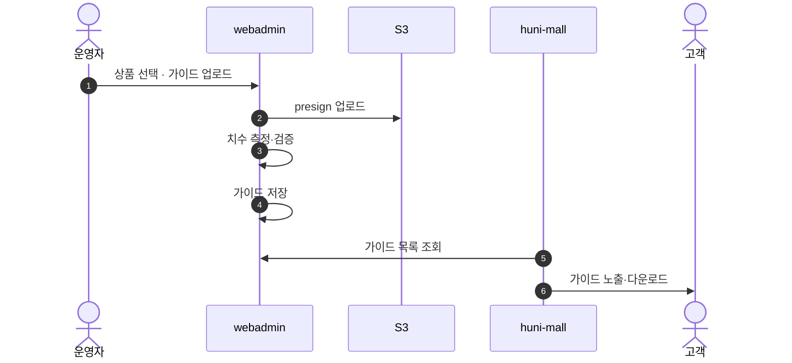
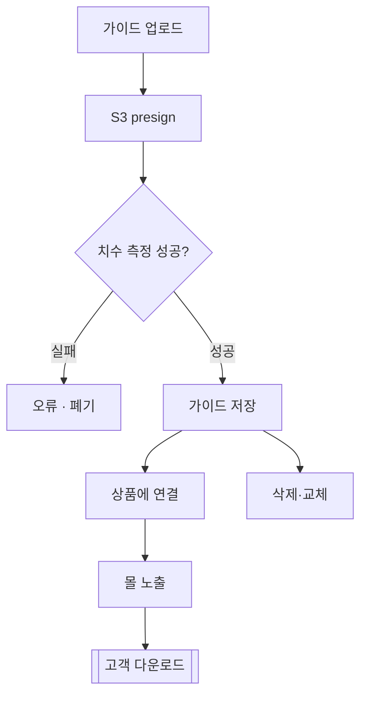

# P29 인쇄 가이드 콘텐츠 운영

> 카드 `t62` · L1 **운영자·회원CS** · L2 **콘텐츠** · 기능 행 1개

## 1. 한줄정의 · 시작/끝 · 등장인물

**한줄정의** — 운영자가 상품별 인쇄 가이드(재단선·여백 등) 파일을 올려 고객이 원고를 만들 때 쓰게 하는 흐름 — 이 범위에서 유일하게 webadmin 이 주체인 일.

- **시작**: 운영자가 webadmin 가이드 화면 진입
- **끝**: 가이드 파일 게시 · 고객 다운로드

**등장인물**

- 운영자
- webadmin(`catalog/guide_views.py`·S3)
- huni-mall(`/guide` 노출)
- 고객

## 2. 흐름(sequence)

## 3. 분기(flowchart) — 실패·비회원·취소 포함

## 4. 단계표

| 단계 | 시스템 | 담당자 | 원장 row_id | 상태 | 근거 |
|---|---|---|---|---|---|
| 1. 인쇄 가이드 콘텐츠 관리 | webadmin + huni-mall | 서희항+최숙진 | `STD-ADC-014` ↔ t63 원고·파일(가이드 활용) | 구현-미검증 | raw/webadmin/webadmin/config/urls.py:72-87 가이드파일 업로드/관리 · raw/webadmin/webadmin/catalog/s3_guide.py:266-350 |

## 5. 빠진 곳

| 종류 | 내용 | 제안 담당 | 선행 |
|---|---|---|---|
| **다 — 코드는 있는데 연결 안 됨** | webadmin 에 업로드·측정·저장·삭제가 모두 있으나(`catalog/guide_views.py`), 이것이 huni-mall `/guide` 화면과 실제로 이어져 있는지 확인하지 못했다 — 판정도 `구현-미검증` 이다. | 서희항 + 최숙진 | 없음 |

## 6. 채우는 방법

- 서희항: webadmin 가이드 목록 API 가 몰에서 호출 가능한 형태인지 확인한다.
- 김동학: `/guide` 화면이 webadmin 가이드를 읽는지, 정적 데이터를 읽는지 확인해 배선한다.

## 7. 확인 못 한 것

- huni-mall `/guide` 가 `lib/guide-data.ts`(정적)만 읽는지 webadmin 을 호출하는지 끝까지 확인하지 못했다.
