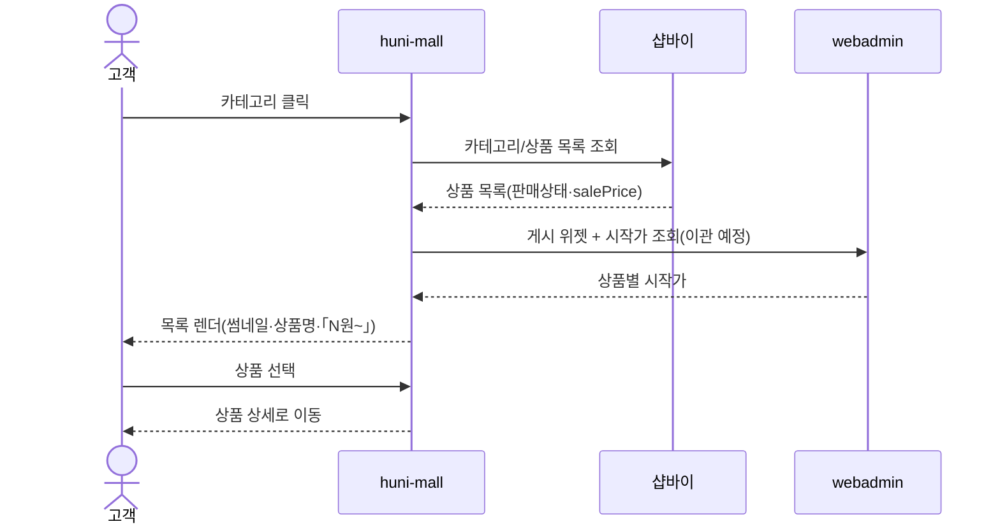
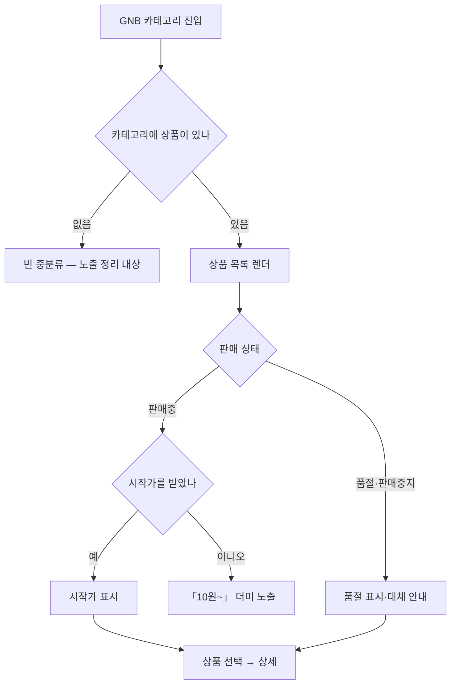

# P01 · 카테고리로 상품 찾기

> t63 프로세스 정리 B — 탐색~결제 · L1 **상품·카탈로그** · L2 카테고리 · 전시

## 1. 한줄정의 · 시작/끝 · 등장인물

**한줄정의** — 손님이 GNB 카테고리를 타고 들어가 상품군 목록에서 살 상품 하나를 고른다.

- **시작**: 손님이 몰 첫 화면 또는 GNB 카테고리를 연다
- **끝**: 상품 상세 페이지로 들어간다(P03 로 이어짐)

| 등장인물 | 무엇인가 |
|---|---|
| 고객 | 몰을 쓰는 손님(회원·비회원) |
| huni-mall | 신규 독립몰(headless · Next.js 15 App Router) |
| 샵바이 | NHN 샵바이 — 회원·장바구니·주문·결제·배송의 커머스 SaaS |
| webadmin | 후니 자체 관리서버(Django) — 상품·옵션·가격·위젯빌더 |

**가로지르는 곳**
- t65 — 상품·가격 등록 운영(STD-ADP)이 이 목록의 원천을 채운다

## 2. 흐름 (sequence)

## 3. 갈림길 (flowchart · 실패·비회원·취소 분기)

## 4. 단계표

| # | 단계 | 시스템 | 담당자 | 원장 row_id | 상태 | 근거 |
|---|---|---|---|---|---|---|
| 1 | 상품 기본정보 세팅·로드(상품코드·주문가능여부·회원전용 노출 게이팅) | 미확인 | 김동학 | `STD-CAT-023` | 작동 | 「미확인」 |
| 2 | 대분류/중분류/소분류 다단 카테고리 트리 노출 | huni-mall | 김동학 | `STD-CAT-001` | 작동 | huni-skin-shopby/src/lib/api/server/catalog.ts:6 catalog.ts comment plus header.tsx:280-288 plus mobile-nav.tsx:118-160 |
| 3 | 카테고리별 상품 리스팅(정렬·페이징) | huni-mall | 김동학 | `STD-CAT-002` | 부분 | huni-skin-shopby/src/lib/api/server/catalog.ts:337-344 plus shop-list.tsx:14-24 |
| 4 | 상품 0개 중분류(스티커 팩 0 등) 노출 정리 | 미확인 | 최숙진 | `STD-CAT-030` | 미착수 | 「미확인」 |
| 5 | 상품군 전용 랜딩(출력/책자/실사/패키지/굿즈) | huni-mall | 김동학 | `STD-CAT-003` | 미착수 | 「미확인」 — 찾지못했다 huni-skin-shopby app main 하위 상품군 전용 랜딩 라우트 grep 0건 |
| 6 | 메인 기획전/배너 영역 | 미확인 | 김동학 | `STD-CAT-021` | 부분 | 「미확인」 |
| 7 | 홈 더미 콘텐츠 정리(BEST 8종 /product/1 404 · 프로모션 ZONE·새소식 영문 문구) | 미확인 | 김동학 | `STD-CAT-027` | 미착수 | 「미확인」 |
| 8 | 품절/판매중지 상품 표시 및 대체 안내 | 미확인 | 김동학 | `STD-CAT-022` | 미착수 | 「미확인」 |
| 9 | 목록 시작가 자동 계산(위젯 기본값) — 오리지널 명함만 수기 입력 | 미확인 | 서희항 | `STD-CAT-039` | 부분 | 「미확인」 |
| 10 | 목록·검색 시작가 「10원~」 표시(샵바이 salePrice 더미) | 미확인 | 김동학 | `STD-CAT-028` | 미착수 | 「미확인」 |
| 11 | 목록·검색 시작가를 webadmin `GET /api/w/v1/catalog`(게시 위젯+시작가) 로 이관 — 「10원~」 더미 대체 개발안 | 미확인 | 김동학+서희항 | `STD-CAT-043` | 미착수 | huni-skin-shopby/src/lib/api/server/catalog.ts (선행 카드 증거 · 실재 확인) |
| 12 | 시작가가 API 로 샵바이에 내려가는데 쇼핑몰에 반영되지 않는 원인 확인 | 미확인 | 서희항·최숙진 | `STD-CAT-040` | 미착수 | 「미확인」 |
| 13 | 판매중 상품 수 3갈래(대시보드 291·상품목록 판매중 297/검색 291·API ONSALE 226) 기준 정리 | 미확인 | 최숙진 | `STD-CAT-041` | 미착수 | 「미확인」 |
| 14 | 포장재 상품군 주문 경로(전용 옵션·주문 흐름) | 미확인 | 김동학 | `STD-CAT-024` | 부분 | _workspace/huni-launch-scope/02_gap/fit-gap-matrix.csv:92 (선행 카드 증거 · 실재 확인) |
| 15 | 굿즈 상품군 주문 경로(파우치·백 포함) | 미확인 | 김동학 | `STD-CAT-025` | 부분 | _workspace/huni-launch-scope/02_gap/fit-gap-matrix.csv:93 · huni-skin-shopby/src/components/home/home-content.ts:120 (선행 카드 증거 · 실재 확인) |
| 16 | 수작 상품 메인·상품페이지 경로 | 미확인 | 김동학 | `STD-CAT-026` | 미착수 | _workspace/huni-launch-scope/02_gap/fit-gap-matrix.csv:94 (선행 카드 증거 · 실재 확인) |
| 17 | 캘린더 4종 1차 오픈 포함 확정 | 미확인 | 최숙진+신우진 | `STD-CAT-031` | 부분 | 「미확인」 |
| 18 | 포토앨범 1차 오픈 제외 — 전달·문의 멘트 통일 | 미확인 | 최숙진 | `STD-CAT-032` | 부분 | 「미확인」 |
| 19 | 카테고리 트리 ↔ webadmin 상품군의 매핑 규약 | huni-mall | 김동학+서희항 | — | **원장 행 없음** | 「미확인」 |

## 5. 빠진 곳

**가 원장에 행 없음** — 1건

| row_id | 내용 | 진단 |
|---|---|---|
| — | 카테고리 트리 ↔ webadmin 상품군의 매핑 규약 | 몰 카테고리와 webadmin 상품군을 무엇으로 잇는지 규약이 원장에 없다 |

**나 행은 있는데 코드 0** — 9건

| row_id | 내용 | 진단 |
|---|---|---|
| `STD-CAT-023` | 상품 기본정보 세팅·로드(상품코드·주문가능여부·회원전용 노출 게이팅) | 코드·명세를 뒤졌으나 구현을 찾지 못했다 |
| `STD-CAT-030` | 상품 0개 중분류(스티커 팩 0 등) 노출 정리 | 코드·명세를 뒤졌으나 구현을 찾지 못했다 |
| `STD-CAT-003` | 상품군 전용 랜딩(출력/책자/실사/패키지/굿즈) | 상품군 전용 랜딩페이지 5종 미구현. 카테고리 목록으로만 진입 가능. |
| `STD-CAT-021` | 메인 기획전/배너 영역 | 코드·명세를 뒤졌으나 구현을 찾지 못했다 |
| `STD-CAT-027` | 홈 더미 콘텐츠 정리(BEST 8종 /product/1 404 · 프로모션 ZONE·새소식 영문 문구) | 코드·명세를 뒤졌으나 구현을 찾지 못했다 |
| `STD-CAT-022` | 품절/판매중지 상품 표시 및 대체 안내 | 코드·명세를 뒤졌으나 구현을 찾지 못했다 |
| `STD-CAT-039` | 목록 시작가 자동 계산(위젯 기본값) — 오리지널 명함만 수기 입력 | 코드·명세를 뒤졌으나 구현을 찾지 못했다 |
| `STD-CAT-028` | 목록·검색 시작가 「10원~」 표시(샵바이 salePrice 더미) | 코드·명세를 뒤졌으나 구현을 찾지 못했다 |
| `STD-CAT-032` | 포토앨범 1차 오픈 제외 — 전달·문의 멘트 통일 | 코드·명세를 뒤졌으나 구현을 찾지 못했다 |

**다 코드는 있는데 연결 안 됨** — 5건

| row_id | 내용 | 진단 |
|---|---|---|
| `STD-CAT-002` | 카테고리별 상품 리스팅(정렬·페이징) | 서버가 shopby 카탈로그를 정렬순으로 내려주고 shop-list.tsx 가 정렬(신상품-리뷰순-인기순)-페이지네이션(PER=8)을 클라이언트에서 처리. 부분=정렬 옵션이 3종뿐. |
| `STD-CAT-043` | 목록·검색 시작가를 webadmin `GET /api/w/v1/catalog`(게시 위젯+시작가) 로 이관 — 「10원~」 더미 대체 개발안 | 코드는 있는데 원장 상태가 「미착수」다 |
| `STD-CAT-024` | 포장재 상품군 주문 경로(전용 옵션·주문 흐름) | 코드는 있는데 원장 상태가 「부분」다 |
| `STD-CAT-025` | 굿즈 상품군 주문 경로(파우치·백 포함) | 코드는 있는데 원장 상태가 「부분」다 |
| `STD-CAT-026` | 수작 상품 메인·상품페이지 경로 | 코드는 있는데 원장 상태가 「미착수」다 |

**라 결정 미정** — 3건

| row_id | 내용 | 진단 |
|---|---|---|
| `STD-CAT-040` | 시작가가 API 로 샵바이에 내려가는데 쇼핑몰에 반영되지 않는 원인 확인 | 사람이 정해야 끝나는 안건 — 코드가 없는 것이 결함이 아니다 |
| `STD-CAT-041` | 판매중 상품 수 3갈래(대시보드 291·상품목록 판매중 297/검색 291·API ONSALE 226) 기준 정리 | 사람이 정해야 끝나는 안건 — 코드가 없는 것이 결함이 아니다 |
| `STD-CAT-031` | 캘린더 4종 1차 오픈 포함 확정 | 사람이 정해야 끝나는 안건 — 코드가 없는 것이 결함이 아니다 |

## 6. 채우는 방법

| 누가 | 무엇을 | 선행 |
|---|---|---|
| 김동학+서희항 | 카테고리 트리 ↔ webadmin 상품군의 매핑 규약 | 원장 735행에 행을 새로 섞지 않는다 — 이 제안으로만 남긴다 |
| 김동학 | 상품 기본정보 세팅·로드(상품코드·주문가능여부·회원전용 노출 게이팅) | 코드·명세를 뒤졌으나 구현을 찾지 못했다 |
| 김동학 | 카테고리별 상품 리스팅(정렬·페이징) | 코드는 있는데 원장 상태가 「부분」다 |
| 최숙진 | 상품 0개 중분류(스티커 팩 0 등) 노출 정리 | 코드·명세를 뒤졌으나 구현을 찾지 못했다 |
| 김동학 | 상품군 전용 랜딩(출력/책자/실사/패키지/굿즈) | 코드·명세를 뒤졌으나 구현을 찾지 못했다 |
| 김동학 | 메인 기획전/배너 영역 | 코드·명세를 뒤졌으나 구현을 찾지 못했다 |
| 김동학 | 홈 더미 콘텐츠 정리(BEST 8종 /product/1 404 · 프로모션 ZONE·새소식 영문 문구) | 코드·명세를 뒤졌으나 구현을 찾지 못했다 |
| 김동학 | 품절/판매중지 상품 표시 및 대체 안내 | 코드·명세를 뒤졌으나 구현을 찾지 못했다 |
| 서희항 | 목록 시작가 자동 계산(위젯 기본값) — 오리지널 명함만 수기 입력 | 코드·명세를 뒤졌으나 구현을 찾지 못했다 |
| 김동학 | 목록·검색 시작가 「10원~」 표시(샵바이 salePrice 더미) | 코드·명세를 뒤졌으나 구현을 찾지 못했다 |
| 김동학+서희항 | 목록·검색 시작가를 webadmin `GET /api/w/v1/catalog`(게시 위젯+시작가) 로 이관 — 「10원~」 더미 대체 개발안 | 코드는 있는데 원장 상태가 「미착수」다 |
| 서희항·최숙진 | 시작가가 API 로 샵바이에 내려가는데 쇼핑몰에 반영되지 않는 원인 확인 | 사람이 정해야 끝나는 안건 — 코드가 없는 것이 결함이 아니다 |
| 최숙진 | 판매중 상품 수 3갈래(대시보드 291·상품목록 판매중 297/검색 291·API ONSALE 226) 기준 정리 | 사람이 정해야 끝나는 안건 — 코드가 없는 것이 결함이 아니다 |
| 김동학 | 포장재 상품군 주문 경로(전용 옵션·주문 흐름) | 코드는 있는데 원장 상태가 「부분」다 |
| 김동학 | 굿즈 상품군 주문 경로(파우치·백 포함) | 코드는 있는데 원장 상태가 「부분」다 |
| 김동학 | 수작 상품 메인·상품페이지 경로 | 코드는 있는데 원장 상태가 「미착수」다 |
| 최숙진+신우진 | 캘린더 4종 1차 오픈 포함 확정 | 사람이 정해야 끝나는 안건 — 코드가 없는 것이 결함이 아니다 |
| 최숙진 | 포토앨범 1차 오픈 제외 — 전달·문의 멘트 통일 | 코드·명세를 뒤졌으나 구현을 찾지 못했다 |

## 7. 확인 못 한 것

판매중 상품 수가 대시보드 291 / 상품목록 297 / API ONSALE 226 으로 갈린다는 선행 관측(STD-CAT-041)을 이 카드에서 재실측하지 않았다 — 분모 확정 전이다.

---
> 이 문서의 상태·근거는 원장 `08_system-screen/t56/rejudge.csv` 와 이 카드의 증거 수집본에서 기계로 채웠다. 「미확인」은 코드·원장·명세를 뒤졌으나 **찾지 못했다**는 뜻이지, 없다는 뜻이 아니다.
