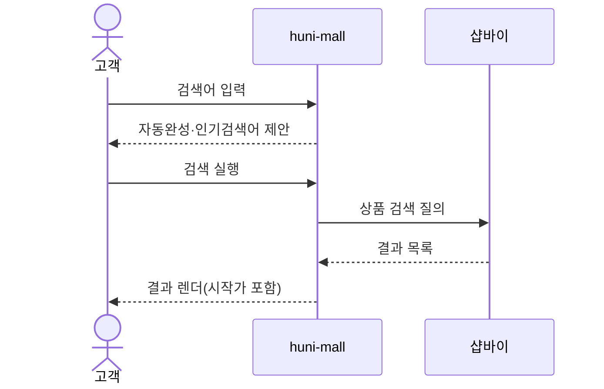
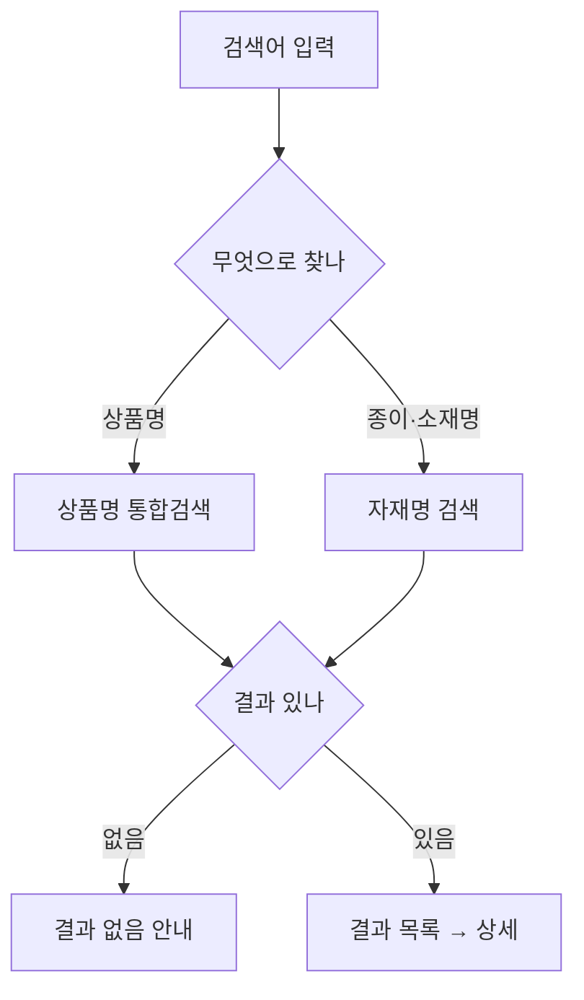

# P02 · 검색으로 상품 찾기

> t63 프로세스 정리 B — 탐색~결제 · L1 **상품·카탈로그** · L2 검색

## 1. 한줄정의 · 시작/끝 · 등장인물

**한줄정의** — 손님이 검색창에 상품명이나 종이 이름을 넣어 상품을 찾는다.

- **시작**: 손님이 검색창에 낱말을 넣는다
- **끝**: 검색 결과에서 상품을 골라 상세로 들어간다

| 등장인물 | 무엇인가 |
|---|---|
| 고객 | 몰을 쓰는 손님(회원·비회원) |
| huni-mall | 신규 독립몰(headless · Next.js 15 App Router) |
| 샵바이 | NHN 샵바이 — 회원·장바구니·주문·결제·배송의 커머스 SaaS |

**가로지르는 곳**
- P01 — 목록 시작가 표시(STD-CAT-028)는 검색 결과에도 그대로 걸린다

## 2. 흐름 (sequence)

## 3. 갈림길 (flowchart · 실패·비회원·취소 분기)

## 4. 단계표

| # | 단계 | 시스템 | 담당자 | 원장 row_id | 상태 | 근거 |
|---|---|---|---|---|---|---|
| 1 | 검색어 자동완성·인기검색어 | huni-mall | 김동학 | `STD-CAT-006` | 부분 | huni-skin-shopby/src/app/(main)/search/page.tsx:1-6 plus use-search.ts:1-16 |
| 2 | 상품명 통합검색 | huni-mall | 김동학 | `STD-CAT-004` | 작동 | huni-skin-shopby/src/app/(main)/search/page.tsx:1-14 plus catalog.ts:181-182 |
| 3 | 종이/소재명 기준 검색(아트지·스노우지 등) | huni-mall | 김동학 | `STD-CAT-005` | 미착수 | 「미확인」 — 찾지못했다 소재 필터 관련 코드 없음 |
| 4 | 검색 결과 0건 안내 화면 | huni-mall | 김동학 | — | **원장 행 없음** | 「미확인」 |

## 5. 빠진 곳

**가 원장에 행 없음** — 1건

| row_id | 내용 | 진단 |
|---|---|---|
| — | 검색 결과 0건 안내 화면 | 결과 없음일 때 무엇을 보여 주는지 원장에 행이 없다 |

**나 행은 있는데 코드 0** — 1건

| row_id | 내용 | 진단 |
|---|---|---|
| `STD-CAT-005` | 종이/소재명 기준 검색(아트지·스노우지 등) | 검색은 상품명 키워드 매칭뿐. 예시 `test` 백틱. |

**다 코드는 있는데 연결 안 됨** — 1건

| row_id | 내용 | 진단 |
|---|---|---|
| `STD-CAT-006` | 검색어 자동완성·인기검색어 | 인기검색어는 shop API GET /products/favoriteKeywords 로 구현(usePopularKeywords). 자동완성은 grep 0건 - 부분 구현. |

## 6. 채우는 방법

| 누가 | 무엇을 | 선행 |
|---|---|---|
| 김동학 | 검색 결과 0건 안내 화면 | 원장 735행에 행을 새로 섞지 않는다 — 이 제안으로만 남긴다 |
| 김동학 | 검색어 자동완성·인기검색어 | 코드는 있는데 원장 상태가 「부분」다 |
| 김동학 | 종이/소재명 기준 검색(아트지·스노우지 등) | 코드·명세를 뒤졌으나 구현을 찾지 못했다 |

## 7. 확인 못 한 것

검색 색인이 샵바이 쪽인지 몰 쪽인지 이 카드에서 실화면으로 확인하지 않았다.

---
> 이 문서의 상태·근거는 원장 `08_system-screen/t56/rejudge.csv` 와 이 카드의 증거 수집본에서 기계로 채웠다. 「미확인」은 코드·원장·명세를 뒤졌으나 **찾지 못했다**는 뜻이지, 없다는 뜻이 아니다.
