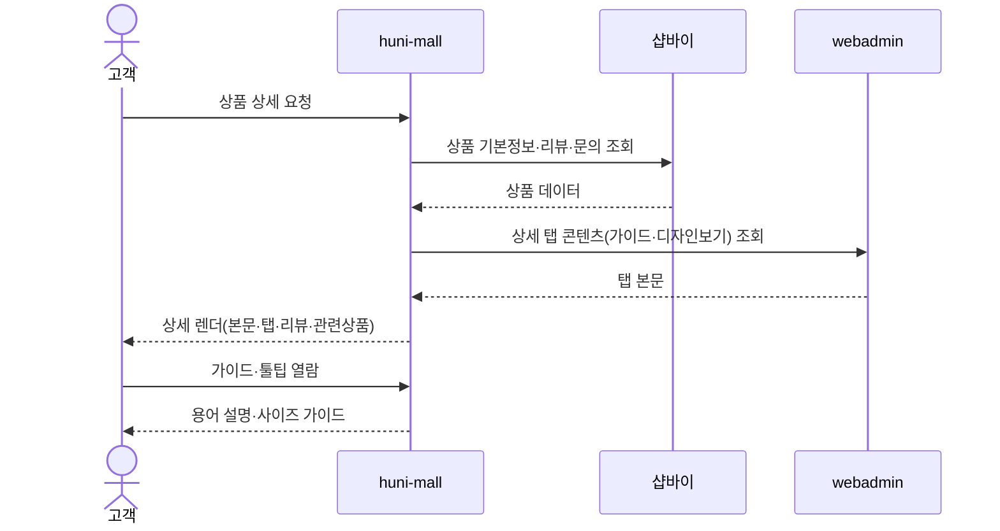
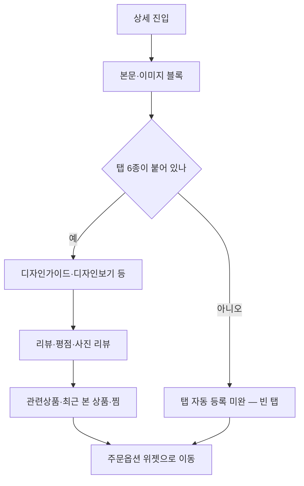

# P03 · 상품 상세 읽고 판단하기

> t63 프로세스 정리 B — 탐색~결제 · L1 **상품·카탈로그** · L2 상품상세 · 콘텐츠

## 1. 한줄정의 · 시작/끝 · 등장인물

**한줄정의** — 손님이 상품 상세에서 사양·가이드·리뷰를 읽고 이 상품이 맞는지 판단한다.

- **시작**: 상품 상세 페이지가 열린다
- **끝**: 주문옵션 위젯에서 사양을 고르기 시작한다(P05 로 이어짐)

| 등장인물 | 무엇인가 |
|---|---|
| 고객 | 몰을 쓰는 손님(회원·비회원) |
| huni-mall | 신규 독립몰(headless · Next.js 15 App Router) |
| 샵바이 | NHN 샵바이 — 회원·장바구니·주문·결제·배송의 커머스 SaaS |
| webadmin | 후니 자체 관리서버(Django) — 상품·옵션·가격·위젯빌더 |

**가로지르는 곳**
- t65 — 상품 Q&A·리뷰의 운영자 응대(STD-CLM)는 t65
- P12 — 템플릿/샘플 다운로드(STD-CAT-020)는 에디터 템플릿과 같은 자산을 본다

## 2. 흐름 (sequence)

## 3. 갈림길 (flowchart · 실패·비회원·취소 분기)

## 4. 단계표

| # | 단계 | 시스템 | 담당자 | 원장 row_id | 상태 | 근거 |
|---|---|---|---|---|---|---|
| 1 | 상품 상세페이지 본문(이미지·설명 블록) | huni-mall | 김동학+최숙진 | `STD-CAT-007` | 부분 | huni-skin-shopby/src/components/product/product-sections.tsx:1-15 |
| 2 | 상세페이지 탭 6종 자동 등록(디자인가이드·디자인보기 포함) | huni-mall | 김동학+서희항+최숙진 | `STD-CAT-034` | 부분 | huni-skin-shopby/src/lib/printly/detail-tabs.ts:18-31 |
| 3 | 메뉴 슬러그형 목업 상세(/product/calendar 등) 잔존 — 「(44 Reviews)」·더미 옵션 | huni-mall | 김동학 | `STD-CAT-029` | 미착수 | huni-skin-shopby/src/components/product/configurators/print-configurator.tsx:379 |
| 4 | 레거시 mock 훅 제거 — legacy-data 참조 17파일(configurator 11종·홈 뉴스/프로모·포인트 모달) | huni-mall | 김동학 | `STD-CAT-042` | 미착수 | huni-skin-shopby/src/lib/legacy-data/index.ts:1 |
| 5 | 동일 계열 상품 분기 안내(일반명함/고급지명함/부분UV명함 등) | huni-mall | 김동학 | `STD-CAT-008` | 미착수 | 「미확인」 — 찾지못했다 계열 분기 안내 UI grep 0건 - MENU_PRODUCTS 는 메뉴 슬러그 분기일 뿐 |
| 6 | 재단사이즈 vs 작업사이즈 설명 가이드 | huni-mall | 김동학 | `STD-CAT-010` | 작동 | huni-skin-shopby/src/lib/guide-data.ts:87 |
| 7 | 후가공 용어 설명 툴팁(도무송·오시·형압·귀돌이) | huni-mall | 김동학+최숙진 | `STD-CAT-009` | 미착수 | huni-skin-shopby/src/lib/guide-data.ts:178-184 |
| 8 | 상품별 제작 소요일/출고 기준 안내 | huni-mall | 김동학+서희항 | `STD-CAT-011` | 미착수 | huni-skin-shopby/src/components/product/product-sections.tsx:151 |
| 9 | 재작업 불가 사항 고지(폰트 아웃라인 등) | huni-mall | 김동학+최숙진 | `STD-CAT-012` | 부분 | huni-skin-shopby/src/lib/guide-data.ts:100 |
| 10 | 인쇄 가이드 콘텐츠(11종) | huni-mall | 최숙진+김동학 | `STD-CAT-019` | 부분 | huni-skin-shopby/src/lib/guide-data.ts:158-206 |
| 11 | 템플릿/샘플 다운로드 제공 | huni-mall | 미정 | `STD-CAT-020` | 미실측 | 「미확인」 — 찾지못했다 guide-data.ts 전체에서 실제 파일 다운로드 링크-템플릿/샘플 파일 경로 grep 0건 - 템플릿 불러오기와 저장(204행)은 편집기 사용법 가이드 제목일 뿐 다운로드 기능 아님 |
| 12 | 상품 리뷰 목록·평점 노출 | huni-mall | 김동학+최숙진 | `STD-CAT-014` | 작동 | huni-skin-shopby/src/components/product/product-sections-interactive.tsx:247-248 |
| 13 | 사진 리뷰 갤러리 | huni-mall | 김동학 | `STD-CAT-015` | 부분 | huni-skin-shopby/src/lib/api/hooks/use-product-reviews.ts:16-34 |
| 14 | 상품 Q&A 게시 | huni-mall + shopby | 김동학 | `STD-CAT-013` | 미착수 | 「미확인」 — 찾지못했다 huni-skin-shopby app main 하위 inquiry-qna 문의 라우트 grep 0건. docs shopby-api product-shop-public.yml products/inquiries 및 display-shop-public.yml ProductInquiry 태그(3180-3360행)에 명세는 존재 |
| 15 | 관련상품/함께 주문한 상품 추천 | huni-mall + shopby | 김동학 | `STD-CAT-016` | 미착수 | print-quote/04_design/ia.md (선행 카드 증거 · 실재 확인) |
| 16 | 최근 본 상품 | huni-mall + shopby | 김동학 | `STD-CAT-017` | 미착수 | print-quote/04_design/ia.md (선행 카드 증거 · 실재 확인) |
| 17 | 찜/관심상품 | huni-mall + shopby | 김동학 | `STD-CAT-018` | 미착수 | print-kb/wiki/policy/mypage.md (선행 카드 증거 · 실재 확인) |
| 18 | 상세 → 주문옵션 위젯으로 넘어가는 진입 지점(CTA) | huni-mall | 김동학 | — | **원장 행 없음** | 「미확인」 |

## 5. 빠진 곳

**가 원장에 행 없음** — 1건

| row_id | 내용 | 진단 |
|---|---|---|
| — | 상세 → 주문옵션 위젯으로 넘어가는 진입 지점(CTA) | 상세를 읽은 손님이 위젯으로 들어가는 자리가 원장에 행으로 없다 |

**나 행은 있는데 코드 0** — 2건

| row_id | 내용 | 진단 |
|---|---|---|
| `STD-CAT-008` | 동일 계열 상품 분기 안내(일반명함/고급지명함/부분UV명함 등) | 일반명함/고급지명함/부분UV명함처럼 같은 계열 상품 간 분기를 안내하는 UI 없음. |
| `STD-CAT-013` | 상품 Q&A 게시 | Shopby API 스펙(전체/상품별 문의 목록 조회)은 있으나 huni-mall 코드에 이를 호출-렌더하는 라우트나 컴포넌트가 없음. |

**다 코드는 있는데 연결 안 됨** — 12건

| row_id | 내용 | 진단 |
|---|---|---|
| `STD-CAT-007` | 상품 상세페이지 본문(이미지·설명 블록) | shopby 상품상세(v3) 조회 + vibe-canvas 발행 탭 우선 |
| `STD-CAT-034` | 상세페이지 탭 6종 자동 등록(디자인가이드·디자인보기 포함) | vibe-canvas 발행 탭(차별점-디자인보기-디자인가이드-유의사항 4종) + 정적 고정 탭(product-sections.tsx 폴백)으로 상세페이지 탭이 자동 매칭-등록됨. 6종은 발행 4종+정적 2종 합산으로 추정. |
| `STD-CAT-029` | 메뉴 슬러그형 목업 상세(/product/calendar 등) 잔존 — 「(44 Reviews)」·더미 옵션 | 메뉴 슬러그형(예 /product/calendar) 목업 상세 10개 컨피규레이터 전부에 (44 Reviews) 하드코딩 더미 문구가 잔존. |
| `STD-CAT-042` | 레거시 mock 훅 제거 — legacy-data 참조 17파일(configurator 11종·홈 뉴스/프로모·포인트 모달) | home/news.tsx |
| `STD-CAT-009` | 후가공 용어 설명 툴팁(도무송·오시·형압·귀돌이) | 인쇄가이드 후가공 섹션에 도무송-형압-귀도리-오시-박(포일) 항목이 정적 목록(스텁)으로만 존재. 상품 상세 화면 내 인라인 툴팁은 아니고 별도 가이드 페이지 목록 - 스텁 상태. |
| `STD-CAT-011` | 상품별 제작 소요일/출고 기준 안내 | 208 |
| `STD-CAT-012` | 재작업 불가 사항 고지(폰트 아웃라인 등) | 105 |
| `STD-CAT-019` | 인쇄 가이드 콘텐츠(11종) | 파일작업-책자-인쇄와종이-후가공-주문-편집기 6개 카테고리 각 12개씩 인쇄가이드 항목 등록(원장 표기 11종). stub() 헬퍼로 본문은 이 가이드는 준비중입니다 로 대부분 스텁. |
| `STD-CAT-015` | 사진 리뷰 갤러리 | 리뷰 아이템에 fileUrls(사진) 필드가 있어 목록에 사진이 섞여 나오나 사진만 모아 보는 전용 갤러리 뷰-필터는 grep 상 확인 안 됨 - 부분(목록 내 포함만). |
| `STD-CAT-016` | 관련상품/함께 주문한 상품 추천 | 10455 relatedProductNos 필드는 스펙상 존재 |
| `STD-CAT-017` | 최근 본 상품 | 4635(profile/recent-products) 스펙 존재 |
| `STD-CAT-018` | 찜/관심상품 | 찜 기능은 주석상 별도 있음으로 언급되나 실제 like-products 를 호출하는 코드-화면(버튼-목록)은 grep 0건 - 미구현으로 판단. |

**라 결정 미정** — 1건

| row_id | 내용 | 진단 |
|---|---|---|
| `STD-CAT-020` | 템플릿/샘플 다운로드 제공 | 템플릿/샘플 다운로드 제공 기능 코드 없음. 가이드 항목 제목만 존재. |

## 6. 채우는 방법

| 누가 | 무엇을 | 선행 |
|---|---|---|
| 김동학 | 상세 → 주문옵션 위젯으로 넘어가는 진입 지점(CTA) | 원장 735행에 행을 새로 섞지 않는다 — 이 제안으로만 남긴다 |
| 김동학+최숙진 | 상품 상세페이지 본문(이미지·설명 블록) | 코드는 있는데 원장 상태가 「부분」다 |
| 김동학+서희항+최숙진 | 상세페이지 탭 6종 자동 등록(디자인가이드·디자인보기 포함) | 코드는 있는데 원장 상태가 「부분」다 |
| 김동학 | 메뉴 슬러그형 목업 상세(/product/calendar 등) 잔존 — 「(44 Reviews)」·더미 옵션 | 코드는 있는데 원장 상태가 「미착수」다 |
| 김동학 | 레거시 mock 훅 제거 — legacy-data 참조 17파일(configurator 11종·홈 뉴스/프로모·포인트 모달) | 코드는 있는데 원장 상태가 「미착수」다 |
| 김동학 | 동일 계열 상품 분기 안내(일반명함/고급지명함/부분UV명함 등) | 코드·명세를 뒤졌으나 구현을 찾지 못했다 |
| 김동학+최숙진 | 후가공 용어 설명 툴팁(도무송·오시·형압·귀돌이) | 코드는 있는데 원장 상태가 「미착수」다 |
| 김동학+서희항 | 상품별 제작 소요일/출고 기준 안내 | 코드는 있는데 원장 상태가 「미착수」다 |
| 김동학+최숙진 | 재작업 불가 사항 고지(폰트 아웃라인 등) | 코드는 있는데 원장 상태가 「부분」다 |
| 최숙진+김동학 | 인쇄 가이드 콘텐츠(11종) | 코드는 있는데 원장 상태가 「부분」다 |
| 미정 | 템플릿/샘플 다운로드 제공 | 사람이 정해야 끝나는 안건 — 코드가 없는 것이 결함이 아니다 |
| 김동학 | 사진 리뷰 갤러리 | 코드는 있는데 원장 상태가 「부분」다 |
| 김동학 | 상품 Q&A 게시 | 코드·명세를 뒤졌으나 구현을 찾지 못했다 |
| 김동학 | 관련상품/함께 주문한 상품 추천 | 코드는 있는데 원장 상태가 「미착수」다 |
| 김동학 | 최근 본 상품 | 코드는 있는데 원장 상태가 「미착수」다 |
| 김동학 | 찜/관심상품 | 코드는 있는데 원장 상태가 「미착수」다 |

## 7. 확인 못 한 것

상세 탭 본문이 pagebuilder 산출인지 샵바이 상세HTML 인지 행마다 갈리는데, 행 단위로 확정하지 않았다.

---
> 이 문서의 상태·근거는 원장 `08_system-screen/t56/rejudge.csv` 와 이 카드의 증거 수집본에서 기계로 채웠다. 「미확인」은 코드·원장·명세를 뒤졌으나 **찾지 못했다**는 뜻이지, 없다는 뜻이 아니다.
