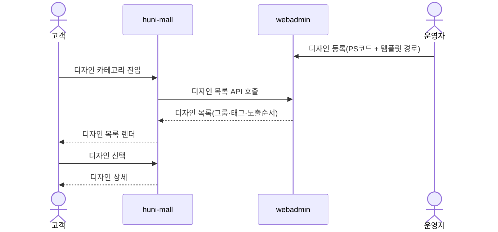
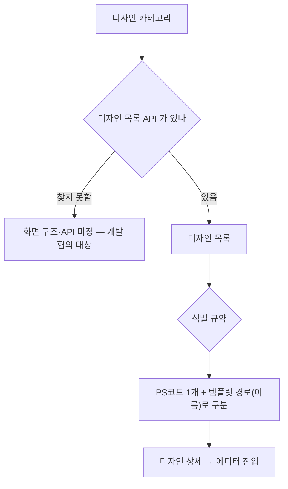

# P04 · 디자인 상품 고르기

> t63 프로세스 정리 B — 탐색~결제 · L1 **상품·카탈로그** · L2 상품상세(디자인 상품)

## 1. 한줄정의 · 시작/끝 · 등장인물

**한줄정의** — 손님이 카테고리 → 디자인 목록 → 디자인 상세로 들어가 이미 만들어진 디자인을 고른다.

- **시작**: 디자인 상품 카테고리에 들어간다
- **끝**: 고른 디자인으로 에디터/주문 경로에 올라탄다(P12 로 이어짐)

| 등장인물 | 무엇인가 |
|---|---|
| 고객 | 몰을 쓰는 손님(회원·비회원) |
| huni-mall | 신규 독립몰(headless · Next.js 15 App Router) |
| webadmin | 후니 자체 관리서버(Django) — 상품·옵션·가격·위젯빌더 |
| 운영자 | 후니 실무진(CS·상품·생산) |

**가로지르는 곳**
- P12 — 고른 디자인은 에디터 템플릿으로 이어진다
- t65 — 디자인 등록·그룹핑 운영(STD-ADP)은 t65

## 2. 흐름 (sequence)

## 3. 갈림길 (flowchart · 실패·비회원·취소 분기)

## 4. 단계표

| # | 단계 | 시스템 | 담당자 | 원장 row_id | 상태 | 근거 |
|---|---|---|---|---|---|---|
| 1 | 디자인 상품 화면 구조 — 카테고리 → 디자인 목록 → 상세 페이지 | huni-mall | 서희항 | `STD-CAT-033` | 미착수 | 「미확인」 — 찾지못했다 huni-skin-shopby 에 카테고리에서 디자인목록으로 상세로 이어지는 3단 전용 라우트 grep 0건 - design-calendar-configurator.tsx 는 기존 상품상세 내 옵션 패널일 뿐 별도 디자인 목록 페이지 아님 |
| 2 | 디자인 식별 규약 — PS코드 1개 + 템플릿 경로(이름) 구분·정사각형 공용 템플릿 | webadmin | 서희항 | `STD-CAT-035` | 미착수 | raw/webadmin/webadmin/catalog/designs.py:8-10 |
| 3 | 디자인 목록 API — webadmin 등록분을 신규몰이 불러오는 연동 | webadmin | 서희항 | `STD-CAT-036` | 미착수 | raw/webadmin/webadmin/config/urls.py:288 |
| 4 | 디자인 그룹핑 기준(태그·그룹·복수 그룹 등록·노출 순서) | webadmin | 최숙진 | `STD-CAT-037` | 미착수 | raw/webadmin/webadmin/catalog/designs.py:235-236 |
| 5 | 디자인 목록용 API·어드민 기능 개발자 협의 | webadmin | 신우진 | `STD-CAT-038` | 미착수 | 「미확인」 — 찾지못했다 디자인 목록용 API-어드민 기능에 대한 개발자 협의 자체는 코드/명세 대상이 아닌 프로세스 항목 - raw/webadmin 및 docs/shopby 어디에도 협의 회의록-TODO 주석 형태의 근거 없음 |

## 5. 빠진 곳

**나 행은 있는데 코드 0** — 1건

| row_id | 내용 | 진단 |
|---|---|---|
| `STD-CAT-033` | 디자인 상품 화면 구조 — 카테고리 → 디자인 목록 → 상세 페이지 | 디자인 상품(에디터 전용)의 화면 구조가 3단계로 분리된 코드는 없음. webadmin api_designs는 prd_cd 단위 디자인 목록 API만 제공. |

**다 코드는 있는데 연결 안 됨** — 3건

| row_id | 내용 | 진단 |
|---|---|---|
| `STD-CAT-035` | 디자인 식별 규약 — PS코드 1개 + 템플릿 경로(이름) 구분·정사각형 공용 템플릿 | 20-30 |
| `STD-CAT-036` | 디자인 목록 API — webadmin 등록분을 신규몰이 불러오는 연동 | GET /api/w/v1/designs 엔드포인트(api_designs)가 site_key+prd_cd 로 디자인 목록(designs.api_payload)을 반환. huni-mall 쪽에서 이 엔드포인트를 호출하는 코드는 grep 0건 - API는 있으나 신규몰 소비 코드 미확인. |
| `STD-CAT-037` | 디자인 그룹핑 기준(태그·그룹·복수 그룹 등록·노출 순서) | 251 |

**라 결정 미정** — 1건

| row_id | 내용 | 진단 |
|---|---|---|
| `STD-CAT-038` | 디자인 목록용 API·어드민 기능 개발자 협의 | STD-CAT-036과 037이 이미 구현돼 있어 API 자체는 존재하나 개발자 협의라는 행위 자체를 코드로 증명할 수 없음. |

## 6. 채우는 방법

| 누가 | 무엇을 | 선행 |
|---|---|---|
| 서희항 | 디자인 상품 화면 구조 — 카테고리 → 디자인 목록 → 상세 페이지 | 코드·명세를 뒤졌으나 구현을 찾지 못했다 |
| 서희항 | 디자인 식별 규약 — PS코드 1개 + 템플릿 경로(이름) 구분·정사각형 공용 템플릿 | 코드는 있는데 원장 상태가 「미착수」다 |
| 서희항 | 디자인 목록 API — webadmin 등록분을 신규몰이 불러오는 연동 | 코드는 있는데 원장 상태가 「미착수」다 |
| 최숙진 | 디자인 그룹핑 기준(태그·그룹·복수 그룹 등록·노출 순서) | 코드는 있는데 원장 상태가 「미착수」다 |
| 신우진 | 디자인 목록용 API·어드민 기능 개발자 협의 | 사람이 정해야 끝나는 안건 — 코드가 없는 것이 결함이 아니다 |

## 7. 확인 못 한 것

디자인 목록 API 는 「개발자 협의」 단계라 계약(요청·응답 필드)이 아직 없다.

---
> 이 문서의 상태·근거는 원장 `08_system-screen/t56/rejudge.csv` 와 이 카드의 증거 수집본에서 기계로 채웠다. 「미확인」은 코드·원장·명세를 뒤졌으나 **찾지 못했다**는 뜻이지, 없다는 뜻이 아니다.
