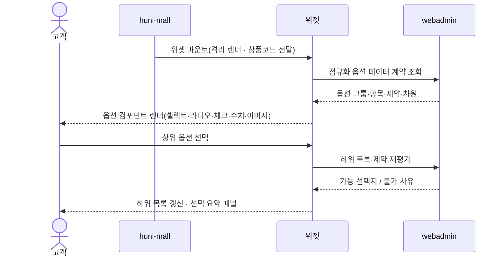
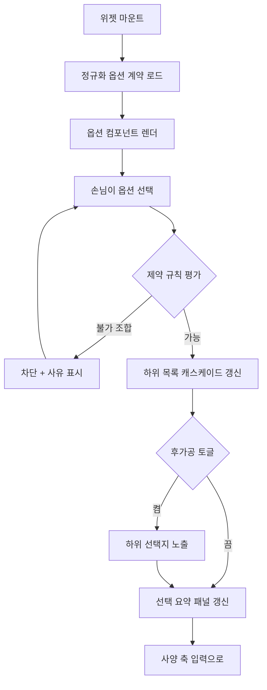

# P05 · 옵션 위젯 띄우고 고르기

> t63 프로세스 정리 B — 탐색~결제 · L1 **옵션·견적** · L2 옵션위젯 · 제약

## 1. 한줄정의 · 시작/끝 · 등장인물

**한줄정의** — 상품 상세에 위젯이 마운트되고, 손님이 옵션을 고를 때마다 하위 선택지와 불가 조합이 갱신된다.

- **시작**: 상품 상세에서 주문옵션 위젯이 마운트된다
- **끝**: 손님이 고를 수 있는 사양 축이 모두 열린다(P06·P07 로 이어짐)

| 등장인물 | 무엇인가 |
|---|---|
| 고객 | 몰을 쓰는 손님(회원·비회원) |
| huni-mall | 신규 독립몰(headless · Next.js 15 App Router) |
| 위젯 | 상품 상세에 마운트되는 인쇄 주문옵션·견적 위젯 |
| webadmin | 후니 자체 관리서버(Django) — 상품·옵션·가격·위젯빌더 |

**가로지르는 곳**
- P14 — 확정 사양의 주문항목 변환(STD-ORD-028)이 이 위젯의 출력을 받는다
- t65 — 제약규칙 등록·관리(webadmin 폼빌더)는 운영 쪽

## 2. 흐름 (sequence)

## 3. 갈림길 (flowchart · 실패·비회원·취소 분기)

## 4. 단계표

| # | 단계 | 시스템 | 담당자 | 원장 row_id | 상태 | 근거 |
|---|---|---|---|---|---|---|
| 1 | 상품 상세 내 주문옵션 위젯 마운트(격리 렌더) | widget | 서희항 | `STD-OPT-001` | 작동 | raw/webadmin/webadmin/catalog/static/catalog/widget.js:136 · raw/webadmin/webadmin/catalog/static/catalog/widget.js:1032 · huni-skin-shopby/src/components/product/huni-widget.tsx:304-313 |
| 2 | 정규화 옵션 데이터 계약 기반 위젯 구동 | widget | 서희항 | `STD-OPT-002` | 작동 | raw/webadmin/webadmin/catalog/static/catalog/widget.js:145 · raw/webadmin/webadmin/catalog/widget_api.py:1172 |
| 3 | 옵션 컴포넌트 타입 다형 렌더(셀렉트·라디오·체크·수치입력·이미지선택) | widget | 서희항 | `STD-OPT-003` | 작동 | raw/webadmin/webadmin/catalog/static/catalog/widget_renderer.js:5019 · raw/webadmin/webadmin/catalog/static/catalog/widget_renderer.js:5159 · raw/webadmin/webadmin/catalog/static/catalog/widget_renderer.js:5182 · raw/webadmin/webadmin/catalog/static/catalog/widget_renderer.js:2454-2493 · raw/webadmin/webadmin/catalog/static/catalog/widget_renderer.js:789-841 |
| 4 | 옵션 그룹 접기/펼치기·진행 스텝 표시 | widget | 서희항 | `STD-OPT-006` | 부분 | raw/webadmin/webadmin/catalog/static/catalog/widget_renderer.js:5289-5307 |
| 5 | 옵션 선택 캐스케이드(상위 선택이 하위 목록 갱신) | widget | 서희항 | `STD-OPT-004` | 부분 | raw/webadmin/webadmin/catalog/static/catalog/widget_renderer.js:2918-2934 · raw/webadmin/webadmin/catalog/static/catalog/widget_renderer.js:690-760 |
| 6 | 토글형 후가공 섹션(켜야 하위 선택지 노출) | widget | 서희항 | `STD-OPT-005` | 부분 | raw/webadmin/webadmin/catalog/static/catalog/widget_renderer.js:5491-5646 |
| 7 | 옵션 조합 제약 규칙 평가(불가 조합 차단·사유 표시) | webadmin | 서희항 | `STD-OPT-037` | 부분 | raw/webadmin/webadmin/catalog/models.py:814-829 · raw/webadmin/webadmin/catalog/widget_api.py:3370-3409 · raw/webadmin/webadmin/catalog/widget_api.py:4389-4392 · raw/webadmin/webadmin/catalog/static/catalog/widget.js:924-939 · raw/webadmin/webadmin/catalog/static/catalog/constraint_engine.js:1-54 |
| 8 | 자재→가능 인쇄방식 게이팅 | webadmin | 서희항 | `STD-OPT-038` | 부분 | raw/webadmin/webadmin/catalog/models.py:814-829 · raw/webadmin/webadmin/catalog/static/catalog/widget_renderer.js:4066-4067 |
| 9 | 공정 택일 그룹(상호배타) 처리 | webadmin | 서희항 | `STD-OPT-039` | 부분 | raw/webadmin/webadmin/catalog/static/catalog/widget_renderer.js:4029-4131 |
| 10 | 필수 동반 옵션 강제(예 인쇄없음 시 후가공 필수) | webadmin | 서희항 | `STD-OPT-040` | 부분 | raw/webadmin/webadmin/catalog/static/catalog/widget_renderer.js:4100-4101 |
| 11 | 수량 최소/최대/증분 검증 | widget | 서희항 | `STD-OPT-041` | 작동 | raw/webadmin/webadmin/catalog/static/catalog/widget_renderer.js:2804-2901 · raw/webadmin/webadmin/catalog/models.py:539-541 |
| 12 | 사이즈 범위·비율 검증(매트릭스 밖 사이즈 차단) | widget | 서희항 | `STD-OPT-042` | 부분 | raw/webadmin/webadmin/catalog/static/catalog/widget_renderer.js:3921-3930 · raw/webadmin/webadmin/catalog/models.py:555-560 |
| 13 | 선택 요약 패널(현재 사양 한눈에) | widget | 서희항 | `STD-OPT-007` | 작동 | raw/webadmin/webadmin/catalog/static/catalog/widget_renderer.js:7867-7900 |

## 5. 빠진 곳

**다 코드는 있는데 연결 안 됨** — 8건

| row_id | 내용 | 진단 |
|---|---|---|
| `STD-OPT-006` | 옵션 그룹 접기/펼치기·진행 스텝 표시 | pv-panel/data-fold로 옵션그룹 접기·펼치기는 구현되어 있으나 진행 스텝 표시 UI는 코드에서 찾지 못했다. |
| `STD-OPT-004` | 옵션 선택 캐스케이드(상위 선택이 하위 목록 갱신) | disallowedFor·memberDimOpts가 상위 선택에 따라 하위 후보를 필터링하는 캐스케이드 로직을 구현(클라이언트 필터 방식). |
| `STD-OPT-005` | 토글형 후가공 섹션(켜야 하위 선택지 노출) | dtlBlocks가 선택(toggle-on)된 공정(chosen)에 한해서만 상세옵션 하위 블록을 렌더한다. |
| `STD-OPT-037` | 옵션 조합 제약 규칙 평가(불가 조합 차단·사유 표시) | TPrdProductConstraints(JSONLogic)를 서버 /api/w/v1/validate(api_validate→_eval_violations)와 handoff(_quote)가 함께 강제하고 클라이언트도 constraint_engine.js(json-logic-js)로 동일 로직을 선평가한다. widget.js:939가 validate를 호출해 사유(violations)를 표시한다. |
| `STD-OPT-038` | 자재→가능 인쇄방식 게이팅 | 자재→인쇄방식 게이팅은 TPrdProductConstraints 제약규칙(JSONLogic)의 한 사례로 구현되며(투명PET에서 뒷면별색 제한 등 실사례 코멘트 확인) 전용 게이팅 코드는 별도로 없다. |
| `STD-OPT-039` | 공정 택일 그룹(상호배타) 처리 | 택1 필수(mand)·최소개수(min>0) 옵션그룹 로직이 상호배타 그룹 처리를 구현하며 공정 택일 그룹에도 같은 매커니즘이 적용된다. |
| `STD-OPT-040` | 필수 동반 옵션 강제(예 인쇄없음 시 후가공 필수) | 이 자재면 코팅 필수 같은 비금지형(필수동반) 제약 유형이 코멘트로 명시되며 TPrdProductConstraints JSONLogic으로 표현된다. |
| `STD-OPT-042` | 사이즈 범위·비율 검증(매트릭스 밖 사이즈 차단) | nsReasons가 nonspec_width/height_min/max 범위를 벗어난 비규격 사이즈를 차단·사유표시한다. |

## 6. 채우는 방법

| 누가 | 무엇을 | 선행 |
|---|---|---|
| 서희항 | 옵션 그룹 접기/펼치기·진행 스텝 표시 | 코드는 있는데 원장 상태가 「부분」다 |
| 서희항 | 옵션 선택 캐스케이드(상위 선택이 하위 목록 갱신) | 코드는 있는데 원장 상태가 「부분」다 |
| 서희항 | 토글형 후가공 섹션(켜야 하위 선택지 노출) | 코드는 있는데 원장 상태가 「부분」다 |
| 서희항 | 옵션 조합 제약 규칙 평가(불가 조합 차단·사유 표시) | 코드는 있는데 원장 상태가 「부분」다 |
| 서희항 | 자재→가능 인쇄방식 게이팅 | 코드는 있는데 원장 상태가 「부분」다 |
| 서희항 | 공정 택일 그룹(상호배타) 처리 | 코드는 있는데 원장 상태가 「부분」다 |
| 서희항 | 필수 동반 옵션 강제(예 인쇄없음 시 후가공 필수) | 코드는 있는데 원장 상태가 「부분」다 |
| 서희항 | 사이즈 범위·비율 검증(매트릭스 밖 사이즈 차단) | 코드는 있는데 원장 상태가 「부분」다 |

## 7. 확인 못 한 것

제약 규칙이 위젯(클라이언트)에서 평가되는지 webadmin(서버)에서 평가되는지 실행 경로를 끝까지 따라가지 않았다.

---
> 이 문서의 상태·근거는 원장 `08_system-screen/t56/rejudge.csv` 와 이 카드의 증거 수집본에서 기계로 채웠다. 「미확인」은 코드·원장·명세를 뒤졌으나 **찾지 못했다**는 뜻이지, 없다는 뜻이 아니다.
