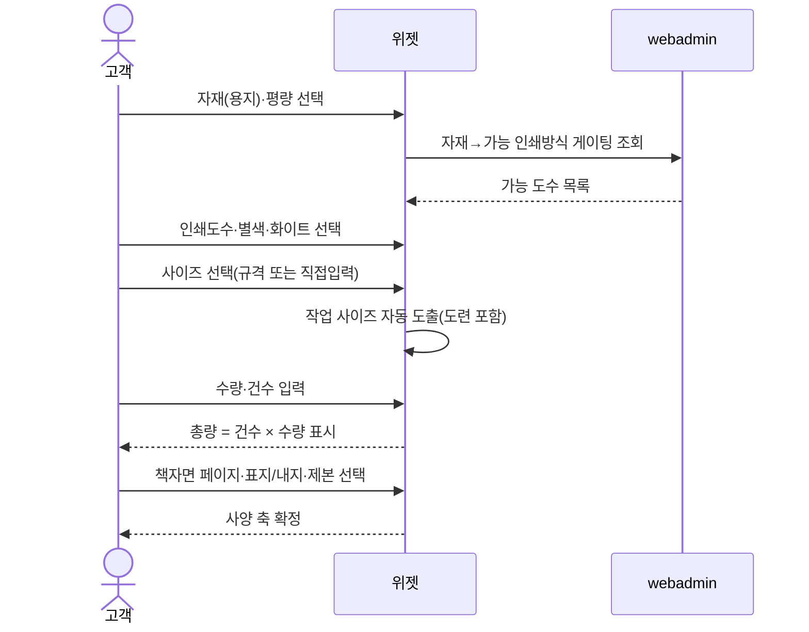
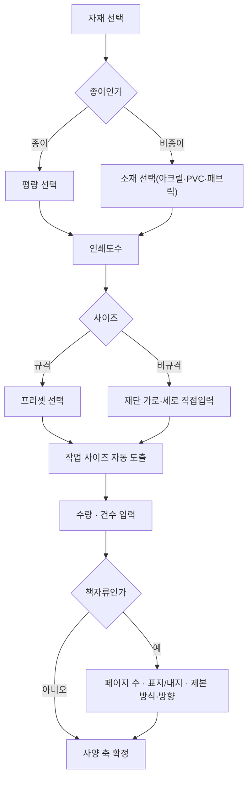

# P06 · 인쇄 사양 축 입력하기

> t63 프로세스 정리 B — 탐색~결제 · L1 **옵션·견적** · L2 옵션축

## 1. 한줄정의 · 시작/끝 · 등장인물

**한줄정의** — 손님이 자재·도수·사이즈·수량·건수·페이지·제본 같은 가격을 가르는 축을 채운다.

- **시작**: 위젯이 사양 축을 열어 준다
- **끝**: 가격을 가르는 축이 모두 채워져 견적이 가능해진다(P08 로 이어짐)

| 등장인물 | 무엇인가 |
|---|---|
| 고객 | 몰을 쓰는 손님(회원·비회원) |
| 위젯 | 상품 상세에 마운트되는 인쇄 주문옵션·견적 위젯 |
| webadmin | 후니 자체 관리서버(Django) — 상품·옵션·가격·위젯빌더 |

**가로지르는 곳**
- P12 — 사이즈·페이지 선택은 에디터 캔버스와 동기화된다(STD-ART-025)
- P03 — 규격 가이드 모달(STD-OPT-057)은 상세 가이드 콘텐츠와 같은 자산을 본다

## 2. 흐름 (sequence)

## 3. 갈림길 (flowchart · 실패·비회원·취소 분기)

## 4. 단계표

| # | 단계 | 시스템 | 담당자 | 원장 row_id | 상태 | 근거 |
|---|---|---|---|---|---|---|
| 1 | 용지(자재) 선택 | webadmin | 서희항 | `STD-OPT-008` | 작동 | raw/webadmin/webadmin/catalog/models.py:155-160 · raw/webadmin/webadmin/catalog/static/catalog/widget_renderer.js:714 |
| 2 | 평량(g/㎡) 선택 | webadmin | 서희항 | `STD-OPT-009` | 작동 | raw/webadmin/webadmin/catalog/models.py:167 · raw/webadmin/webadmin/catalog/paper_views.py:419 |
| 3 | 비종이 소재 선택(아크릴·PVC·패브릭 등) | webadmin | 서희항 | `STD-OPT-010` | 작동 | raw/webadmin/webadmin/catalog/models.py:160-161 · raw/webadmin/webadmin/catalog/tmpl_combo.py:54 |
| 4 | 주문가능 자재(용지) 목록 모달 | webadmin | 김동학+최숙진 | `STD-OPT-058` | 미착수 | _workspace/huni-launch-scope/02_gap/fit-gap-matrix.csv:60 (선행 카드 증거 · 실재 확인) |
| 5 | 인쇄도수 선택(단면/양면·4도/8도·1도) | webadmin | 서희항 | `STD-OPT-011` | 작동 | raw/webadmin/webadmin/catalog/models.py:48-56 |
| 6 | 별색(spot color) 선택 | webadmin | 서희항 | `STD-OPT-012` | 작동 | raw/webadmin/webadmin/catalog/models.py:213 · raw/webadmin/webadmin/catalog/static/catalog/widget_renderer.js:3995-4005 |
| 7 | 화이트/UV white 언더베이스 선택 | widget | 서희항 | `STD-OPT-013` | 작동 | raw/webadmin/webadmin/catalog/static/catalog/widget_renderer.js:4001-4067 |
| 8 | 규격 사이즈 선택(프리셋) | webadmin | 서희항 | `STD-OPT-014` | 작동 | raw/webadmin/webadmin/catalog/models.py:534-550 · raw/webadmin/webadmin/catalog/static/catalog/widget_renderer.js:2795 |
| 9 | 비규격 사이즈 직접입력(재단 가로·세로) | webadmin | 서희항 | `STD-OPT-015` | 작동 | raw/webadmin/webadmin/catalog/models.py:555-560 · raw/webadmin/webadmin/catalog/static/catalog/widget_renderer.js:3114-3174 |
| 10 | 작업 사이즈 입력·자동 도출(도련 포함) | webadmin | 서희항 | `STD-OPT-016` | 부분 | raw/webadmin/webadmin/catalog/static/catalog/widget_renderer.js:3921-3930 · raw/webadmin/webadmin/catalog/cover_rule_db.py:212 |
| 11 | 규격 가이드 모달(사이즈 안내 팝업) | shopby | 김동학+최숙진 | `STD-OPT-057` | 미착수 | 「미확인」 — 찾지 못했다(huni-skin-shopby/src 전체 및 raw/webadmin/webadmin/catalog/static/catalog/*.js에서 사이즈 안내 모달 관련 코드 grep 0건) |
| 12 | 수량 선택(구간 프리셋 + 직접입력) | widget | 서희항 | `STD-OPT-017` | 작동 | raw/webadmin/webadmin/catalog/static/catalog/widget_renderer.js:5010-5024 · raw/webadmin/webadmin/catalog/static/catalog/widget_renderer.js:5033-5041 |
| 13 | 건수(디자인 종류 수) 입력 및 총량 = 건수×수량 규칙 표시 | widget | 서희항 | `STD-OPT-018` | 작동 | raw/webadmin/webadmin/catalog/static/catalog/widget_renderer.js:5045-5052 · raw/webadmin/webadmin/catalog/static/catalog/widget_renderer.js:2977 |
| 14 | 페이지 수 입력(책자류 필수 축) | webadmin | 서희항 | `STD-OPT-019` | 부분 | raw/webadmin/webadmin/catalog/models.py:215 · raw/webadmin/webadmin/catalog/static/catalog/widget_renderer.js:894 |
| 15 | 표지/내지/간지 용지 개별 선택 | widget | 서희항 | `STD-OPT-020` | 작동 | raw/webadmin/webadmin/catalog/models.py:889 · raw/webadmin/webadmin/catalog/static/catalog/widget_renderer.js:690-760 |
| 16 | 표지/내지 인쇄도수 개별 선택 | widget | 서희항 | `STD-OPT-021` | 작동 | raw/webadmin/webadmin/catalog/static/catalog/widget_renderer.js:1104 · raw/webadmin/webadmin/catalog/static/catalog/widget_renderer.js:1805-1806 |
| 17 | 제본 방식 선택(중철·무선·PUR·트윈링·하드커버) | webadmin | 서희항 | `STD-OPT-022` | 작동 | raw/webadmin/webadmin/catalog/models.py:589-624 · raw/webadmin/webadmin/catalog/spine_calc.py:1 |
| 18 | 제본 방향 선택(좌철/상철 × 세로/가로) | webadmin | 서희항 | `STD-OPT-023` | 작동 | raw/webadmin/webadmin/catalog/spine_calc.py:48-58 |
| 19 | 캘린더 가공·장수(월수) 선택 | shopby | 김동학 | `STD-OPT-056` | 구현-미검증 | huni-skin-shopby/src/components/product/configurators/calendar-configurator.tsx:59 · huni-skin-shopby/src/components/product/configurators/calendar-configurator.tsx:167-169 · huni-skin-shopby/src/components/product/configurators/calendar-configurator.tsx:196-211 |

## 5. 빠진 곳

**나 행은 있는데 코드 0** — 1건

| row_id | 내용 | 진단 |
|---|---|---|
| `STD-OPT-057` | 규격 가이드 모달(사이즈 안내 팝업) | 규격 가이드 모달 코드를 찾지 못했다. |

**다 코드는 있는데 연결 안 됨** — 4건

| row_id | 내용 | 진단 |
|---|---|---|
| `STD-OPT-058` | 주문가능 자재(용지) 목록 모달 | 주문가능 자재(용지) 목록 모달 코드를 찾지 못했다. |
| `STD-OPT-016` | 작업 사이즈 입력·자동 도출(도련 포함) | nsReasons가 범위 위반 사유를 계산하고 cover_rule_db.load_size_dims가 재단 사이즈로부터 작업 사이즈·여백을 산출한다(용어는 여백/작업사이즈이며 도련이라는 리터럴 코드 문자열은 없음). |
| `STD-OPT-019` | 페이지 수 입력(책자류 필수 축) | page_cnt(페이지수) 차원과 위젯 QTY 컴포넌트의 ref_key=pages 분기가 책자 페이지수 입력을 구현한다. |
| `STD-OPT-056` | 캘린더 가공·장수(월수) 선택 | calendar-configurator.tsx가 캘린더 가공(process) select와 장수(sheets) 입력을 각각 렌더한다. |

## 6. 채우는 방법

| 누가 | 무엇을 | 선행 |
|---|---|---|
| 김동학+최숙진 | 주문가능 자재(용지) 목록 모달 | 코드는 있는데 원장 상태가 「미착수」다 |
| 서희항 | 작업 사이즈 입력·자동 도출(도련 포함) | 코드는 있는데 원장 상태가 「부분」다 |
| 김동학+최숙진 | 규격 가이드 모달(사이즈 안내 팝업) | 코드·명세를 뒤졌으나 구현을 찾지 못했다 |
| 서희항 | 페이지 수 입력(책자류 필수 축) | 코드는 있는데 원장 상태가 「부분」다 |
| 김동학 | 캘린더 가공·장수(월수) 선택 | 코드는 있는데 원장 상태가 「구현-미검증」다 |

## 7. 확인 못 한 것

판형·판걸이수는 이 축 입력의 결과로 서버에서 정해지는데, 위젯이 손님에게 무엇을 보여 주는지(판형 노출 여부)를 실화면으로 확인하지 않았다.

---
> 이 문서의 상태·근거는 원장 `08_system-screen/t56/rejudge.csv` 와 이 카드의 증거 수집본에서 기계로 채웠다. 「미확인」은 코드·원장·명세를 뒤졌으나 **찾지 못했다**는 뜻이지, 없다는 뜻이 아니다.
