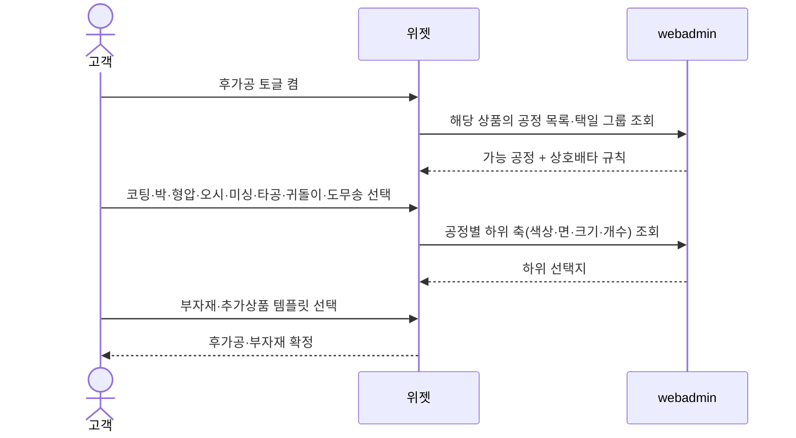
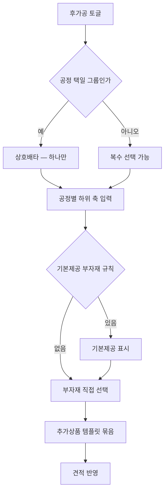

# P07 · 후가공·부자재 고르기

> t63 프로세스 정리 B — 탐색~결제 · L1 **옵션·견적** · L2 후가공 · 부자재

## 1. 한줄정의 · 시작/끝 · 등장인물

**한줄정의** — 손님이 코팅·박·형압·오시·도무송 같은 후가공과 케이스·포장 같은 부자재를 더한다.

- **시작**: 후가공 섹션을 켠다
- **끝**: 후가공·부자재가 확정되어 견적에 반영된다(P08 로 이어짐)

| 등장인물 | 무엇인가 |
|---|---|
| 고객 | 몰을 쓰는 손님(회원·비회원) |
| 위젯 | 상품 상세에 마운트되는 인쇄 주문옵션·견적 위젯 |
| webadmin | 후니 자체 관리서버(Django) — 상품·옵션·가격·위젯빌더 |

**가로지르는 곳**
- t64 — 선택된 공정은 MES 공정 전개의 입력이 된다

## 2. 흐름 (sequence)

## 3. 갈림길 (flowchart · 실패·비회원·취소 분기)

## 4. 단계표

| # | 단계 | 시스템 | 담당자 | 원장 row_id | 상태 | 근거 |
|---|---|---|---|---|---|---|
| 1 | 코팅 선택(무광/유광 × 단면/양면) | 미확인 | 서희항 | `STD-OPT-024` | 부분 | 「미확인」 |
| 2 | 박 선택(색상 다종 × 면 × 크기 × 내용같음/틀림) | 미확인 | 서희항 | `STD-OPT-025` | 부분 | 「미확인」 |
| 3 | 형압(양각/음각) 선택 | 미확인 | 서희항 | `STD-OPT-026` | 부분 | raw/webadmin/webadmin/config/urls.py:356 (선행 카드 증거 · 실재 확인) |
| 4 | 오시 선택(줄 수 × 방향) | 미확인 | 서희항 | `STD-OPT-027` | 부분 | raw/webadmin/webadmin/config/urls.py:356 (선행 카드 증거 · 실재 확인) |
| 5 | 미싱 선택 | 미확인 | 서희항 | `STD-OPT-028` | 부분 | 「미확인」 |
| 6 | 타공 선택(직경 × 개수 × 위치) | 미확인 | 서희항 | `STD-OPT-029` | 부분 | 「미확인」 |
| 7 | 귀돌이/라운딩 선택(반경 × 모서리 위치) | 미확인 | 서희항 | `STD-OPT-030` | 부분 | 「미확인」 |
| 8 | 도무송(전체/부분·모양·개수) 선택 | 미확인 | 서희항 | `STD-OPT-031` | 작동 | 「미확인」 |
| 9 | 넘버링(일반/난수 × 자릿수 × 개수) 선택 | 미확인 | 서희항 | `STD-OPT-032` | 미착수 | 「미확인」 |
| 10 | 부분UV/에폭시 선택 | 미확인 | 서희항 | `STD-OPT-033` | 부분 | 「미확인」 |
| 11 | 부자재 선택(케이스·폴리백·포장) | 미확인 | 서희항 | `STD-OPT-034` | 작동 | 「미확인」 |
| 12 | 상품별 기본제공 부자재 규칙 표시 | 미확인 | 서희항 | `STD-OPT-035` | 미착수 | 「미확인」 |
| 13 | 추가상품(악세사리) 템플릿 묶음 선택 | 미확인 | 서희항 | `STD-OPT-036` | 작동 | 「미확인」 |

## 5. 빠진 곳

**나 행은 있는데 코드 0** — 11건

| row_id | 내용 | 진단 |
|---|---|---|
| `STD-OPT-024` | 코팅 선택(무광/유광 × 단면/양면) | 코드·명세를 뒤졌으나 구현을 찾지 못했다 |
| `STD-OPT-025` | 박 선택(색상 다종 × 면 × 크기 × 내용같음/틀림) | 코드·명세를 뒤졌으나 구현을 찾지 못했다 |
| `STD-OPT-028` | 미싱 선택 | 코드·명세를 뒤졌으나 구현을 찾지 못했다 |
| `STD-OPT-029` | 타공 선택(직경 × 개수 × 위치) | 코드·명세를 뒤졌으나 구현을 찾지 못했다 |
| `STD-OPT-030` | 귀돌이/라운딩 선택(반경 × 모서리 위치) | 코드·명세를 뒤졌으나 구현을 찾지 못했다 |
| `STD-OPT-031` | 도무송(전체/부분·모양·개수) 선택 | 코드·명세를 뒤졌으나 구현을 찾지 못했다 |
| `STD-OPT-032` | 넘버링(일반/난수 × 자릿수 × 개수) 선택 | 코드·명세를 뒤졌으나 구현을 찾지 못했다 |
| `STD-OPT-033` | 부분UV/에폭시 선택 | 코드·명세를 뒤졌으나 구현을 찾지 못했다 |
| `STD-OPT-034` | 부자재 선택(케이스·폴리백·포장) | 코드·명세를 뒤졌으나 구현을 찾지 못했다 |
| `STD-OPT-035` | 상품별 기본제공 부자재 규칙 표시 | 코드·명세를 뒤졌으나 구현을 찾지 못했다 |
| `STD-OPT-036` | 추가상품(악세사리) 템플릿 묶음 선택 | 코드·명세를 뒤졌으나 구현을 찾지 못했다 |

**다 코드는 있는데 연결 안 됨** — 2건

| row_id | 내용 | 진단 |
|---|---|---|
| `STD-OPT-026` | 형압(양각/음각) 선택 | 코드는 있는데 원장 상태가 「부분」다 |
| `STD-OPT-027` | 오시 선택(줄 수 × 방향) | 코드는 있는데 원장 상태가 「부분」다 |

## 6. 채우는 방법

| 누가 | 무엇을 | 선행 |
|---|---|---|
| 서희항 | 코팅 선택(무광/유광 × 단면/양면) | 코드·명세를 뒤졌으나 구현을 찾지 못했다 |
| 서희항 | 박 선택(색상 다종 × 면 × 크기 × 내용같음/틀림) | 코드·명세를 뒤졌으나 구현을 찾지 못했다 |
| 서희항 | 형압(양각/음각) 선택 | 코드는 있는데 원장 상태가 「부분」다 |
| 서희항 | 오시 선택(줄 수 × 방향) | 코드는 있는데 원장 상태가 「부분」다 |
| 서희항 | 미싱 선택 | 코드·명세를 뒤졌으나 구현을 찾지 못했다 |
| 서희항 | 타공 선택(직경 × 개수 × 위치) | 코드·명세를 뒤졌으나 구현을 찾지 못했다 |
| 서희항 | 귀돌이/라운딩 선택(반경 × 모서리 위치) | 코드·명세를 뒤졌으나 구현을 찾지 못했다 |
| 서희항 | 도무송(전체/부분·모양·개수) 선택 | 코드·명세를 뒤졌으나 구현을 찾지 못했다 |
| 서희항 | 넘버링(일반/난수 × 자릿수 × 개수) 선택 | 코드·명세를 뒤졌으나 구현을 찾지 못했다 |
| 서희항 | 부분UV/에폭시 선택 | 코드·명세를 뒤졌으나 구현을 찾지 못했다 |
| 서희항 | 부자재 선택(케이스·폴리백·포장) | 코드·명세를 뒤졌으나 구현을 찾지 못했다 |
| 서희항 | 상품별 기본제공 부자재 규칙 표시 | 코드·명세를 뒤졌으나 구현을 찾지 못했다 |
| 서희항 | 추가상품(악세사리) 템플릿 묶음 선택 | 코드·명세를 뒤졌으나 구현을 찾지 못했다 |

## 7. 확인 못 한 것

넘버링(STD-OPT-032)은 원장 상태가 미착수인데 라이브 위젯에 노출되는지 확인하지 않았다.

---
> 이 문서의 상태·근거는 원장 `08_system-screen/t56/rejudge.csv` 와 이 카드의 증거 수집본에서 기계로 채웠다. 「미확인」은 코드·원장·명세를 뒤졌으나 **찾지 못했다**는 뜻이지, 없다는 뜻이 아니다.
