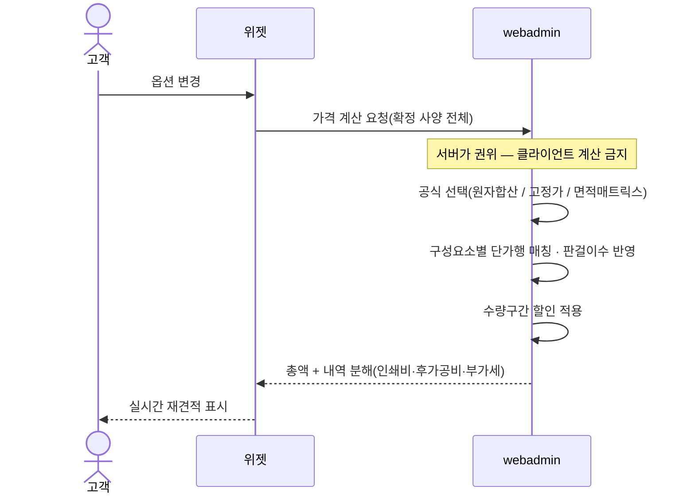
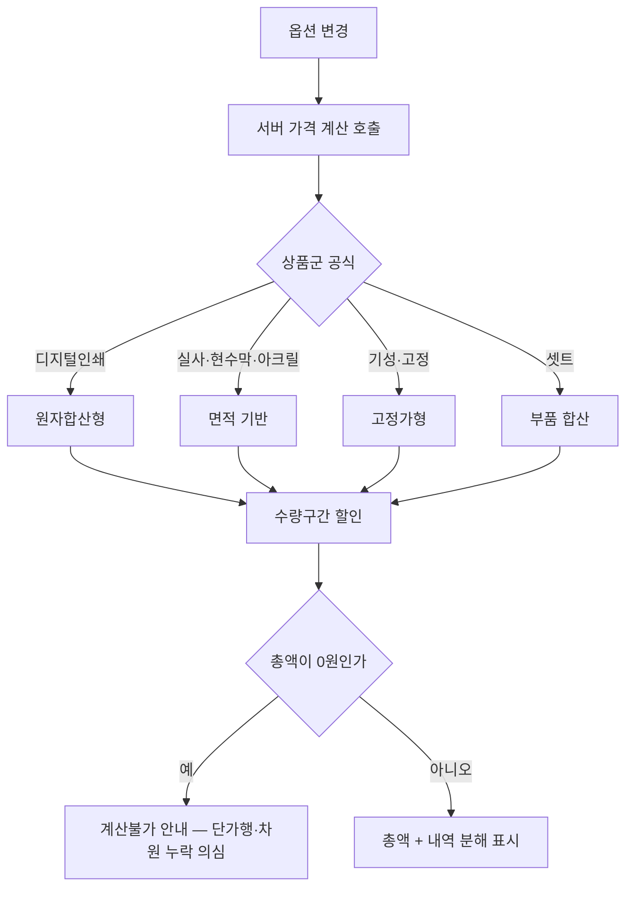

# P08 · 실시간 견적 받기

> t63 프로세스 정리 B — 탐색~결제 · L1 **옵션·견적** · L2 가격

## 1. 한줄정의 · 시작/끝 · 등장인물

**한줄정의** — 옵션이 바뀔 때마다 서버가 값을 다시 계산해 손님에게 총액과 내역을 보여 준다.

- **시작**: 손님이 옵션을 하나 바꾼다
- **끝**: 총액·내역이 화면에 뜨고 장바구니 담기가 열린다(P14 로 이어짐)

| 등장인물 | 무엇인가 |
|---|---|
| 고객 | 몰을 쓰는 손님(회원·비회원) |
| 위젯 | 상품 상세에 마운트되는 인쇄 주문옵션·견적 위젯 |
| webadmin | 후니 자체 관리서버(Django) — 상품·옵션·가격·위젯빌더 |

**가로지르는 곳**
- P19 — 위젯 총액과 샵바이 청구액의 정합(STD-PAY-031)은 결제 프로세스에서 다시 걸린다
- P01 — 목록 시작가(STD-CAT-039)는 이 계산의 기본값 산출물이다

## 2. 흐름 (sequence)

## 3. 갈림길 (flowchart · 실패·비회원·취소 분기)

## 4. 단계표

| # | 단계 | 시스템 | 담당자 | 원장 row_id | 상태 | 근거 |
|---|---|---|---|---|---|---|
| 1 | 옵션 변경 시 실시간 재견적 | widget | 서희항 | `STD-OPT-043` | 작동 | raw/webadmin/webadmin/catalog/static/catalog/widget.js:682 |
| 2 | 서버 권위 가격 계산(클라이언트 계산 금지) | webadmin | 서희항 | `STD-OPT-044` | 작동 | raw/webadmin/webadmin/catalog/pricing.py:838 · raw/webadmin/webadmin/catalog/widget_api.py:3029 |
| 3 | 원자합산형 가격 계산(디지털인쇄) | webadmin | 서희항 | `STD-OPT-049` | 작동 | raw/webadmin/webadmin/catalog/pricing.py:83 · raw/webadmin/webadmin/catalog/pricing.py:17 |
| 4 | 면적 기반 가격 계산(실사·현수막·아크릴) | webadmin | 서희항 | `STD-OPT-048` | 부분 | raw/webadmin/webadmin/catalog/pricing.py:68-78 |
| 5 | 고정가형 가격 계산(수량×옵션) | webadmin | 서희항 | `STD-OPT-050` | 부분 | raw/webadmin/webadmin/catalog/pricing.py:85 |
| 6 | 셋트/부품조립 상품 합산 가격 계산 | webadmin | 서희항 | `STD-OPT-051` | 부분 | raw/webadmin/webadmin/catalog/pricing.py:1873-1931 |
| 7 | 판걸이수 기반 판형 원가 반영 | webadmin | 서희항 | `STD-OPT-052` | 작동 | raw/webadmin/webadmin/catalog/pricing.py:20-22 · raw/webadmin/webadmin/catalog/pricing.py:392-413 |
| 8 | 수량구간 할인 적용 | webadmin | 서희항 | `STD-OPT-047` | 작동 | raw/webadmin/webadmin/catalog/pricing.py:1476-1509 |
| 9 | 가격 내역 분해 표시(인쇄비·후가공비·부가세) | webadmin | 서희항 | `STD-OPT-046` | 작동 | raw/webadmin/webadmin/catalog/pricing.py:147-179 · raw/webadmin/webadmin/catalog/static/catalog/widget.js:682-745 |
| 10 | 가격 0원/계산불가 상태 처리 및 사용자 안내 | widget | 최숙진 | `STD-OPT-045` | 부분 | raw/webadmin/webadmin/catalog/static/catalog/widget.js:688-691 · raw/webadmin/webadmin/catalog/pricing.py:114-119 |

## 5. 빠진 곳

**다 코드는 있는데 연결 안 됨** — 4건

| row_id | 내용 | 진단 |
|---|---|---|
| `STD-OPT-048` | 면적 기반 가격 계산(실사·현수막·아크릴) | 박·형압 가공비·동판셋업비가 가로×세로 면적 격자표로 계산된다는 설계 주석을 확인했으나 전용 area 함수명은 특정하지 못했다. |
| `STD-OPT-050` | 고정가형 가격 계산(수량×옵션) | PRICE_TYPE.03(고정금액=매칭 구간 금액 그대로·수량 무관)이 고정가형 계산방식으로 정의된다. |
| `STD-OPT-051` | 셋트/부품조립 상품 합산 가격 계산 | evaluate_set_price가 셋트구성원(members)·셋트선택값(set_selections)·벌수(copies)를 받아 합산 가격을 계산한다. |
| `STD-OPT-045` | 가격 0원/계산불가 상태 처리 및 사용자 안내 | widget.js가 amount==null(계산불가)은 남기고 0원 줄만 생략하도록 명시적으로 분기하며 pricing.py의 ERR_NO_TIER_ROW/ERR_NO_PLATE가 계산불가 사유코드를 정의한다. |

## 6. 채우는 방법

| 누가 | 무엇을 | 선행 |
|---|---|---|
| 서희항 | 면적 기반 가격 계산(실사·현수막·아크릴) | 코드는 있는데 원장 상태가 「부분」다 |
| 서희항 | 고정가형 가격 계산(수량×옵션) | 코드는 있는데 원장 상태가 「부분」다 |
| 서희항 | 셋트/부품조립 상품 합산 가격 계산 | 코드는 있는데 원장 상태가 「부분」다 |
| 최숙진 | 가격 0원/계산불가 상태 처리 및 사용자 안내 | 코드는 있는데 원장 상태가 「부분」다 |

## 7. 확인 못 한 것

가격이 0원으로 나오는 갈래가 단가행 부재인지 차원 누락인지 구분하는 로직을 이 카드에서 코드로 확인하지 않았다 — 선행 하네스(§26 가격테이블 무결성) 소관.

---
> 이 문서의 상태·근거는 원장 `08_system-screen/t56/rejudge.csv` 와 이 카드의 증거 수집본에서 기계로 채웠다. 「미확인」은 코드·원장·명세를 뒤졌으나 **찾지 못했다**는 뜻이지, 없다는 뜻이 아니다.
