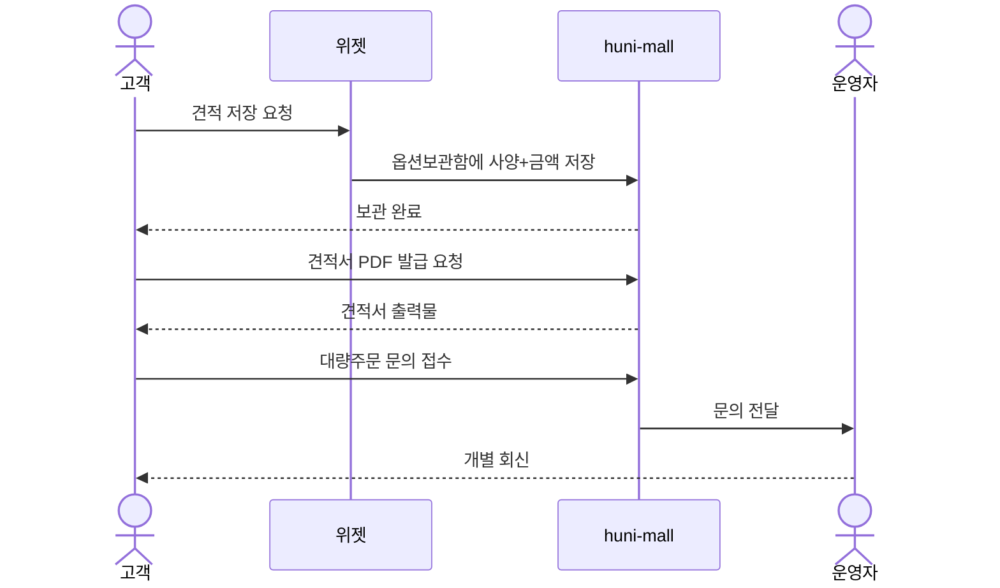
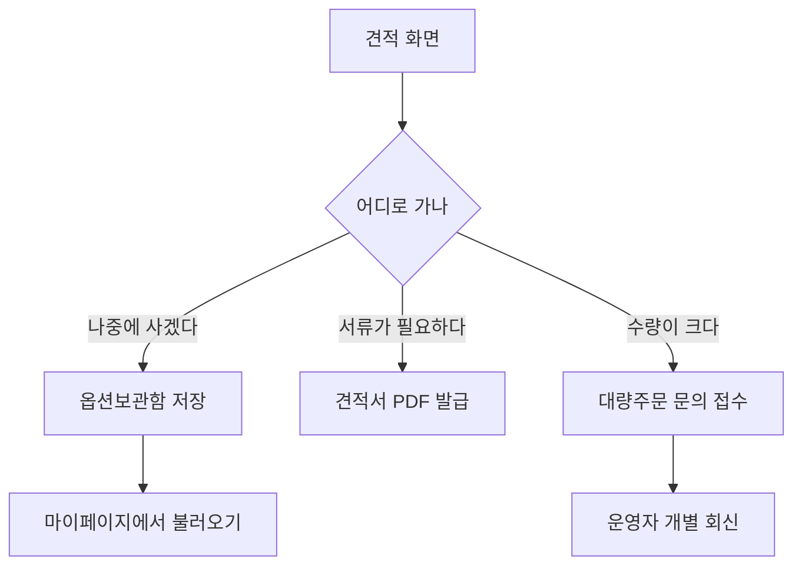

# P09 · 견적 저장·대량주문 문의

> t63 프로세스 정리 B — 탐색~결제 · L1 **옵션·견적** · L2 견적

## 1. 한줄정의 · 시작/끝 · 등장인물

**한줄정의** — 손님이 지금 잡은 견적을 나중에 쓰려고 저장하거나, 대량이면 따로 문의를 넣는다.

- **시작**: 견적이 화면에 떠 있다
- **끝**: 견적이 보관되거나 문의가 접수된다

| 등장인물 | 무엇인가 |
|---|---|
| 고객 | 몰을 쓰는 손님(회원·비회원) |
| huni-mall | 신규 독립몰(headless · Next.js 15 App Router) |
| 위젯 | 상품 상세에 마운트되는 인쇄 주문옵션·견적 위젯 |
| 운영자 | 후니 실무진(CS·상품·생산) |

**가로지르는 곳**
- t62 — 저장된 견적을 다시 보는 자리는 마이페이지(STD-MYP)
- t65 — 대량주문 문의 응대는 운영자 CS

## 2. 흐름 (sequence)

## 3. 갈림길 (flowchart · 실패·비회원·취소 분기)

## 4. 단계표

| # | 단계 | 시스템 | 담당자 | 원장 row_id | 상태 | 근거 |
|---|---|---|---|---|---|---|
| 1 | 견적 결과 저장(옵션보관함) | 미확인 | 서희항 | `STD-OPT-053` | 미착수 | 「미확인」 |
| 2 | 견적서 PDF/출력물 발급 | 미확인 | 서희항 | `STD-OPT-054` | 미착수 | 「미확인」 |
| 3 | 대량주문 견적 문의 접수 | 미확인 | 김동학 | `STD-OPT-055` | 미착수 | 「미확인」 |

## 5. 빠진 곳

**나 행은 있는데 코드 0** — 3건

| row_id | 내용 | 진단 |
|---|---|---|
| `STD-OPT-053` | 견적 결과 저장(옵션보관함) | 코드·명세를 뒤졌으나 구현을 찾지 못했다 |
| `STD-OPT-054` | 견적서 PDF/출력물 발급 | 코드·명세를 뒤졌으나 구현을 찾지 못했다 |
| `STD-OPT-055` | 대량주문 견적 문의 접수 | 코드·명세를 뒤졌으나 구현을 찾지 못했다 |

## 6. 채우는 방법

| 누가 | 무엇을 | 선행 |
|---|---|---|
| 서희항 | 견적 결과 저장(옵션보관함) | 코드·명세를 뒤졌으나 구현을 찾지 못했다 |
| 서희항 | 견적서 PDF/출력물 발급 | 코드·명세를 뒤졌으나 구현을 찾지 못했다 |
| 김동학 | 대량주문 견적 문의 접수 | 코드·명세를 뒤졌으나 구현을 찾지 못했다 |

## 7. 확인 못 한 것

세 행 모두 원장 상태가 미착수다. 저장 그릇(테이블·스토리지)이 정해졌는지 확인하지 못했다.

---
> 이 문서의 상태·근거는 원장 `08_system-screen/t56/rejudge.csv` 와 이 카드의 증거 수집본에서 기계로 채웠다. 「미확인」은 코드·원장·명세를 뒤졌으나 **찾지 못했다**는 뜻이지, 없다는 뜻이 아니다.
