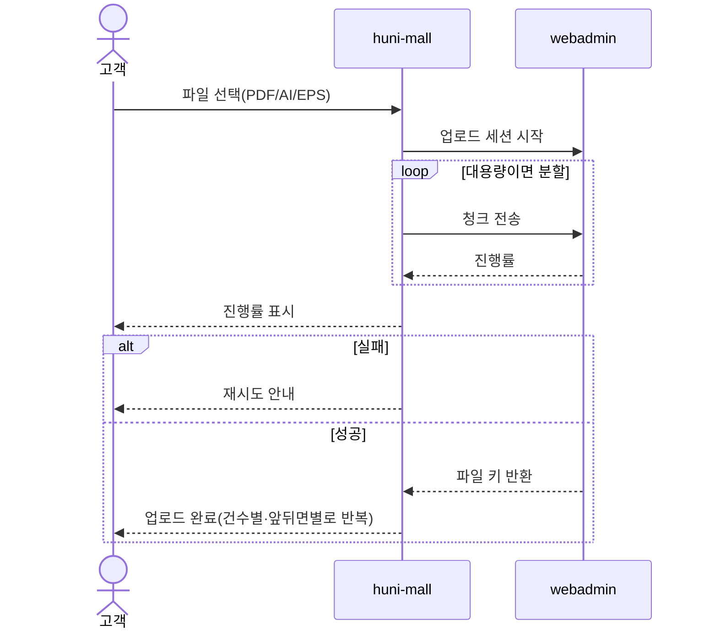
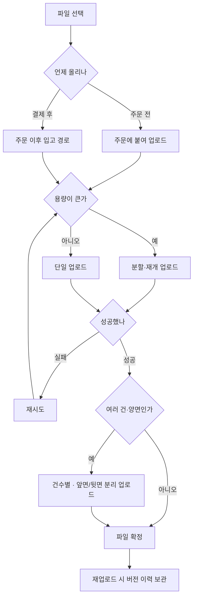

# P10 · 원고 올리기

> t63 프로세스 정리 B — 탐색~결제 · L1 **원고·파일** · L2 업로드

## 1. 한줄정의 · 시작/끝 · 등장인물

**한줄정의** — 손님이 인쇄할 파일을 올린다 — 주문 전에도, 결제 뒤에도 올릴 수 있어야 한다.

- **시작**: 사양을 정한 손님이 파일 선택을 누른다
- **끝**: 파일이 보관소에 올라가 주문에 붙는다(P11·P14 로 이어짐)

| 등장인물 | 무엇인가 |
|---|---|
| 고객 | 몰을 쓰는 손님(회원·비회원) |
| huni-mall | 신규 독립몰(headless · Next.js 15 App Router) |
| webadmin | 후니 자체 관리서버(Django) — 상품·옵션·가격·위젯빌더 |

**가로지르는 곳**
- t64 — 올라간 파일의 검판(STD-ART-008~018)·생산 전달(STD-ART-028)은 t64
- P14 — 장바구니 담기는 파일을 동반한다(STD-ORD-001)

## 2. 흐름 (sequence)

## 3. 갈림길 (flowchart · 실패·비회원·취소 분기)

## 4. 단계표

| # | 단계 | 시스템 | 담당자 | 원장 row_id | 상태 | 근거 |
|---|---|---|---|---|---|---|
| 1 | 인쇄원고 파일 업로드(PDF/AI/EPS) | 미확인 | 서희항 | `STD-ART-001` | 작동 | 「미확인」 |
| 2 | 대용량 파일 분할/재개 업로드 | 미확인 | 서희항 | `STD-ART-002` | 구현-미검증 | raw/webadmin/webadmin/catalog/s3_artwork.py:208 (선행 카드 증거 · 실재 확인) |
| 3 | 업로드 진행률·실패 재시도 | 미확인 | 서희항 | `STD-ART-003` | 부분 | 「미확인」 |
| 4 | 건수별 개별 파일 업로드(디자인 N종) | 미확인 | 서희항 | `STD-ART-004` | 부분 | 「미확인」 |
| 5 | 앞면/뒷면 파일 분리 업로드 | 미확인 | 서희항 | `STD-ART-005` | 부분 | 「미확인」 |
| 6 | 주문 이후 파일 업로드 경로(결제 후 입고) | 미확인 | 서희항 | `STD-ART-006` | 부분 | raw/webadmin/webadmin/catalog/artwork_promote.py:1 (선행 카드 증거 · 실재 확인) |
| 7 | 파일 재업로드·버전 이력 보관 | 미확인 | 서희항 | `STD-ART-007` | 부분 | raw/webadmin/webadmin/catalog/artwork_promote.py:1 (선행 카드 증거 · 실재 확인) |
| 8 | 가변데이터 인쇄(VDP) 데이터 업로드·병합 | 미확인 | 김동학 | `STD-ART-029` | 미착수 | _workspace/huni-launch-scope/02_gap/fit-gap-matrix.csv:56 (선행 카드 증거 · 실재 확인) |

## 5. 빠진 곳

**나 행은 있는데 코드 0** — 4건

| row_id | 내용 | 진단 |
|---|---|---|
| `STD-ART-001` | 인쇄원고 파일 업로드(PDF/AI/EPS) | 코드·명세를 뒤졌으나 구현을 찾지 못했다 |
| `STD-ART-003` | 업로드 진행률·실패 재시도 | 코드·명세를 뒤졌으나 구현을 찾지 못했다 |
| `STD-ART-004` | 건수별 개별 파일 업로드(디자인 N종) | 코드·명세를 뒤졌으나 구현을 찾지 못했다 |
| `STD-ART-005` | 앞면/뒷면 파일 분리 업로드 | 코드·명세를 뒤졌으나 구현을 찾지 못했다 |

**다 코드는 있는데 연결 안 됨** — 4건

| row_id | 내용 | 진단 |
|---|---|---|
| `STD-ART-002` | 대용량 파일 분할/재개 업로드 | 코드는 있는데 원장 상태가 「구현-미검증」다 |
| `STD-ART-006` | 주문 이후 파일 업로드 경로(결제 후 입고) | 코드는 있는데 원장 상태가 「부분」다 |
| `STD-ART-007` | 파일 재업로드·버전 이력 보관 | 코드는 있는데 원장 상태가 「부분」다 |
| `STD-ART-029` | 가변데이터 인쇄(VDP) 데이터 업로드·병합 | 코드는 있는데 원장 상태가 「미착수」다 |

## 6. 채우는 방법

| 누가 | 무엇을 | 선행 |
|---|---|---|
| 서희항 | 인쇄원고 파일 업로드(PDF/AI/EPS) | 코드·명세를 뒤졌으나 구현을 찾지 못했다 |
| 서희항 | 대용량 파일 분할/재개 업로드 | 코드는 있는데 원장 상태가 「구현-미검증」다 |
| 서희항 | 업로드 진행률·실패 재시도 | 코드·명세를 뒤졌으나 구현을 찾지 못했다 |
| 서희항 | 건수별 개별 파일 업로드(디자인 N종) | 코드·명세를 뒤졌으나 구현을 찾지 못했다 |
| 서희항 | 앞면/뒷면 파일 분리 업로드 | 코드·명세를 뒤졌으나 구현을 찾지 못했다 |
| 서희항 | 주문 이후 파일 업로드 경로(결제 후 입고) | 코드는 있는데 원장 상태가 「부분」다 |
| 서희항 | 파일 재업로드·버전 이력 보관 | 코드는 있는데 원장 상태가 「부분」다 |
| 김동학 | 가변데이터 인쇄(VDP) 데이터 업로드·병합 | 코드는 있는데 원장 상태가 「미착수」다 |

## 7. 확인 못 한 것

파일 보관소(S3 등)의 실제 위치와 키 규약을 이 카드에서 코드로 확정하지 않았다.

---
> 이 문서의 상태·근거는 원장 `08_system-screen/t56/rejudge.csv` 와 이 카드의 증거 수집본에서 기계로 채웠다. 「미확인」은 코드·원장·명세를 뒤졌으나 **찾지 못했다**는 뜻이지, 없다는 뜻이 아니다.
