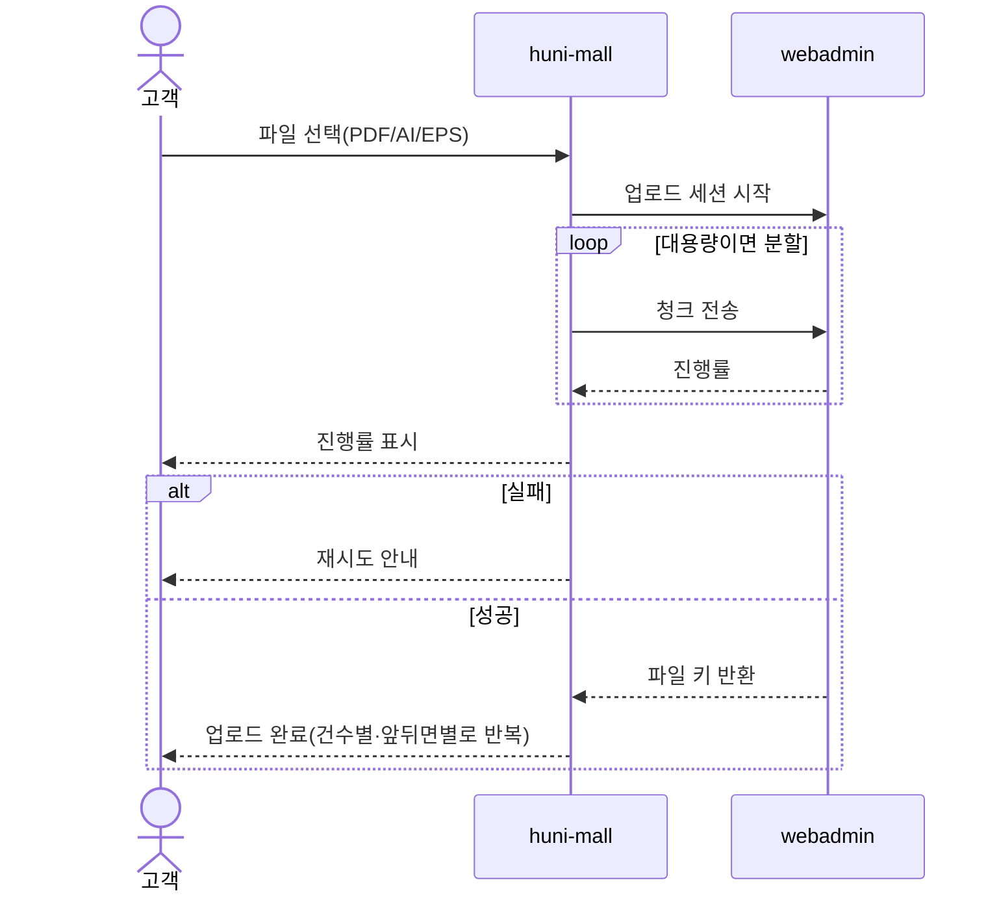
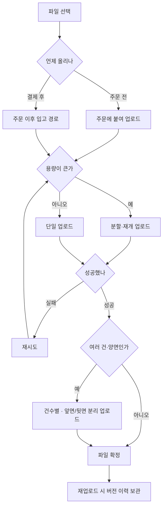

# P10 · 원고 올리기

> t63 프로세스 정리 B — 탐색~결제 · L1 **원고·파일** · L2 업로드

## 1. 한줄정의 · 시작/끝 · 등장인물

**한줄정의** — 손님이 인쇄할 파일을 올린다 — 주문 전에도, 결제 뒤에도 올릴 수 있어야 한다.

- **시작**: 사양을 정한 손님이 파일 선택을 누른다
- **끝**: 파일이 보관소에 올라가 주문에 붙는다(P11·P14 로 이어짐)

| 등장인물 | 무엇인가 |
|---|---|
| 고객 | 몰을 쓰는 손님(회원·비회원) |
| huni-mall | 신규 독립몰(headless · Next.js 15 App Router) |
| webadmin | 후니 자체 관리서버(Django) — 상품·옵션·가격·위젯빌더 |

**가로지르는 곳**
- t64 — 올라간 파일의 검판(STD-ART-008~018)·생산 전달(STD-ART-028)은 t64
- P14 — 장바구니 담기는 파일을 동반한다(STD-ORD-001)

## 2. 흐름 (sequence)

## 3. 갈림길 (flowchart · 실패·비회원·취소 분기)

## 4. 단계표

| # | 단계 | 시스템 | 담당자 | 원장 row_id | 상태 | 근거 |
|---|---|---|---|---|---|---|
| 1 | 인쇄원고 파일 업로드(PDF/AI/EPS) | widget | 서희항 | `STD-ART-001` | 작동 | raw/webadmin/webadmin/catalog/static/catalog/widget.js:773 · raw/webadmin/webadmin/catalog/static/catalog/widget.js:799 · raw/webadmin/webadmin/catalog/s3_artwork.py:83-88 |
| 2 | 대용량 파일 분할/재개 업로드 | widget | 서희항 | `STD-ART-002` | 구현-미검증 | raw/webadmin/webadmin/catalog/static/catalog/widget.js:819 · raw/webadmin/webadmin/catalog/s3_artwork.py:56-57 · raw/webadmin/webadmin/catalog/static/catalog/widget_renderer.js:628-666 |
| 3 | 업로드 진행률·실패 재시도 | widget | 서희항 | `STD-ART-003` | 부분 | raw/webadmin/webadmin/catalog/static/catalog/widget_renderer.js:3283-3289 · raw/webadmin/webadmin/catalog/static/catalog/widget_renderer.js:5408 · raw/webadmin/webadmin/catalog/static/catalog/widget_renderer.js:8036 |
| 4 | 건수별 개별 파일 업로드(디자인 N종) | widget | 서희항 | `STD-ART-004` | 부분 | raw/webadmin/webadmin/catalog/static/catalog/widget_renderer.js:3245-3258 · raw/webadmin/webadmin/catalog/s3_artwork.py:135-145 |
| 5 | 앞면/뒷면 파일 분리 업로드 | widget | 서희항 | `STD-ART-005` | 부분 | raw/webadmin/webadmin/catalog/static/catalog/widget_renderer.js:3255-3258 · raw/webadmin/webadmin/catalog/s3_artwork.py:122-131 |
| 6 | 주문 이후 파일 업로드 경로(결제 후 입고) | webadmin | 서희항 | `STD-ART-006` | 부분 | raw/webadmin/webadmin/catalog/artwork_promote.py:1-24 · raw/webadmin/webadmin/catalog/edicus_lookup.py:433-462 |
| 7 | 파일 재업로드·버전 이력 보관 | webadmin | 서희항 | `STD-ART-007` | 부분 | raw/webadmin/webadmin/catalog/s3_artwork.py:135-166 |
| 8 | 가변데이터 인쇄(VDP) 데이터 업로드·병합 | edicus | 김동학 | `STD-ART-029` | 미착수 | raw/edicus_dev/demo-vdp/context.js:19-23 · raw/edicus_dev/demo-vdp/context.js:164-170 · raw/webadmin/webadmin/catalog/edicus_lookup.py:391 |

## 5. 빠진 곳

**다 코드는 있는데 연결 안 됨** — 7건

| row_id | 내용 | 진단 |
|---|---|---|
| `STD-ART-002` | 대용량 파일 분할/재개 업로드 | 100MB 이상 파일은 _uploadMultipart 로 10MB 단위 분할 전송(분할은 구현). 다만 조각 실패 시 ops.abort 로 전체 중단 후 처음부터 다시 시작하며 이미 올라간 조각부터 이어받기는 코드에 없다 — 재개(resume)는 미구현 |
| `STD-ART-003` | 업로드 진행률·실패 재시도 | paintFileProgress 가 파일별 %를 실시간 갱신하고 pvfileretry 버튼과 retryUploads로 실패 재시도를 제공한다. |
| `STD-ART-004` | 건수별 개별 파일 업로드(디자인 N종) | multi 모드에서 cap(최대 개수)까지 파일을 누적하고 build_order_key 의 seq(1-based 순번)가 벌(건수)별 별도 경로를 만든다. |
| `STD-ART-005` | 앞면/뒷면 파일 분리 업로드 | 파일은 item·mbr·inst 단위로 구분 업로드되어 구성요소(반제품)별 분리는 되나 앞면/뒷면 이라는 이름의 축은 코드에서 직접 확인 못함(item 단위 분리로 대체 구현된 것으로 추정). |
| `STD-ART-006` | 주문 이후 파일 업로드 경로(결제 후 입고) | 결제가 끝나도 Edicus 쪽 프로젝트는 editing 에 머물고 인쇄 데이터 생성이 시작되지 않는다(edicus_lookup.py 자체 주석) — 원고 파일(S3)의 tmp→order 승격은 order/register 직후 구현돼 있으나 편집기 산출물(Edicus definitive_order) 쪽 후속 배선은 TODO(edicus-G7)로 미완. |
| `STD-ART-007` | 파일 재업로드·버전 이력 보관 | build_order_key 의 r{rev}(회차) 세그먼트가 재업로드본을 덮어쓰지 않고 쌓는다고 docstring에 명시 — 버전 이력 보관 설계·구현 확인. |
| `STD-ART-029` | 가변데이터 인쇄(VDP) 데이터 업로드·병합 | Edicus 공식 데모(demo-vdp)에 VDP 데이터 업로드·저장(loadVdpData/saveVdpData) 기능이 있으나 webadmin/huni-mall 쪽에는 VDP 취소 시 데이터 삭제를 언급하는 주석 한 줄(edicus_lookup.py:391) 외 통합 코드가 없음 — Edicus SDK 자체 기능만 확인 |

## 6. 채우는 방법

| 누가 | 무엇을 | 선행 |
|---|---|---|
| 서희항 | 대용량 파일 분할/재개 업로드 | 코드는 있는데 원장 상태가 「구현-미검증」다 |
| 서희항 | 업로드 진행률·실패 재시도 | 코드는 있는데 원장 상태가 「부분」다 |
| 서희항 | 건수별 개별 파일 업로드(디자인 N종) | 코드는 있는데 원장 상태가 「부분」다 |
| 서희항 | 앞면/뒷면 파일 분리 업로드 | 코드는 있는데 원장 상태가 「부분」다 |
| 서희항 | 주문 이후 파일 업로드 경로(결제 후 입고) | 코드는 있는데 원장 상태가 「부분」다 |
| 서희항 | 파일 재업로드·버전 이력 보관 | 코드는 있는데 원장 상태가 「부분」다 |
| 김동학 | 가변데이터 인쇄(VDP) 데이터 업로드·병합 | 코드는 있는데 원장 상태가 「미착수」다 |

## 7. 확인 못 한 것

파일 보관소(S3 등)의 실제 위치와 키 규약을 이 카드에서 코드로 확정하지 않았다.

---
> 이 문서의 상태·근거는 원장 `08_system-screen/t56/rejudge.csv` 와 이 카드의 증거 수집본에서 기계로 채웠다. 「미확인」은 코드·원장·명세를 뒤졌으나 **찾지 못했다**는 뜻이지, 없다는 뜻이 아니다.
