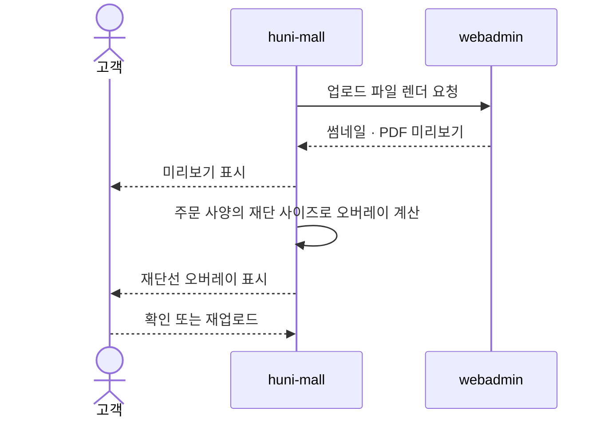
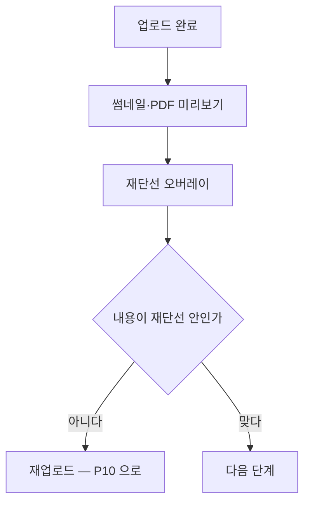

# P11 · 올린 원고 확인하기

> t63 프로세스 정리 B — 탐색~결제 · L1 **원고·파일** · L2 미리보기

## 1. 한줄정의 · 시작/끝 · 등장인물

**한줄정의** — 손님이 올린 파일이 맞는지, 재단선 안에 내용이 들어왔는지 화면에서 본다.

- **시작**: 업로드가 끝난다
- **끝**: 손님이 파일이 맞다고 확인하고 다음으로 넘어간다

| 등장인물 | 무엇인가 |
|---|---|
| 고객 | 몰을 쓰는 손님(회원·비회원) |
| huni-mall | 신규 독립몰(headless · Next.js 15 App Router) |
| webadmin | 후니 자체 관리서버(Django) — 상품·옵션·가격·위젯빌더 |

**가로지르는 곳**
- t64 — 기계 검판(블리드·색공간·해상도)은 t64. 여기는 손님 눈으로 보는 단계다

## 2. 흐름 (sequence)

## 3. 갈림길 (flowchart · 실패·비회원·취소 분기)

## 4. 단계표

| # | 단계 | 시스템 | 담당자 | 원장 row_id | 상태 | 근거 |
|---|---|---|---|---|---|---|
| 1 | 업로드 파일 썸네일·PDF 미리보기 | widget | 서희항 | `STD-ART-019` | 미착수 | 「미확인」 — 찾지 못했다(webadmin/catalog/widget.js·widget_renderer.js 전수 grep thumbnail/썸네일/preview/미리보기 — 디자인 템플릿 썸네일(widget_api.py:6105 |
| 2 | 재단선 오버레이 미리보기 | widget | 서희항 | `STD-ART-020` | 미착수 | 「미확인」 — 찾지 못했다(widget_renderer.js:1638-1707 은 재단선/작업사이즈 치수 도해(사이즈 안내 SVG)이고 고객이 올린 실제 파일 위에 재단선을 겹쳐 보여주는 오버레이가 아님) |

## 5. 빠진 곳

**나 행은 있는데 코드 0** — 2건

| row_id | 내용 | 진단 |
|---|---|---|
| `STD-ART-019` | 업로드 파일 썸네일·PDF 미리보기 | 6135)만 있고 고객 업로드 파일의 썸네일·PDF 미리보기 코드 없음) |
| `STD-ART-020` | 재단선 오버레이 미리보기 | 사이즈 설명용 겹상자 그림(MediaBox/BleedBox/TrimBox 식)은 있으나 업로드 파일 자체에 대한 재단선 오버레이 미리보기는 아님 — 혼동 방지를 위해 found=N으로 판정. |

## 6. 채우는 방법

| 누가 | 무엇을 | 선행 |
|---|---|---|
| 서희항 | 업로드 파일 썸네일·PDF 미리보기 | 코드·명세를 뒤졌으나 구현을 찾지 못했다 |
| 서희항 | 재단선 오버레이 미리보기 | 코드·명세를 뒤졌으나 구현을 찾지 못했다 |

## 7. 확인 못 한 것

두 행 모두 원장 상태 미착수다. 렌더를 몰이 하는지 webadmin 이 하는지 정해지지 않았다.

---
> 이 문서의 상태·근거는 원장 `08_system-screen/t56/rejudge.csv` 와 이 카드의 증거 수집본에서 기계로 채웠다. 「미확인」은 코드·원장·명세를 뒤졌으나 **찾지 못했다**는 뜻이지, 없다는 뜻이 아니다.
