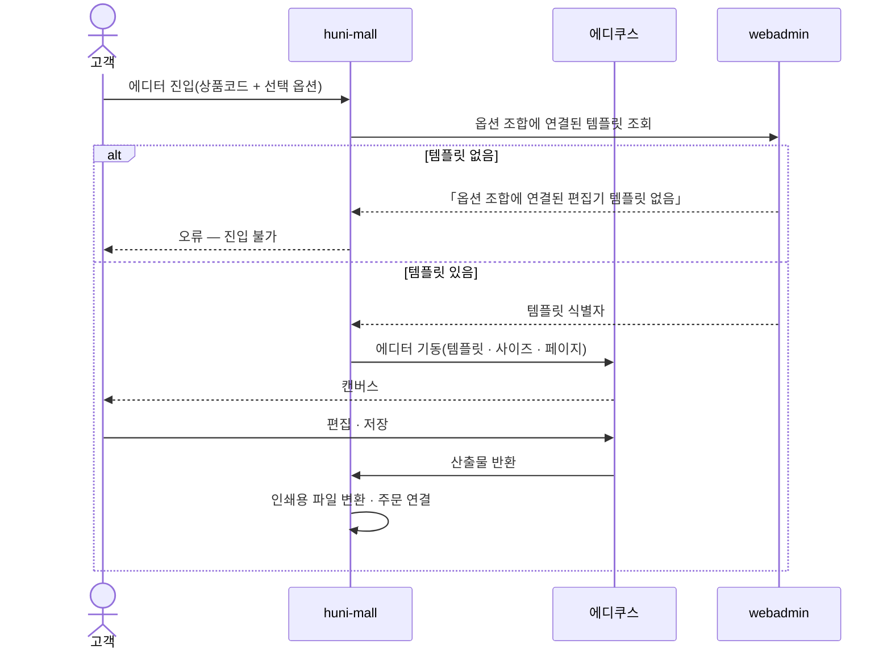
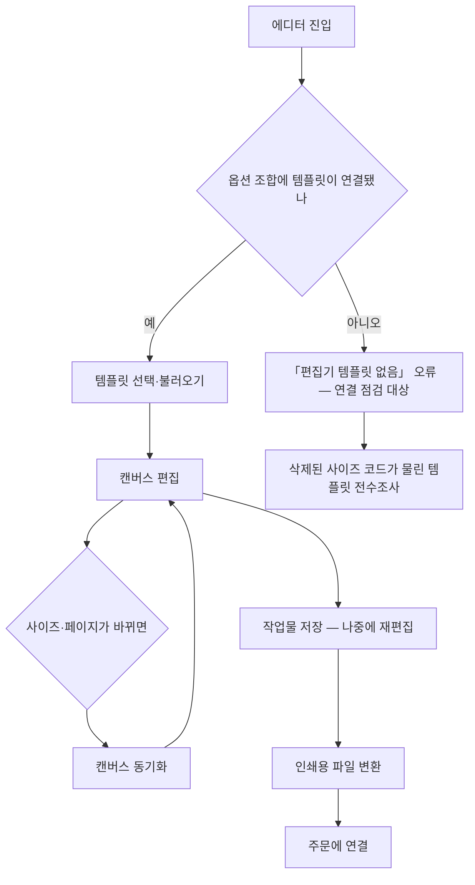

# P12 · 에디터로 디자인하기

> t63 프로세스 정리 B — 탐색~결제 · L1 **원고·파일** · L2 에디터

## 1. 한줄정의 · 시작/끝 · 등장인물

**한줄정의** — 원고가 없는 손님이 에디쿠스 에디터에 들어가 템플릿을 골라 직접 만들고 인쇄용 파일로 내보낸다.

- **시작**: 손님이 「디자인하기」로 에디터에 진입한다
- **끝**: 에디터 산출물이 인쇄용 파일로 변환되어 주문에 붙는다

| 등장인물 | 무엇인가 |
|---|---|
| 고객 | 몰을 쓰는 손님(회원·비회원) |
| huni-mall | 신규 독립몰(headless · Next.js 15 App Router) |
| 에디쿠스 | 온라인 디자인 에디터(Edicus) |
| webadmin | 후니 자체 관리서버(Django) — 상품·옵션·가격·위젯빌더 |

**가로지르는 곳**
- P04 — 디자인 상품에서 고른 디자인이 여기 템플릿으로 들어온다
- P06 — 사이즈·페이지 선택과 캔버스를 맞춘다
- P03 — 템플릿/샘플 다운로드(STD-CAT-020)와 같은 자산

## 2. 흐름 (sequence)

## 3. 갈림길 (flowchart · 실패·비회원·취소 분기)

## 4. 단계표

| # | 단계 | 시스템 | 담당자 | 원장 row_id | 상태 | 근거 |
|---|---|---|---|---|---|---|
| 1 | 온라인 디자인 에디터 진입 | 미확인 | 서희항 | `STD-ART-021` | 부분 | raw/webadmin/webadmin/config/urls.py:274 (선행 카드 증거 · 실재 확인) |
| 2 | 「옵션 조합에 연결된 편집기 템플릿 없음」 오류 — 에디쿠스 템플릿 연결 점검 | 미확인 | 서희항 | `STD-ART-030` | 미착수 | 「미확인」 |
| 3 | 에디터 템플릿 선택·불러오기 | 미확인 | 서희항 | `STD-ART-022` | 작동 | 「미확인」 |
| 4 | 삭제된 사이즈 코드가 연결된 템플릿 전수조사(800여 개 중 노출 대상 선별) | 미확인 | 서희항 | `STD-ART-031` | 미착수 | 「미확인」 |
| 5 | 에디쿠스 테스트용 단순 상품(메모패드 등) 제공 | 미확인 | 서희항 | `STD-ART-032` | 미착수 | 「미확인」 |
| 6 | 선택 옵션(사이즈·페이지)과 에디터 캔버스 동기화 | 미확인 | 서희항 | `STD-ART-025` | 부분 | 「미확인」 |
| 7 | 에디터 작업물 저장·재편집 | 미확인 | 서희항 | `STD-ART-023` | 미착수 | 「미확인」 |
| 8 | 에디터 산출물 인쇄용 파일 변환·주문 연결 | 미확인 | 서희항 | `STD-ART-024` | 부분 | 「미확인」 |
| 9 | 에디터 산출물 변환 실패 처리 | huni-mall | 서희항 | — | **원장 행 없음** | 「미확인」 |

## 5. 빠진 곳

**가 원장에 행 없음** — 1건

| row_id | 내용 | 진단 |
|---|---|---|
| — | 에디터 산출물 변환 실패 처리 | 인쇄용 파일 변환이 실패했을 때의 손님 안내·재시도가 원장에 없다 |

**나 행은 있는데 코드 0** — 7건

| row_id | 내용 | 진단 |
|---|---|---|
| `STD-ART-030` | 「옵션 조합에 연결된 편집기 템플릿 없음」 오류 — 에디쿠스 템플릿 연결 점검 | 코드·명세를 뒤졌으나 구현을 찾지 못했다 |
| `STD-ART-022` | 에디터 템플릿 선택·불러오기 | 코드·명세를 뒤졌으나 구현을 찾지 못했다 |
| `STD-ART-031` | 삭제된 사이즈 코드가 연결된 템플릿 전수조사(800여 개 중 노출 대상 선별) | 코드·명세를 뒤졌으나 구현을 찾지 못했다 |
| `STD-ART-032` | 에디쿠스 테스트용 단순 상품(메모패드 등) 제공 | 코드·명세를 뒤졌으나 구현을 찾지 못했다 |
| `STD-ART-025` | 선택 옵션(사이즈·페이지)과 에디터 캔버스 동기화 | 코드·명세를 뒤졌으나 구현을 찾지 못했다 |
| `STD-ART-023` | 에디터 작업물 저장·재편집 | 코드·명세를 뒤졌으나 구현을 찾지 못했다 |
| `STD-ART-024` | 에디터 산출물 인쇄용 파일 변환·주문 연결 | 코드·명세를 뒤졌으나 구현을 찾지 못했다 |

**다 코드는 있는데 연결 안 됨** — 1건

| row_id | 내용 | 진단 |
|---|---|---|
| `STD-ART-021` | 온라인 디자인 에디터 진입 | 코드는 있는데 원장 상태가 「부분」다 |

## 6. 채우는 방법

| 누가 | 무엇을 | 선행 |
|---|---|---|
| 서희항 | 에디터 산출물 변환 실패 처리 | 원장 735행에 행을 새로 섞지 않는다 — 이 제안으로만 남긴다 |
| 서희항 | 온라인 디자인 에디터 진입 | 코드는 있는데 원장 상태가 「부분」다 |
| 서희항 | 「옵션 조합에 연결된 편집기 템플릿 없음」 오류 — 에디쿠스 템플릿 연결 점검 | 코드·명세를 뒤졌으나 구현을 찾지 못했다 |
| 서희항 | 에디터 템플릿 선택·불러오기 | 코드·명세를 뒤졌으나 구현을 찾지 못했다 |
| 서희항 | 삭제된 사이즈 코드가 연결된 템플릿 전수조사(800여 개 중 노출 대상 선별) | 코드·명세를 뒤졌으나 구현을 찾지 못했다 |
| 서희항 | 에디쿠스 테스트용 단순 상품(메모패드 등) 제공 | 코드·명세를 뒤졌으나 구현을 찾지 못했다 |
| 서희항 | 선택 옵션(사이즈·페이지)과 에디터 캔버스 동기화 | 코드·명세를 뒤졌으나 구현을 찾지 못했다 |
| 서희항 | 에디터 작업물 저장·재편집 | 코드·명세를 뒤졌으나 구현을 찾지 못했다 |
| 서희항 | 에디터 산출물 인쇄용 파일 변환·주문 연결 | 코드·명세를 뒤졌으나 구현을 찾지 못했다 |

## 7. 확인 못 한 것

삭제된 사이즈 코드가 연결된 템플릿이 800여 개 중 몇 개인지는 선행 관측이고 이 카드에서 재실측하지 않았다.

---
> 이 문서의 상태·근거는 원장 `08_system-screen/t56/rejudge.csv` 와 이 카드의 증거 수집본에서 기계로 채웠다. 「미확인」은 코드·원장·명세를 뒤졌으나 **찾지 못했다**는 뜻이지, 없다는 뜻이 아니다.
