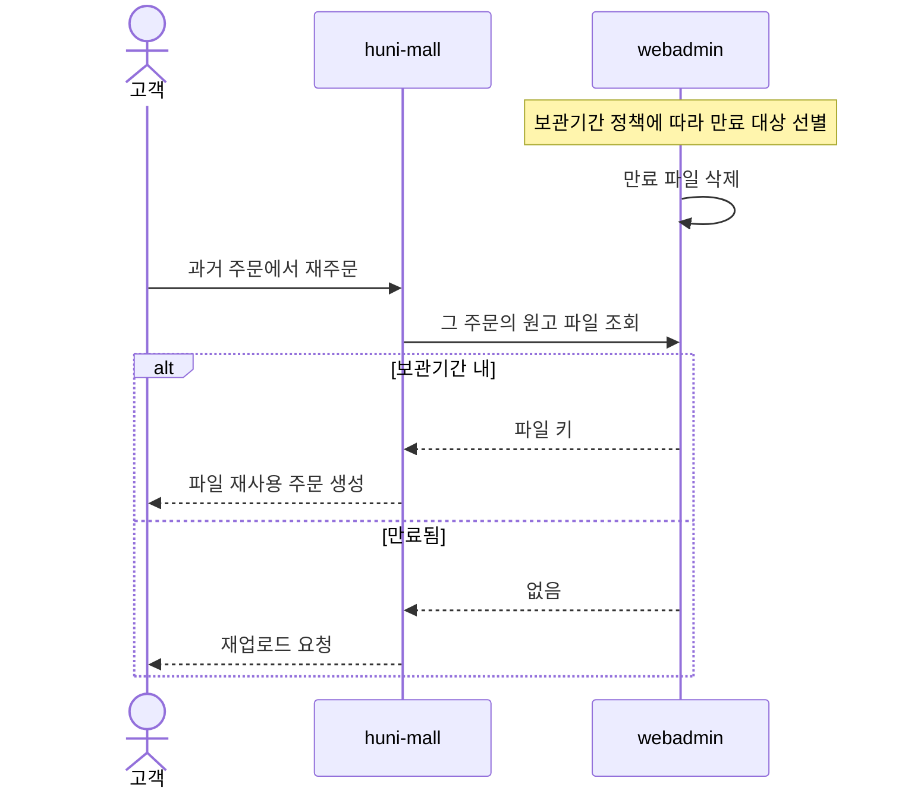
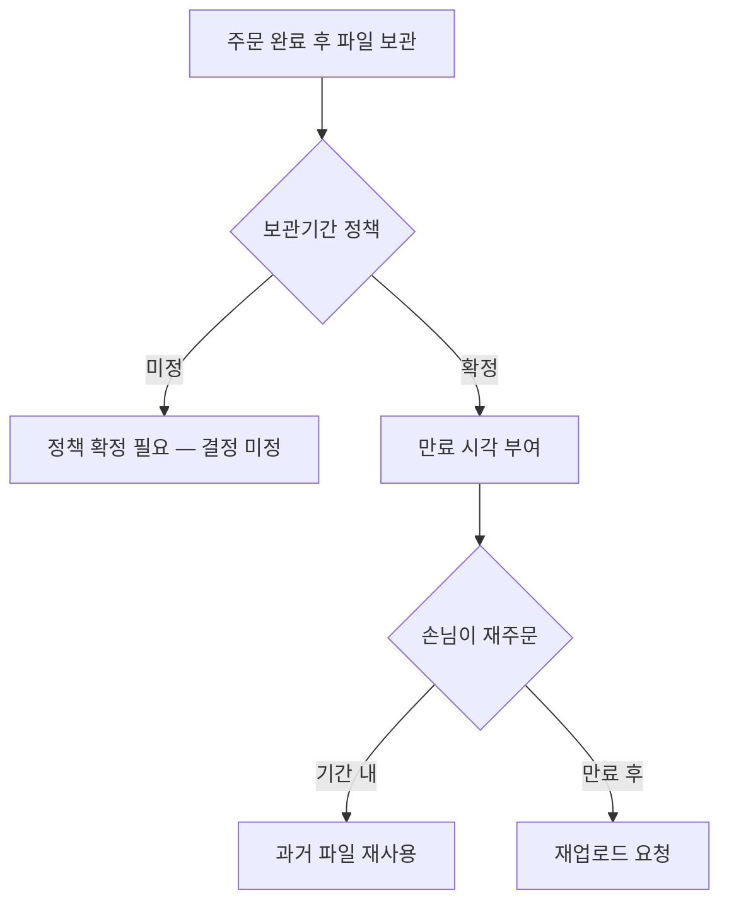

# P13 · 원고 보관·재사용

> t63 프로세스 정리 B — 탐색~결제 · L1 **원고·파일** · L2 보관

## 1. 한줄정의 · 시작/끝 · 등장인물

**한줄정의** — 올린 원고를 언제까지 두고, 다음 주문에 그대로 다시 쓸 수 있게 한다.

- **시작**: 주문이 끝나 파일이 보관 상태로 넘어간다
- **끝**: 보관기간이 지나 삭제되거나, 재주문에 다시 쓰인다

| 등장인물 | 무엇인가 |
|---|---|
| 고객 | 몰을 쓰는 손님(회원·비회원) |
| huni-mall | 신규 독립몰(headless · Next.js 15 App Router) |
| webadmin | 후니 자체 관리서버(Django) — 상품·옵션·가격·위젯빌더 |
| 운영자 | 후니 실무진(CS·상품·생산) |

**가로지르는 곳**
- P17 — 재주문(STD-ORD-026)과 같은 손님 동선에서 만난다
- t62 — 과거 주문 목록을 보는 자리는 마이페이지

## 2. 흐름 (sequence)

## 3. 갈림길 (flowchart · 실패·비회원·취소 분기)

## 4. 단계표

| # | 단계 | 시스템 | 담당자 | 원장 row_id | 상태 | 근거 |
|---|---|---|---|---|---|---|
| 1 | 고객 파일 보관기간 정책 적용·만료 삭제 | webadmin | 미정 | `STD-ART-026` | 미착수 | raw/webadmin/webadmin/catalog/artwork_promote.py:3 · raw/webadmin/webadmin/catalog/widget_api.py:3628-3636 |
| 2 | 과거 주문 파일 재사용 재주문 | webadmin | 서희항+김동학 | `STD-ART-027` | 미착수 | raw/webadmin/webadmin/catalog/edicus_lookup.py:401-415 · raw/webadmin/webadmin/catalog/edicus_lookup.py:433-462 |

## 5. 빠진 곳

**다 코드는 있는데 연결 안 됨** — 2건

| row_id | 내용 | 진단 |
|---|---|---|
| `STD-ART-026` | 고객 파일 보관기간 정책 적용·만료 삭제 | 고객이 올린 원고는 30일 시한부인 임시 버킷 이 코드 주석상 여러 곳에서 전제되지만 그 30일 만료·삭제는 S3 버킷 수명주기(인프라 설정)이지 이 저장소 코드가 정의/집행하지 않음 — 정책 반영은 간접 확인 |
| `STD-ART-027` | 과거 주문 파일 재사용 재주문 | clone_project() 함수(TODO edicus-G9 재주문 설계의 열쇠)는 존재하나 이 함수들은 어디에서도 호출되지 않는다(433-438 주석) — 재사용 재주문 경로는 설계만 있고 미배선. |

## 6. 채우는 방법

| 누가 | 무엇을 | 선행 |
|---|---|---|
| 미정 | 고객 파일 보관기간 정책 적용·만료 삭제 | 코드는 있는데 원장 상태가 「미착수」다 |
| 서희항+김동학 | 과거 주문 파일 재사용 재주문 | 코드는 있는데 원장 상태가 「미착수」다 |

## 7. 확인 못 한 것

보관기간 정책은 원장에서 담당자조차 「미정」이다. 며칠인지 정해진 바를 찾지 못했다.

---
> 이 문서의 상태·근거는 원장 `08_system-screen/t56/rejudge.csv` 와 이 카드의 증거 수집본에서 기계로 채웠다. 「미확인」은 코드·원장·명세를 뒤졌으나 **찾지 못했다**는 뜻이지, 없다는 뜻이 아니다.
