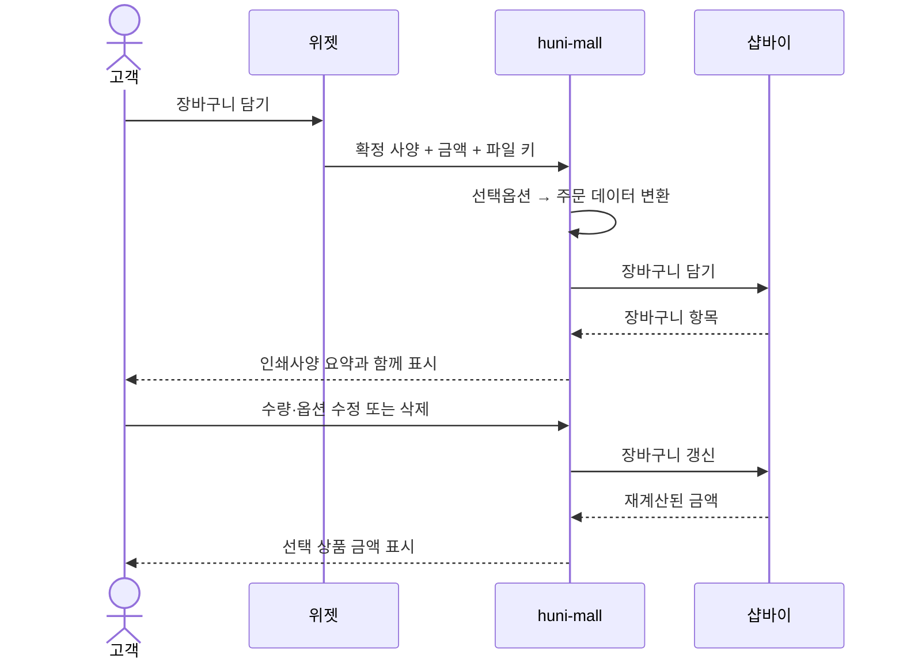
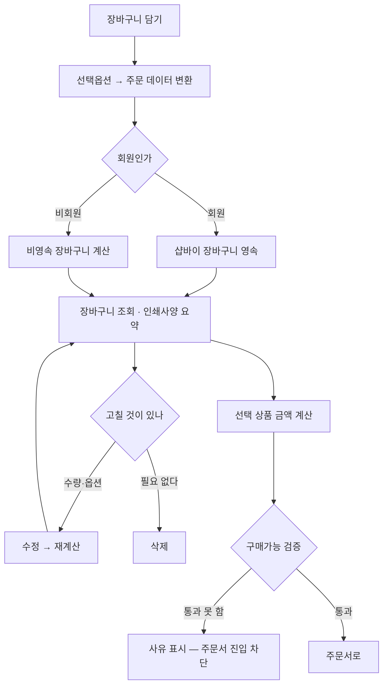

# P14 · 장바구니 담고 고치기

> t63 프로세스 정리 B — 탐색~결제 · L1 **장바구니·주문** · L2 장바구니

## 1. 한줄정의 · 시작/끝 · 등장인물

**한줄정의** — 확정한 인쇄 사양과 파일을 한 덩어리로 장바구니에 담고, 담은 뒤에도 고칠 수 있다.

- **시작**: 견적 화면에서 「장바구니 담기」를 누른다
- **끝**: 장바구니에서 살 항목을 골라 주문서로 넘어간다(P15 로 이어짐)

| 등장인물 | 무엇인가 |
|---|---|
| 고객 | 몰을 쓰는 손님(회원·비회원) |
| huni-mall | 신규 독립몰(headless · Next.js 15 App Router) |
| 위젯 | 상품 상세에 마운트되는 인쇄 주문옵션·견적 위젯 |
| 샵바이 | NHN 샵바이 — 회원·장바구니·주문·결제·배송의 커머스 SaaS |

**가로지르는 곳**
- P05·P08 — 담기는 내용은 위젯이 확정한 사양과 금액이다
- P10 — 파일이 항목에 동반된다

## 2. 흐름 (sequence)

## 3. 갈림길 (flowchart · 실패·비회원·취소 분기)

## 4. 단계표

| # | 단계 | 시스템 | 담당자 | 원장 row_id | 상태 | 근거 |
|---|---|---|---|---|---|---|
| 1 | 선택옵션→주문 데이터 변환(확정 사양의 주문항목 생성) | 미확인 | 김동학 | `STD-ORD-028` | 작동 | 「미확인」 |
| 2 | 장바구니 담기(인쇄옵션+파일 동반) | 미확인 | 김동학 | `STD-ORD-001` | 작동 | 「미확인」 |
| 3 | 비회원 장바구니 계산(비영속) | 미확인 | 김동학 | `STD-ORD-007` | 작동 | 「미확인」 |
| 4 | 장바구니 조회 | 미확인 | 김동학 | `STD-ORD-002` | 작동 | 「미확인」 |
| 5 | 장바구니 인쇄사양 요약 표시 | 미확인 | 김동학 | `STD-ORD-008` | 작동 | 「미확인」 |
| 6 | 장바구니 수량/옵션 수정 | 미확인 | 김동학 | `STD-ORD-003` | 작동 | 「미확인」 |
| 7 | 장바구니 항목 삭제 | 미확인 | 김동학 | `STD-ORD-004` | 작동 | 「미확인」 |
| 8 | 선택 상품 금액 계산 | 미확인 | 김동학 | `STD-ORD-005` | 작동 | 「미확인」 |
| 9 | 구매가능 검증(결제 전 sanity) | 미확인 | 김동학 | `STD-ORD-006` | 부분 | raw/webadmin/webadmin/config/urls.py:249 (선행 카드 증거 · 실재 확인) |

## 5. 빠진 곳

**나 행은 있는데 코드 0** — 7건

| row_id | 내용 | 진단 |
|---|---|---|
| `STD-ORD-001` | 장바구니 담기(인쇄옵션+파일 동반) | 코드·명세를 뒤졌으나 구현을 찾지 못했다 |
| `STD-ORD-007` | 비회원 장바구니 계산(비영속) | 코드·명세를 뒤졌으나 구현을 찾지 못했다 |
| `STD-ORD-002` | 장바구니 조회 | 코드·명세를 뒤졌으나 구현을 찾지 못했다 |
| `STD-ORD-008` | 장바구니 인쇄사양 요약 표시 | 코드·명세를 뒤졌으나 구현을 찾지 못했다 |
| `STD-ORD-003` | 장바구니 수량/옵션 수정 | 코드·명세를 뒤졌으나 구현을 찾지 못했다 |
| `STD-ORD-004` | 장바구니 항목 삭제 | 코드·명세를 뒤졌으나 구현을 찾지 못했다 |
| `STD-ORD-005` | 선택 상품 금액 계산 | 코드·명세를 뒤졌으나 구현을 찾지 못했다 |

**다 코드는 있는데 연결 안 됨** — 1건

| row_id | 내용 | 진단 |
|---|---|---|
| `STD-ORD-006` | 구매가능 검증(결제 전 sanity) | 코드는 있는데 원장 상태가 「부분」다 |

**라 결정 미정** — 1건

| row_id | 내용 | 진단 |
|---|---|---|
| `STD-ORD-028` | 선택옵션→주문 데이터 변환(확정 사양의 주문항목 생성) | 사람이 정해야 끝나는 안건 — 코드가 없는 것이 결함이 아니다 |

## 6. 채우는 방법

| 누가 | 무엇을 | 선행 |
|---|---|---|
| 김동학 | 선택옵션→주문 데이터 변환(확정 사양의 주문항목 생성) | 사람이 정해야 끝나는 안건 — 코드가 없는 것이 결함이 아니다 |
| 김동학 | 장바구니 담기(인쇄옵션+파일 동반) | 코드·명세를 뒤졌으나 구현을 찾지 못했다 |
| 김동학 | 비회원 장바구니 계산(비영속) | 코드·명세를 뒤졌으나 구현을 찾지 못했다 |
| 김동학 | 장바구니 조회 | 코드·명세를 뒤졌으나 구현을 찾지 못했다 |
| 김동학 | 장바구니 인쇄사양 요약 표시 | 코드·명세를 뒤졌으나 구현을 찾지 못했다 |
| 김동학 | 장바구니 수량/옵션 수정 | 코드·명세를 뒤졌으나 구현을 찾지 못했다 |
| 김동학 | 장바구니 항목 삭제 | 코드·명세를 뒤졌으나 구현을 찾지 못했다 |
| 김동학 | 선택 상품 금액 계산 | 코드·명세를 뒤졌으나 구현을 찾지 못했다 |
| 김동학 | 구매가능 검증(결제 전 sanity) | 코드는 있는데 원장 상태가 「부분」다 |

## 7. 확인 못 한 것

비회원 장바구니가 브라우저 저장인지 샵바이 게스트 세션인지 실행 경로로 확인하지 않았다.

---
> 이 문서의 상태·근거는 원장 `08_system-screen/t56/rejudge.csv` 와 이 카드의 증거 수집본에서 기계로 채웠다. 「미확인」은 코드·원장·명세를 뒤졌으나 **찾지 못했다**는 뜻이지, 없다는 뜻이 아니다.
