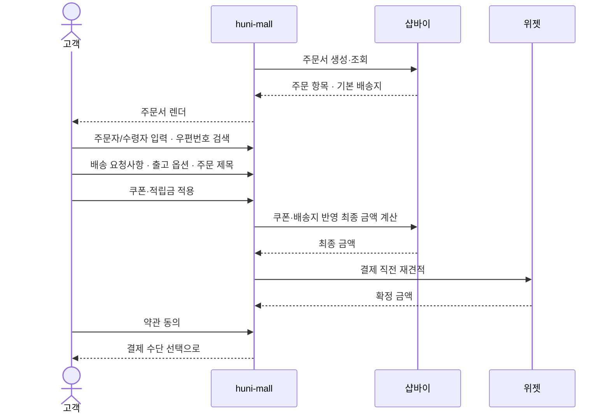
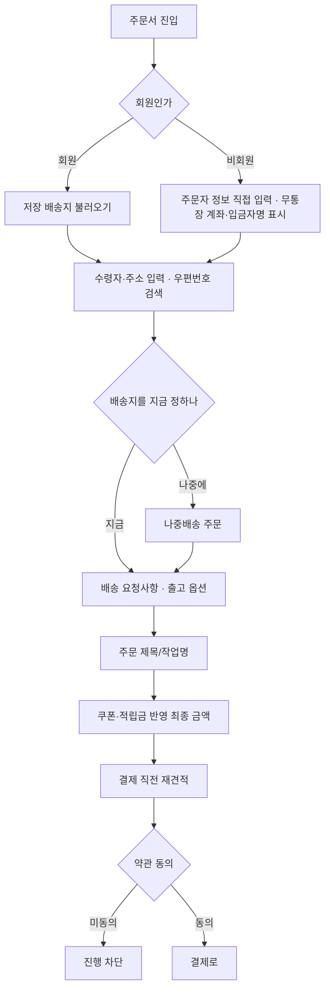

# P15 · 주문서 쓰기

> t63 프로세스 정리 B — 탐색~결제 · L1 **장바구니·주문** · L2 주문서

## 1. 한줄정의 · 시작/끝 · 등장인물

**한줄정의** — 손님이 주문자·받는사람·배송지·요청사항을 적고 약관에 동의해 결제 직전까지 간다.

- **시작**: 장바구니에서 주문서로 넘어온다
- **끝**: 최종 금액이 확정되어 결제 수단 선택으로 넘어간다(P19 로 이어짐)

| 등장인물 | 무엇인가 |
|---|---|
| 고객 | 몰을 쓰는 손님(회원·비회원) |
| huni-mall | 신규 독립몰(headless · Next.js 15 App Router) |
| 샵바이 | NHN 샵바이 — 회원·장바구니·주문·결제·배송의 커머스 SaaS |
| 위젯 | 상품 상세에 마운트되는 인쇄 주문옵션·견적 위젯 |

**가로지르는 곳**
- t62 — 쿠폰·적립금의 발급·보유는 프로모션(STD-PRM)
- P22 — 배송지가 정해져야 배송비가 확정된다

## 2. 흐름 (sequence)

## 3. 갈림길 (flowchart · 실패·비회원·취소 분기)

## 4. 단계표

| # | 단계 | 시스템 | 담당자 | 원장 row_id | 상태 | 근거 |
|---|---|---|---|---|---|---|
| 1 | 주문서 작성 | huni-mall | 김동학 | `STD-ORD-009` | 작동 | 「미확인」 — src/lib/api/hooks/use-order-sheet.ts:5-6 · src/lib/api/hooks/use-order-sheet.ts:40-49 |
| 2 | 주문서 조회 | huni-mall | 김동학 | `STD-ORD-010` | 작동 | 「미확인」 — src/lib/api/hooks/use-order-sheet.ts:6 · src/lib/api/hooks/use-order-sheet.ts:177-183 |
| 3 | 주문자/수령자 정보 입력 | huni-mall | 김동학 | `STD-ORD-012` | 작동 | 「미확인」 — src/components/checkout/checkout-form.tsx:244-334 · src/components/checkout/checkout-form.tsx:400-401 |
| 4 | 비회원 주문서 무통장 계좌·입금자명 표시(회원 주문서와 동일 여부) | huni-mall | 김동학 | `STD-ORD-032` | 부분 | 「미확인」 — src/components/checkout/checkout-form.tsx:827-852 · src/components/checkout/guest-checkout-form.tsx:55 · src/components/checkout/guest-checkout-form.tsx:323-365 |
| 5 | 배송지 주소 검색(우편번호) | huni-mall | 김동학 | `STD-ORD-013` | 작동 | 「미확인」 — src/components/common/address-search-modal.tsx:4-5 · src/components/common/address-search-modal.tsx:77 · src/components/checkout/checkout-form.tsx:984-991 |
| 6 | 나중배송(배송지 미입력) 주문 | shopby | 김동학 | `STD-ORD-015` | 미착수 | docs/shopby/shopby-api/order-shop-public.yml:2707 |
| 7 | 배송 요청사항 입력 | huni-mall | 김동학 | `STD-ORD-014` | 미착수 | 「미확인」 — src/components/checkout/checkout-form.tsx:733 |
| 8 | 출고 옵션 선택(오늘출고·토요일출고) | huni-mall | 김동학 | `STD-ORD-017` | 미착수 | 「미확인」 — 찾지 못했다(checkout-form.tsx·guest-checkout-form.tsx·shopby yml order-shop-public.yml 전수 grep 오늘출고/토요일출고/당일출고/Saturday — 없음) |
| 9 | 주문 제목/작업명 입력 | huni-mall | 김동학 | `STD-ORD-016` | 부분 | huni-skin-shopby/src/components/product/huni-widget.tsx:62-68 |
| 10 | 쿠폰·배송지 반영 최종 금액 계산 | huni-mall | 김동학 | `STD-ORD-011` | 부분 | huni-skin-shopby/src/lib/api/hooks/use-order-sheet.ts:177 (선행 카드 증거 · 실재 확인) |
| 11 | 결제 직전 재견적(최종 금액을 다시 확정하고 결제로 넘김) | huni-mall | 김동학 | `STD-ORD-029` | 미착수 | 「미확인」 — src/lib/api/requote.ts:1-9 · src/app/api/printly/requote/route.ts:1-19 · src/components/cart/cart-page.tsx:162-189 |
| 12 | 약관 동의(구매·개인정보 제3자) | huni-mall | 김동학 | `STD-ORD-018` | 부분 | 「미확인」 — src/components/checkout/order-summary.tsx:12 · src/components/checkout/order-summary.tsx:79-98 · src/components/checkout/checkout-form.tsx:281 |

## 5. 빠진 곳

**나 행은 있는데 코드 0** — 8건

| row_id | 내용 | 진단 |
|---|---|---|
| `STD-ORD-009` | 주문서 작성 | useCreateOrderSheet 이 POST /order-sheets 로 cartNos/products 를 실어 주문서를 만든다. |
| `STD-ORD-010` | 주문서 조회 | useOrderSheet 이 GET /order-sheets/{orderSheetNo} 로 주문서 요약을 조회. |
| `STD-ORD-012` | 주문자/수령자 정보 입력 | address.recipient/phone 필드로 수령자 정보를 ordererName/ordererContact1 로 주문자 정보를 입력·전송. |
| `STD-ORD-032` | 비회원 주문서 무통장 계좌·입금자명 표시(회원 주문서와 동일 여부) | 회원(checkout-form.tsx)·비회원(guest-checkout-form.tsx) 양쪽 모두 은행 선택 드롭다운+입금자명 입력 필드를 거의 동일한 구조로 구현 — 회원 주문서와 동일 UI 패턴 확인. |
| `STD-ORD-013` | 배송지 주소 검색(우편번호) | AddressSearchModal 이 GET /addresses/search(우편번호 찾기)로 zipCode/roadAddress 를 검색해 채워 넣는다. |
| `STD-ORD-014` | 배송 요청사항 입력 | 배송메모 TextField(register(address.memo))로 배송 요청사항 입력. |
| `STD-ORD-017` | 출고 옵션 선택(오늘출고·토요일출고) | 출고 옵션(오늘출고·토요일출고) 선택 UI/필드를 huni-mall·shopby 스펙 어디서도 못 찾음. |
| `STD-ORD-018` | 약관 동의(구매·개인정보 제3자) | RHF Controller 로 zod agree 필드를 연결한 동의 체크박스(라디오/체크 1개) — 구매·개인정보 제3자 약관을 세분한 다중 체크는 못 찾음(단일 동의로 보임). |

**다 코드는 있는데 연결 안 됨** — 3건

| row_id | 내용 | 진단 |
|---|---|---|
| `STD-ORD-015` | 나중배송(배송지 미입력) 주문 | /later-input/order(배송지 나중입력 주문) 엔드포인트가 shopby 스펙에 존재하나 huni-mall(src/) 전수 grep 결과 later-input 을 호출하는 코드가 없음 — 서버 능력만 있고 몰 쪽 미구현. |
| `STD-ORD-016` | 주문 제목/작업명 입력 | 전용 주문 제목 입력 필드는 못 찾음 — 위젯 요약(summary)이 그 역할을 부분 대체하는 것으로 추정. |
| `STD-ORD-011` | 쿠폰·배송지 반영 최종 금액 계산 | POST /order-sheets/{no}/calculate 로 쿠폰·주소 반영 서버 재계산(calc) 후 dispTotal 표시 |

**라 결정 미정** — 1건

| row_id | 내용 | 진단 |
|---|---|---|
| `STD-ORD-029` | 결제 직전 재견적(최종 금액을 다시 확정하고 결제로 넘김) | 생략 → 결제 직전 재견적 인프라(requote.ts·requote/route.ts)는 존재하나 실제 호출은 cart-page.tsx 의 로드시 정규화에서만 쓰이고 checkout-form.tsx(결제 버튼 클릭 시점)에는 requote 호출이 없음 — grep 결과 checkout-form.tsx 에 requote 문자열 0건. |

## 6. 채우는 방법

| 누가 | 무엇을 | 선행 |
|---|---|---|
| 김동학 | 주문서 작성 | 코드·명세를 뒤졌으나 구현을 찾지 못했다 |
| 김동학 | 주문서 조회 | 코드·명세를 뒤졌으나 구현을 찾지 못했다 |
| 김동학 | 주문자/수령자 정보 입력 | 코드·명세를 뒤졌으나 구현을 찾지 못했다 |
| 김동학 | 비회원 주문서 무통장 계좌·입금자명 표시(회원 주문서와 동일 여부) | 코드·명세를 뒤졌으나 구현을 찾지 못했다 |
| 김동학 | 배송지 주소 검색(우편번호) | 코드·명세를 뒤졌으나 구현을 찾지 못했다 |
| 김동학 | 나중배송(배송지 미입력) 주문 | 코드는 있는데 원장 상태가 「미착수」다 |
| 김동학 | 배송 요청사항 입력 | 코드·명세를 뒤졌으나 구현을 찾지 못했다 |
| 김동학 | 출고 옵션 선택(오늘출고·토요일출고) | 코드·명세를 뒤졌으나 구현을 찾지 못했다 |
| 김동학 | 주문 제목/작업명 입력 | 코드는 있는데 원장 상태가 「부분」다 |
| 김동학 | 쿠폰·배송지 반영 최종 금액 계산 | 코드는 있는데 원장 상태가 「부분」다 |
| 김동학 | 결제 직전 재견적(최종 금액을 다시 확정하고 결제로 넘김) | 사람이 정해야 끝나는 안건 — 코드가 없는 것이 결함이 아니다 |
| 김동학 | 약관 동의(구매·개인정보 제3자) | 코드·명세를 뒤졌으나 구현을 찾지 못했다 |

## 7. 확인 못 한 것

「결제 직전 재견적」(STD-ORD-029)이 위젯 재호출인지 샵바이 재계산인지 정해진 바를 찾지 못했다.

---
> 이 문서의 상태·근거는 원장 `08_system-screen/t56/rejudge.csv` 와 이 카드의 증거 수집본에서 기계로 채웠다. 「미확인」은 코드·원장·명세를 뒤졌으나 **찾지 못했다**는 뜻이지, 없다는 뜻이 아니다.
