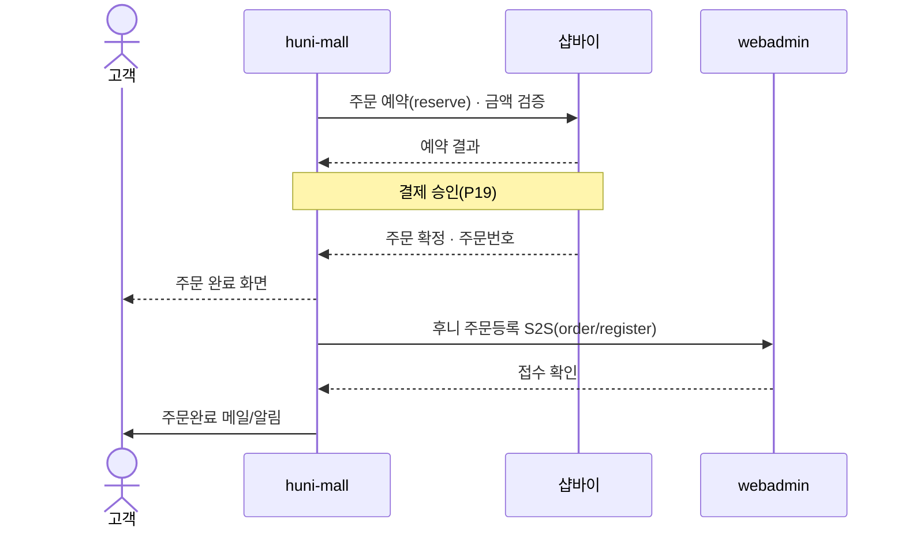
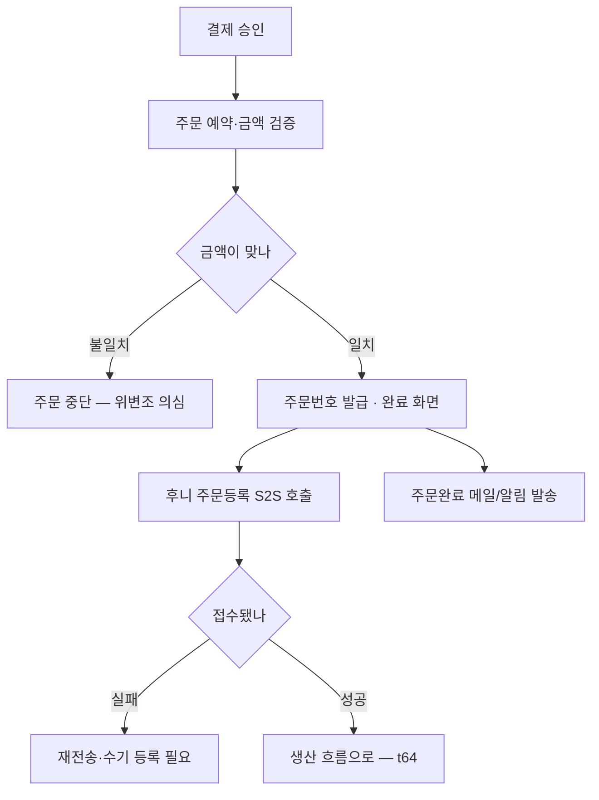

# P16 · 주문 확정하기

> t63 프로세스 정리 B — 탐색~결제 · L1 **장바구니·주문** · L2 주문

## 1. 한줄정의 · 시작/끝 · 등장인물

**한줄정의** — 결제가 끝나면 주문번호가 나오고, 그 주문이 후니 쪽 시스템으로 넘어간다.

- **시작**: 결제가 승인된다(P19 에서 이어짐)
- **끝**: 주문번호가 발급되고 후니 주문등록까지 끝난다(t64 로 이어짐)

| 등장인물 | 무엇인가 |
|---|---|
| 고객 | 몰을 쓰는 손님(회원·비회원) |
| huni-mall | 신규 독립몰(headless · Next.js 15 App Router) |
| 샵바이 | NHN 샵바이 — 회원·장바구니·주문·결제·배송의 커머스 SaaS |
| webadmin | 후니 자체 관리서버(Django) — 상품·옵션·가격·위젯빌더 |
| 운영자 | 후니 실무진(CS·상품·생산) |

**가로지르는 곳**
- t64 — 주문등록 S2S 이후의 검판·MES·공정·출고는 전부 t64
- P19 — 결제 승인이 이 프로세스의 방아쇠다

## 2. 흐름 (sequence)

## 3. 갈림길 (flowchart · 실패·비회원·취소 분기)

## 4. 단계표

| # | 단계 | 시스템 | 담당자 | 원장 row_id | 상태 | 근거 |
|---|---|---|---|---|---|---|
| 1 | 주문 예약(reserve) 및 금액 검증 | 미확인 | 김동학 | `STD-ORD-019` | 부분 | huni-skin-shopby/src/components/checkout/checkout-form.tsx:157 (선행 카드 증거 · 실재 확인) |
| 2 | 주문 완료 화면·주문번호 발급 | 미확인 | 김동학 | `STD-ORD-020` | 작동 | 「미확인」 |
| 3 | 주문 생성 직후 후니 주문등록 S2S 호출(order/register) | 미확인 | 김동학 | `STD-ORD-030` | 미착수 | raw/webadmin/webadmin/config/urls.py:267 (선행 카드 증거 · 실재 확인) |
| 4 | 주문완료 메일/알림 발송 | 미확인 | 최숙진 | `STD-ORD-031` | 미착수 | 「미확인」 |
| 5 | 주문등록 S2S 실패 재전송·수기 보정 | webadmin | 김동학+서희항 | — | **원장 행 없음** | 「미확인」 |

## 5. 빠진 곳

**가 원장에 행 없음** — 1건

| row_id | 내용 | 진단 |
|---|---|---|
| — | 주문등록 S2S 실패 재전송·수기 보정 | S2S 가 실패하면 주문이 후니로 안 넘어가는데 복구 경로가 원장에 없다 |

**나 행은 있는데 코드 0** — 2건

| row_id | 내용 | 진단 |
|---|---|---|
| `STD-ORD-020` | 주문 완료 화면·주문번호 발급 | 코드·명세를 뒤졌으나 구현을 찾지 못했다 |
| `STD-ORD-031` | 주문완료 메일/알림 발송 | 코드·명세를 뒤졌으나 구현을 찾지 못했다 |

**다 코드는 있는데 연결 안 됨** — 2건

| row_id | 내용 | 진단 |
|---|---|---|
| `STD-ORD-019` | 주문 예약(reserve) 및 금액 검증 | 코드는 있는데 원장 상태가 「부분」다 |
| `STD-ORD-030` | 주문 생성 직후 후니 주문등록 S2S 호출(order/register) | 코드는 있는데 원장 상태가 「미착수」다 |

## 6. 채우는 방법

| 누가 | 무엇을 | 선행 |
|---|---|---|
| 김동학+서희항 | 주문등록 S2S 실패 재전송·수기 보정 | 원장 735행에 행을 새로 섞지 않는다 — 이 제안으로만 남긴다 |
| 김동학 | 주문 예약(reserve) 및 금액 검증 | 코드는 있는데 원장 상태가 「부분」다 |
| 김동학 | 주문 완료 화면·주문번호 발급 | 코드·명세를 뒤졌으나 구현을 찾지 못했다 |
| 김동학 | 주문 생성 직후 후니 주문등록 S2S 호출(order/register) | 코드는 있는데 원장 상태가 「미착수」다 |
| 최숙진 | 주문완료 메일/알림 발송 | 코드·명세를 뒤졌으나 구현을 찾지 못했다 |

## 7. 확인 못 한 것

S2S 실패 시 재전송 정책(재시도 횟수·수기 보정 경로)을 찾지 못했다.

---
> 이 문서의 상태·근거는 원장 `08_system-screen/t56/rejudge.csv` 와 이 카드의 증거 수집본에서 기계로 채웠다. 「미확인」은 코드·원장·명세를 뒤졌으나 **찾지 못했다**는 뜻이지, 없다는 뜻이 아니다.
