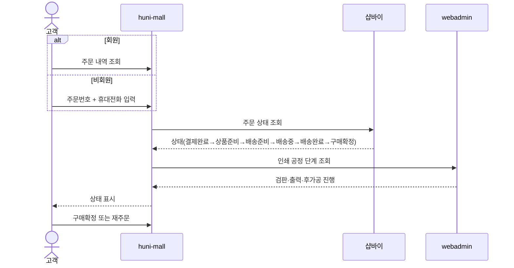
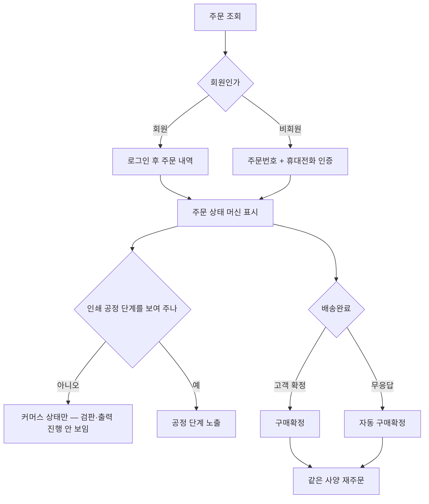

# P17 · 주문 조회·후속 처리

> t63 프로세스 정리 B — 탐색~결제 · L1 **장바구니·주문** · L2 주문

## 1. 한줄정의 · 시작/끝 · 등장인물

**한줄정의** — 손님이 회원으로든 비회원으로든 주문 상태를 보고, 확정하거나 같은 사양으로 다시 주문한다.

- **시작**: 손님이 주문 내역을 연다
- **끝**: 구매확정하거나 재주문한다

| 등장인물 | 무엇인가 |
|---|---|
| 고객 | 몰을 쓰는 손님(회원·비회원) |
| huni-mall | 신규 독립몰(headless · Next.js 15 App Router) |
| 샵바이 | NHN 샵바이 — 회원·장바구니·주문·결제·배송의 커머스 SaaS |
| webadmin | 후니 자체 관리서버(Django) — 상품·옵션·가격·위젯빌더 |

**가로지르는 곳**
- t62 — 회원 주문 내역 화면은 마이페이지(STD-MYP)
- t64 — 공정 단계 값을 만드는 쪽은 MES·운영자 주문운영
- t65 — 취소·반품·교환은 클레임(STD-CLM)
- P13 — 재주문은 과거 원고 재사용과 붙는다

## 2. 흐름 (sequence)

## 3. 갈림길 (flowchart · 실패·비회원·취소 분기)

## 4. 단계표

| # | 단계 | 시스템 | 담당자 | 원장 row_id | 상태 | 근거 |
|---|---|---|---|---|---|---|
| 1 | 주문 상태 조회(회원) | huni-mall | 김동학 | `STD-ORD-021` | 부분 | huni-skin-shopby/src/lib/api/hooks/use-my-orders.ts:84 (선행 카드 증거 · 실재 확인) |
| 2 | 비회원 주문 조회(주문번호+휴대전화) | huni-mall | 김동학 | `STD-ORD-022` | 작동 | 「미확인」 — src/components/order/guest-order-lookup.tsx:1-9 · src/components/order/guest-order-lookup.tsx:25-28 · src/components/order/guest-order-lookup.tsx:136-196 |
| 3 | 주문 상태 머신 전이 표시(결제완료→상품준비→배송준비→배송중→배송완료→구매확정) | huni-mall | 김동학 | `STD-ORD-023` | 부분 | huni-skin-shopby/src/lib/api/hooks/use-my-orders.ts:84 (선행 카드 증거 · 실재 확인) |
| 4 | 인쇄 공정 단계 상태 노출(검판·출력·후가공) | webadmin | 김동학 | `STD-ORD-024` | 미착수 | 「미확인」 — 찾지 못했다(webadmin/catalog/*.py 전수 grep 검판/후가공 단계/공정 노출 — 후가공은 전부 가격 구성요소 용어이고 MES 는 원고 전달 대상일 뿐 고객에게 인쇄 공정 진행 단계를 노출하는 코드/화면은 huni-mall·webadmin 어디서도 못 찾음) |
| 5 | 구매확정(고객·자동) | shopby | 김동학 | `STD-ORD-025` | 미착수 | docs/shopby/shopby-api/order-shop-public.yml:1950-1958 · docs/shopby/shopby-api/order-shop-public.yml:6612-6620 · docs/shopby/shopby-api/order-shop-public.yml:1996-2008 |
| 6 | 재주문(동일 사양 반복) | huni-mall | 김동학 | `STD-ORD-026` | 미착수 | 「미확인」 — 찾지 못했다(src 전수 grep 재주문/reorder — src/lib/guide-data.ts:193 에 재주문·재견적 방법 이라는 가이드 문서 제목만 있고 실제 재주문 버튼/로직 코드는 없음) |

## 5. 빠진 곳

**나 행은 있는데 코드 0** — 3건

| row_id | 내용 | 진단 |
|---|---|---|
| `STD-ORD-022` | 비회원 주문 조회(주문번호+휴대전화) | 실제 구현은 주문번호+주문 비밀번호(password) 기반이며 문서화된 POST /guest/orders/{orderNo}의 mobileNo 파라미터는 UI 폼에서 쓰이지 않음(휴대전화 입력칸 없음) — 요구된 주문번호+휴대전화 방식과 불일치 |
| `STD-ORD-024` | 인쇄 공정 단계 상태 노출(검판·출력·후가공) | artwork_promote.py 의 MES 관련 주석은 원고를 MES 에 넘긴다는 내부 파이프라인 설명이지 고객 화면 노출 기능이 아님. |
| `STD-ORD-026` | 재주문(동일 사양 반복) | 가이드 스텁 문서 제목 외 실제 재주문(동일 사양 반복) 기능 코드를 찾지 못함. |

**다 코드는 있는데 연결 안 됨** — 3건

| row_id | 내용 | 진단 |
|---|---|---|
| `STD-ORD-021` | 주문 상태 조회(회원) | ORDER_STATUS_LABEL_KO 매핑과 mypage/orders 상세 페이지로 회원 주문 상태 조회. |
| `STD-ORD-023` | 주문 상태 머신 전이 표시(결제완료→상품준비→배송준비→배송중→배송완료→구매확정) | ORDER_STATUS_LABEL_KO 가 DEPOSIT_WAIT/PAY_DONE/PRODUCT_PREPARE/DELIVERY_PREPARE/DELIVERY_ING/DELIVERY_DONE/BUY_CONFIRM 전 단계를 한글 라벨로 매핑 — 요청된 전이 순서와 정확히 일치. |
| `STD-ORD-025` | 구매확정(고객·자동) | 배송중 배송완료 상태의 상품주문을 구매확정 처리하는 API 가 비회원(1950)·회원(6612) 양쪽에 있고 delivery-done(자동/수령확인 2008)도 별도 존재 — 고객 수동 확정과 자동 확정 경로 모두 shopby 스펙에 존재. |

## 6. 채우는 방법

| 누가 | 무엇을 | 선행 |
|---|---|---|
| 김동학 | 주문 상태 조회(회원) | 코드는 있는데 원장 상태가 「부분」다 |
| 김동학 | 비회원 주문 조회(주문번호+휴대전화) | 코드·명세를 뒤졌으나 구현을 찾지 못했다 |
| 김동학 | 주문 상태 머신 전이 표시(결제완료→상품준비→배송준비→배송중→배송완료→구매확정) | 코드는 있는데 원장 상태가 「부분」다 |
| 김동학 | 인쇄 공정 단계 상태 노출(검판·출력·후가공) | 코드·명세를 뒤졌으나 구현을 찾지 못했다 |
| 김동학 | 구매확정(고객·자동) | 코드는 있는데 원장 상태가 「미착수」다 |
| 김동학 | 재주문(동일 사양 반복) | 코드·명세를 뒤졌으나 구현을 찾지 못했다 |

## 7. 확인 못 한 것

비회원 주문 조회의 본인확인 수단이 휴대전화 외에 무엇을 더 요구하는지 확인하지 않았다.

---
> 이 문서의 상태·근거는 원장 `08_system-screen/t56/rejudge.csv` 와 이 카드의 증거 수집본에서 기계로 채웠다. 「미확인」은 코드·원장·명세를 뒤졌으나 **찾지 못했다**는 뜻이지, 없다는 뜻이 아니다.
