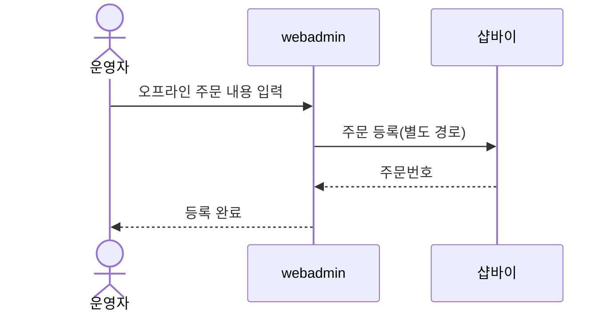
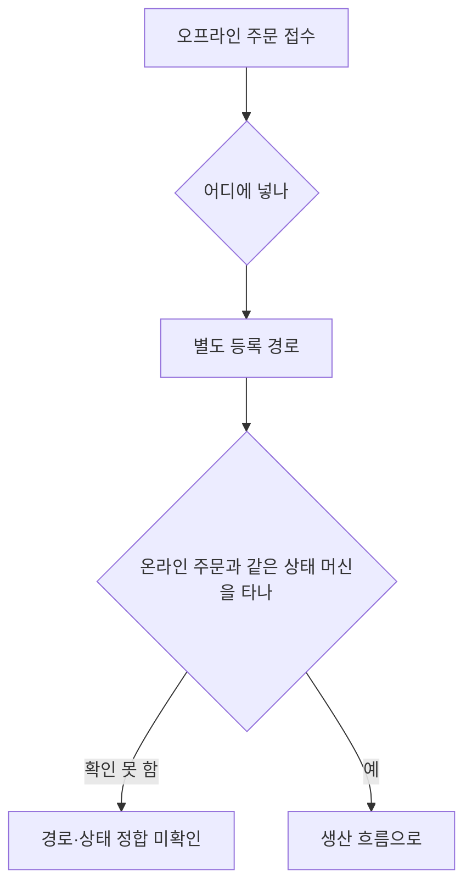

# P18 · 오프라인 주문 등록

> t63 프로세스 정리 B — 탐색~결제 · L1 **장바구니·주문** · L2 주문

## 1. 한줄정의 · 시작/끝 · 등장인물

**한줄정의** — 전화·방문으로 들어온 주문을 운영자가 몰 밖 경로로 시스템에 넣는다.

- **시작**: 운영자가 오프라인 주문을 받는다
- **끝**: 주문이 시스템에 등록되어 온라인 주문과 같은 흐름을 탄다

| 등장인물 | 무엇인가 |
|---|---|
| 운영자 | 후니 실무진(CS·상품·생산) |
| webadmin | 후니 자체 관리서버(Django) — 상품·옵션·가격·위젯빌더 |
| 샵바이 | NHN 샵바이 — 회원·장바구니·주문·결제·배송의 커머스 SaaS |

**가로지르는 곳**
- t64 — 등록된 주문은 같은 생산 흐름을 탄다
- t65 — 운영자 주문 운영 화면 전반은 t64·t65

## 2. 흐름 (sequence)

## 3. 갈림길 (flowchart · 실패·비회원·취소 분기)

## 4. 단계표

| # | 단계 | 시스템 | 담당자 | 원장 row_id | 상태 | 근거 |
|---|---|---|---|---|---|---|
| 1 | 오프라인 주문 별도 등록 경로 | webadmin | 서희항 | `STD-ORD-027` | 부분 | raw/webadmin/webadmin/catalog/models.py:87 (선행 카드 증거 · 실재 확인) |

## 5. 빠진 곳

**다 코드는 있는데 연결 안 됨** — 1건

| row_id | 내용 | 진단 |
|---|---|---|
| `STD-ORD-027` | 오프라인 주문 별도 등록 경로 | TOrdOrders 모델(models.py:1058)은 order/register S2S 수신 전용이고 오프라인 주문을 위한 별도 등록 화면/API 는 못 찾음. |

## 6. 채우는 방법

| 누가 | 무엇을 | 선행 |
|---|---|---|
| 서희항 | 오프라인 주문 별도 등록 경로 | 코드는 있는데 원장 상태가 「부분」다 |

## 7. 확인 못 한 것

「별도 등록 경로」가 webadmin 인지 샵바이 어드민인지 이 카드에서 확정하지 않았다.

---
> 이 문서의 상태·근거는 원장 `08_system-screen/t56/rejudge.csv` 와 이 카드의 증거 수집본에서 기계로 채웠다. 「미확인」은 코드·원장·명세를 뒤졌으나 **찾지 못했다**는 뜻이지, 없다는 뜻이 아니다.
