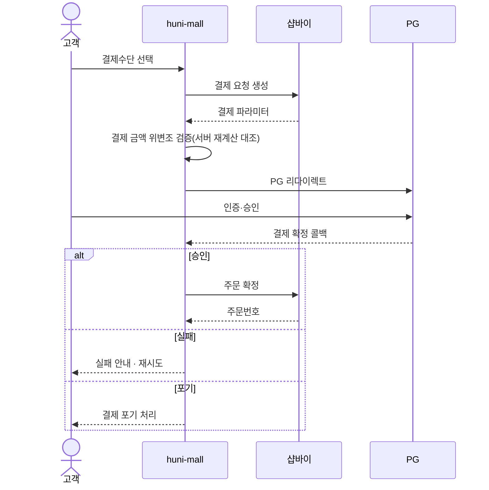
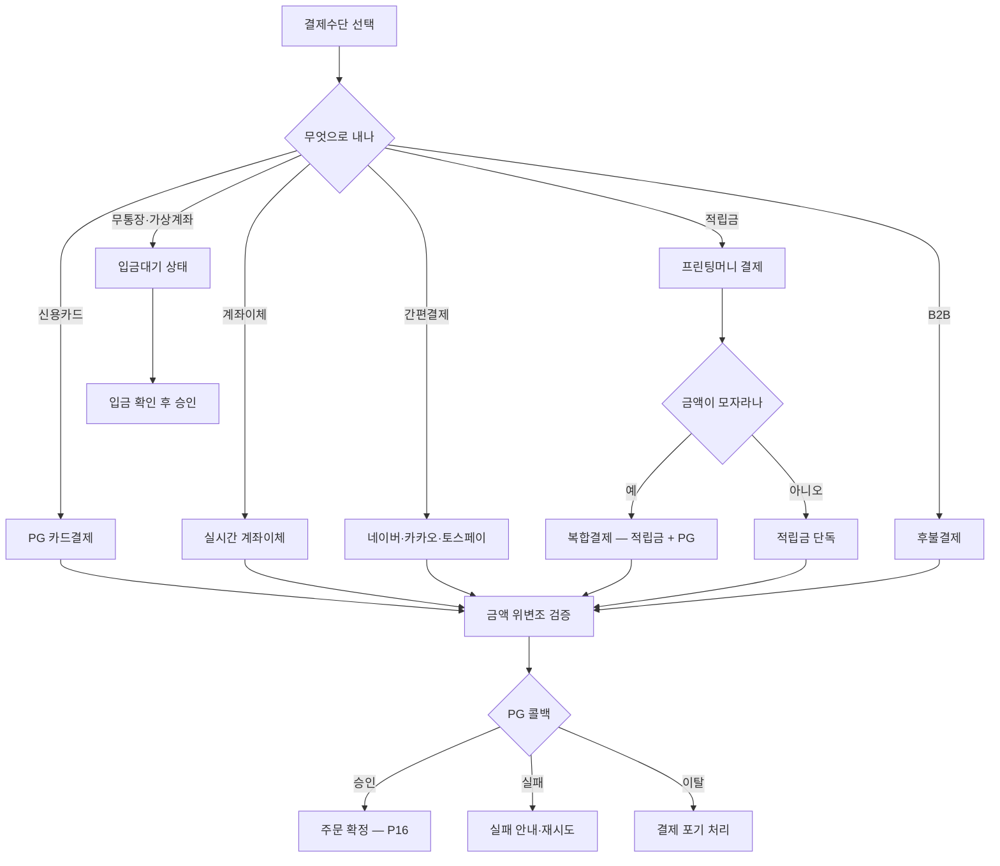

# P19 · 결제하기

> t63 프로세스 정리 B — 탐색~결제 · L1 **결제** · L2 결제수단 · 결제처리

## 1. 한줄정의 · 시작/끝 · 등장인물

**한줄정의** — 손님이 결제수단을 골라 값을 치르고, 서버가 금액을 다시 확인한 뒤 승인을 확정한다.

- **시작**: 주문서에서 결제수단을 고른다
- **끝**: 결제가 승인되거나 실패·포기로 끝난다(P16 으로 이어짐)

| 등장인물 | 무엇인가 |
|---|---|
| 고객 | 몰을 쓰는 손님(회원·비회원) |
| huni-mall | 신규 독립몰(headless · Next.js 15 App Router) |
| 샵바이 | NHN 샵바이 — 회원·장바구니·주문·결제·배송의 커머스 SaaS |
| PG | 외부 결제대행(이니시스·토스·카카오·네이버) |

**가로지르는 곳**
- P08 — 위젯 총액과 샵바이 청구액이 어긋나면 여기서 터진다(STD-PAY-031)
- t62 — 적립금(프린팅머니) 잔액·충전은 프로모션·마이페이지
- P20 — 결제수단이 실제로 열려 있어야 이 프로세스가 돈다

## 2. 흐름 (sequence)

## 3. 갈림길 (flowchart · 실패·비회원·취소 분기)

## 4. 단계표

| # | 단계 | 시스템 | 담당자 | 원장 row_id | 상태 | 근거 |
|---|---|---|---|---|---|---|
| 1 | 카드 결제 화면 분기(비회원·회원 주문서) | huni-mall | 김동학 | `STD-PAY-020` | 미착수 | huni-skin-shopby/src/components/checkout/guest-checkout-form.tsx:1-10 |
| 2 | 신용카드 결제(PG) | huni-mall | 김동학 | `STD-PAY-001` | 미착수 | huni-skin-shopby/src/components/checkout/checkout-form.tsx:8 (선행 카드 증거 · 실재 확인) |
| 3 | 실시간 계좌이체 | huni-mall | 김동학 | `STD-PAY-002` | 미착수 | huni-skin-shopby/src/components/checkout/checkout-form.tsx:8 (선행 카드 증거 · 실재 확인) |
| 4 | 무통장입금(가상계좌)·입금대기 상태 | huni-mall | 최숙진 | `STD-PAY-003` | 작동 | huni-skin-shopby/src/components/checkout/checkout-form.tsx:4-9 · huni-skin-shopby/src/components/checkout/checkout-form.tsx:157-180 · huni-skin-shopby/src/components/checkout/checkout-form.tsx:360-420 · huni-skin-shopby/src/lib/payments/ncp-pay.ts:1-105 · huni-skin-shopby/src/components/order/order-complete-view.tsx:105-139 |
| 5 | 네이버페이 결제 | huni-mall | 외부(네이버페이) | `STD-PAY-004` | 미착수 | 「미확인」 — huni-skin-shopby/src/components/checkout/checkout-form.tsx:365-371 · docs/shopby/shopby-api/admin-shop-public.yml:1374 |
| 6 | 카카오페이 결제 | huni-mall | 외부(카카오페이) | `STD-PAY-005` | 미착수 | 「미확인」 — huni-skin-shopby/src/components/checkout/checkout-form.tsx:365-371 · docs/shopby/shopby-api/admin-shop-public.yml:1378 |
| 7 | 토스페이 결제 | huni-mall | 최숙진 | `STD-PAY-006` | 미착수 | 「미확인」 — huni-skin-shopby/src/components/checkout/checkout-form.tsx:365-371 · docs/shopby/shopby-api/admin-shop-public.yml:1380 |
| 8 | 할부·무이자 옵션 | huni-mall | 외부(KG이니시스) | `STD-PAY-009` | 미착수 | 「미확인」 — huni-skin-shopby/src/components/checkout/checkout-data.ts:62 |
| 9 | 수동카드결제(키인·가상단말 · PC+모바일) | 외부PG | 외부(KG이니시스) | `STD-PAY-019` | 미착수 | 「미확인」 — 코드 대상 아님(계약·설정) — 이니시스 가상단말/키인결제는 PG 계약·단말 발급 사안 |
| 10 | 적립금(프린팅머니) 결제 | huni-mall | 김동학 | `STD-PAY-007` | 부분 | huni-skin-shopby/src/components/checkout/checkout-form.tsx:170-183 · huni-skin-shopby/src/components/checkout/checkout-form.tsx:289-299 · huni-skin-shopby/src/components/checkout/checkout-form.tsx:413 |
| 11 | 복합결제(적립금+PG 병용) | huni-mall | 김동학 | `STD-PAY-008` | 미착수 | huni-skin-shopby/src/components/checkout/checkout-form.tsx:52 (선행 카드 증거 · 실재 확인) |
| 12 | B2B 후불결제 | 미확인 | 김동학 | `STD-PAY-010` | 미착수 | 「미확인」 — 찾지 못했다(huni-skin-shopby/src 전수 grep 'B2B'·'후불' 0건 · raw/webadmin/webadmin 전수 grep 0건) |
| 13 | 결제 금액 위변조 검증(서버 재계산 대조) | huni-mall | 김동학+서희항 | `STD-PAY-013` | 부분 | huni-skin-shopby/src/app/api/printly/requote/route.ts:1-77 · huni-skin-shopby/src/lib/api/widget-order.ts:20-35 |
| 14 | 위젯 총액↔shopby 청구액 「10원×수량」 모델 정합 검증(표시↔청구 불일치 알려진 이슈) | huni-mall | 김동학+서희항 | `STD-PAY-031` | 미착수 | huni-skin-shopby/README.md:70-71 · huni-skin-shopby/src/lib/api/widget-order.ts:20-35 |
| 15 | PG 리다이렉트·결제 확정 콜백 | huni-mall | 김동학 | `STD-PAY-011` | 부분 | huni-skin-shopby/src/lib/payments/ncp-pay.ts:1-105 · huni-skin-shopby/src/app/(main)/order-complete/page.tsx:1-40 |
| 16 | 결제 실패 안내·재시도 | huni-mall | 김동학 | `STD-PAY-012` | 미착수 | huni-skin-shopby/src/components/checkout/checkout-form.tsx:428-434 · huni-skin-shopby/src/components/order/order-complete-view.tsx:24-40 |
| 17 | 결제 포기 처리 | 미확인 | 김동학 | `STD-PAY-014` | 미착수 | 「미확인」 — 찾지 못했다(huni-skin-shopby/src/components/checkout, src/lib/payments 전수 grep '포기'·'abandon'·'beforeunload' 0건) |
| 18 | 무통장 입금 확인 → 결제완료 전이 | shopby | 최숙진 | — | **원장 행 없음** | 「미확인」 |

## 5. 빠진 곳

**가 원장에 행 없음** — 1건

| row_id | 내용 | 진단 |
|---|---|---|
| — | 무통장 입금 확인 → 결제완료 전이 | 입금대기에서 결제완료로 넘어가는 확인 단계가 원장에 행으로 없다 |

**나 행은 있는데 코드 0** — 7건

| row_id | 내용 | 진단 |
|---|---|---|
| `STD-PAY-004` | 네이버페이 결제 | huni-mall 코드에 네이버페이 없음. 샵바이 PG 코드값(NAVER_PAY)만 스펙에 존재, 연동 없음 |
| `STD-PAY-005` | 카카오페이 결제 | 카카오페이 동일 — PG 코드값만 존재, huni-mall 연동 없음 |
| `STD-PAY-006` | 토스페이 결제 | 토스페이먼츠 동일 — PG 코드값만 존재, huni-mall 연동 없음 |
| `STD-PAY-009` | 할부·무이자 옵션 | 안내문구에 '일시불/할부 선택' 언급만 있고 실제 할부 옵션 UI·로직 없음(카드결제 자체 미연동) |
| `STD-PAY-019` | 수동카드결제(키인·가상단말 · PC+모바일) | PG 가맹계약 항목, 코드 없음이 정상 |
| `STD-PAY-010` | B2B 후불결제 | B2B 후불결제 코드 전무 확인 |
| `STD-PAY-014` | 결제 포기 처리 | 결제 포기(이탈) 전용 처리 없음, 결제 실패(FAIL) 처리만 존재 |

**다 코드는 있는데 연결 안 됨** — 9건

| row_id | 내용 | 진단 |
|---|---|---|
| `STD-PAY-020` | 카드 결제 화면 분기(비회원·회원 주문서) | 세션 유무로 CheckoutForm(회원)/GuestCheckoutForm(비회원) 분기 구현됨 |
| `STD-PAY-001` | 신용카드 결제(PG) | 신용카드 탭 UI는 있으나 제출 로직이 bank_transfer 외 전부 차단(주석 '카드/PG 연동은 후속') — PG 미연동 확정 |
| `STD-PAY-002` | 실시간 계좌이체 | 실시간계좌이체 탭 UI만 존재, 제출 시 무통장 외 차단(동일 사유) |
| `STD-PAY-007` | 적립금(프린팅머니) 결제 | 적립금(포인트) 사용액 입력→클램프→reserve 요청 subPayAmt 로 전달, 무통장결제와 결합해 실사용됨 |
| `STD-PAY-008` | 복합결제(적립금+PG 병용) | 적립금+무통장 조합은 실사용되나, 원 문구가 요구하는 '적립금+PG(카드 등)' 병용은 PG 자체가 없어 미구현 |
| `STD-PAY-013` | 결제 금액 위변조 검증(서버 재계산 대조) | 서버 전용 재견적 프록시가 서명된 token 으로 결제 직전 가격을 재계산(위변조 방지). widget-order.ts 는 총액÷10 을 shopby 주문수량으로 치환하는 간접 방식이라 README.md:70-71 에 알려진 이슈로 별도 기재됨 |
| `STD-PAY-031` | 위젯 총액↔shopby 청구액 「10원×수량」 모델 정합 검증(표시↔청구 불일치 알려진 이슈) | 10원×수량 모델을 코드로 구현(SHOPBY_AMOUNT_UNIT=10, amountToOrderCnt) 확인. README 자체가 '표시↔청구 불일치, 별도 과제'로 알려진 이슈 명시 — 정합 검증은 아직 완료 안 됨(scope.csv 상태 '미착수'와 일치) |
| `STD-PAY-011` | PG 리다이렉트·결제 확정 콜백 | NCPPay SDK reservation()→confirmUrl 리다이렉트로 PG 결제확정 콜백 처리 구현 |
| `STD-PAY-012` | 결제 실패 안내·재시도 | NCPPay onError 콜백 시 toast.error 안내 + result=FAIL 시 OrderFailView(장바구니로 돌아가기)만 있음, 전용 재시도 버튼은 없음(부분) |

## 6. 채우는 방법

| 누가 | 무엇을 | 선행 |
|---|---|---|
| 최숙진 | 무통장 입금 확인 → 결제완료 전이 | 원장 735행에 행을 새로 섞지 않는다 — 이 제안으로만 남긴다 |
| 김동학 | 카드 결제 화면 분기(비회원·회원 주문서) | 코드는 있는데 원장 상태가 「미착수」다 |
| 김동학 | 신용카드 결제(PG) | 코드는 있는데 원장 상태가 「미착수」다 |
| 김동학 | 실시간 계좌이체 | 코드는 있는데 원장 상태가 「미착수」다 |
| 외부(네이버페이) | 네이버페이 결제 | 코드·명세를 뒤졌으나 구현을 찾지 못했다 |
| 외부(카카오페이) | 카카오페이 결제 | 코드·명세를 뒤졌으나 구현을 찾지 못했다 |
| 최숙진 | 토스페이 결제 | 코드·명세를 뒤졌으나 구현을 찾지 못했다 |
| 외부(KG이니시스) | 할부·무이자 옵션 | 코드·명세를 뒤졌으나 구현을 찾지 못했다 |
| 외부(KG이니시스) | 수동카드결제(키인·가상단말 · PC+모바일) | 코드·명세를 뒤졌으나 구현을 찾지 못했다 |
| 김동학 | 적립금(프린팅머니) 결제 | 코드는 있는데 원장 상태가 「부분」다 |
| 김동학 | 복합결제(적립금+PG 병용) | 코드는 있는데 원장 상태가 「미착수」다 |
| 김동학 | B2B 후불결제 | 코드·명세를 뒤졌으나 구현을 찾지 못했다 |
| 김동학+서희항 | 결제 금액 위변조 검증(서버 재계산 대조) | 코드는 있는데 원장 상태가 「부분」다 |
| 김동학+서희항 | 위젯 총액↔shopby 청구액 「10원×수량」 모델 정합 검증(표시↔청구 불일치 알려진 이슈) | 코드는 있는데 원장 상태가 「미착수」다 |
| 김동학 | PG 리다이렉트·결제 확정 콜백 | 코드는 있는데 원장 상태가 「부분」다 |
| 김동학 | 결제 실패 안내·재시도 | 코드는 있는데 원장 상태가 「미착수」다 |
| 김동학 | 결제 포기 처리 | 코드·명세를 뒤졌으나 구현을 찾지 못했다 |

## 7. 확인 못 한 것

표시가격=start_price · 결제단위=10원 은 t61 리드 보강 판정을 따른다. 위젯 총액↔청구액 정합(STD-PAY-031)은 이 카드에서 실화면으로 재현하지 않았다.

---
> 이 문서의 상태·근거는 원장 `08_system-screen/t56/rejudge.csv` 와 이 카드의 증거 수집본에서 기계로 채웠다. 「미확인」은 코드·원장·명세를 뒤졌으나 **찾지 못했다**는 뜻이지, 없다는 뜻이 아니다.
