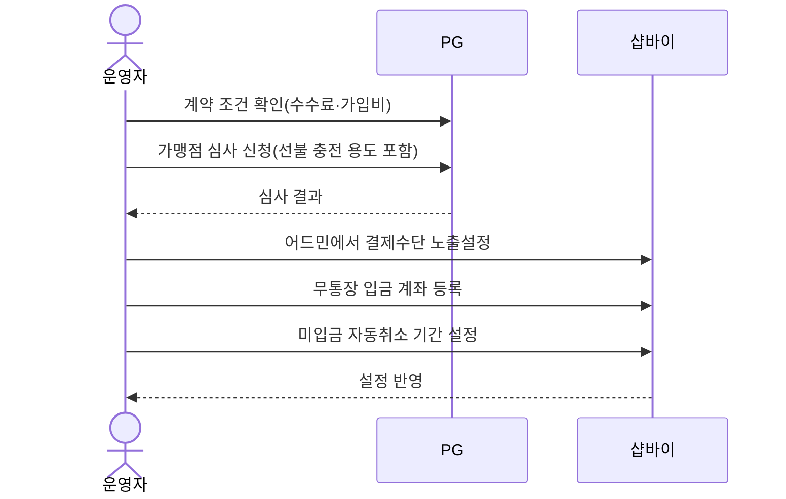
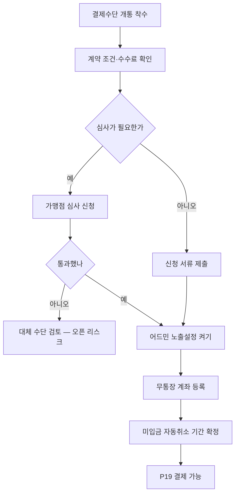

# P20 · 결제수단 개통하기

> t63 프로세스 정리 B — 탐색~결제 · L1 **결제** · L2 결제수단(계약·설정)

## 1. 한줄정의 · 시작/끝 · 등장인물

**한줄정의** — 오픈 전에 PG 계약을 맺고 심사를 통과하고 어드민에서 결제수단을 켜는, 코드가 아닌 일.

- **시작**: 결제수단별 계약·심사를 시작한다
- **끝**: 어드민 결제수단 노출설정이 켜져 P19 가 실제로 돈다

| 등장인물 | 무엇인가 |
|---|---|
| 운영자 | 후니 실무진(CS·상품·생산) |
| 샵바이 | NHN 샵바이 — 회원·장바구니·주문·결제·배송의 커머스 SaaS |
| PG | 외부 결제대행(이니시스·토스·카카오·네이버) |

**가로지르는 곳**
- P19 — 여기가 열려야 결제가 돈다
- t65 — 충전 회계 분리(STD-PAY-021)는 정산(STD-FIN)과 맞물린다

## 2. 흐름 (sequence)

## 3. 갈림길 (flowchart · 실패·비회원·취소 분기)

## 4. 단계표

| # | 단계 | 시스템 | 담당자 | 원장 row_id | 상태 | 근거 |
|---|---|---|---|---|---|---|
| 1 | 토스 계약 조건 확인(건당 수수료·가입비/연관리비 면제 프로모션·포트원 경유) | 외부PG | 외부(토스페이먼츠) | `STD-PAY-022` | 미착수 | 「미확인」 — 코드 대상 아님(계약·설정) — 토스페이먼츠 수수료·프로모션·포트원 경유 여부 확인 사안 |
| 2 | 「자사 상품 전용 선불 충전」 용도 가맹점 심사 가능 여부 사전 확인 | 외부PG | 외부(토스페이먼츠) | `STD-PAY-023` | 미착수 | 「미확인」 — 코드 대상 아님(계약·설정) — 선불충전 전용 가맹점 심사 여부 확인 사안 |
| 3 | 경로별 수수료 차이(이니시스 경유 +0.x% 여부) 확인 | 외부PG | 외부(이니시스·카카오페이) | `STD-PAY-026` | 미착수 | 「미확인」 — 코드 대상 아님(계약·설정) — PG 경유 수수료 차이 확인 사안 |
| 4 | 카카오페이 신청 서류·절차 정리 후 전달 | 외부PG | 신우진 | `STD-PAY-024` | 미착수 | 「미확인」 — 코드 대상 아님(계약·설정) — 카카오페이 신청 서류·절차 정리 사안 |
| 5 | 샵바이 어드민의 카카오페이 신청 경로 확인 | shopby | 김동학 | `STD-PAY-025` | 미착수 | 「미확인」 — 찾지 못했다(docs/shopby/shopby-api 전수 grep '카카오페이 신청'·'PG 신청' 0건 — 셀러어드민 신청화면은 API 문서 범위 밖) |
| 6 | 충전은 현금만 수납 — 이니시스 PG 결제와 회계 분리 | 외부PG | 신우진 | `STD-PAY-021` | 미착수 | 「미확인」 — 코드 대상 아님(계약·설정) — 프린팅머니 충전 결제수단·회계분리 정책 확정 사안 |
| 7 | 결제수단 노출설정 10항목 켜기(PG 승인 후) | shopby | 최숙진 | `STD-PAY-027` | 미착수 | 「미확인」 — 찾지 못했다(docs/shopby/shopby-api/admin-shop-public.yml·workspace-server-public.yml 전수 grep '노출설정'·'exposureYn' 등 결제수단 10항목 관련 전용 엔드포인트 미발견) |
| 8 | 무통장 입금 계좌 등록 | shopby | 최숙진 | `STD-PAY-028` | 작동 | huni-skin-shopby/src/lib/api/hooks/use-order-sheet.ts:194 · huni-skin-shopby/src/components/checkout/checkout-form.tsx:150 · huni-skin-shopby/src/components/checkout/checkout-form.tsx:177-180 |
| 9 | 미입금 주문 자동취소 기간 정책 확정(현재 무통장 7영업일·가상계좌 7일) | 외부PG | 최숙진 | `STD-PAY-029` | 미착수 | /Users/innojini/Dev/HuniWeb/.claude/worktrees/t59/_workspace/huni-launch-runway/08_system-screen/t56/rejudge.csv (선행 카드 증거 · 실재 확인) |

## 5. 빠진 곳

**나 행은 있는데 코드 0** — 2건

| row_id | 내용 | 진단 |
|---|---|---|
| `STD-PAY-021` | 충전은 현금만 수납 — 이니시스 PG 결제와 회계 분리 | 회계 정책 확정 안건, 코드 없음이 정상 |
| `STD-PAY-027` | 결제수단 노출설정 10항목 켜기(PG 승인 후) | 결제수단 노출설정은 샵바이 셀러어드민 UI 기능으로 추정되나 API 스펙에서 전용 엔드포인트 확인 못함 |

**다 코드는 있는데 연결 안 됨** — 1건

| row_id | 내용 | 진단 |
|---|---|---|
| `STD-PAY-029` | 미입금 주문 자동취소 기간 정책 확정(현재 무통장 7영업일·가상계좌 7일) | 정책값 확정 안건, 자동취소 자체는 샵바이 플랫폼이 수행(어드민 설정), huni-mall/스펙에 전용 코드 없음 |

**라 결정 미정** — 5건

| row_id | 내용 | 진단 |
|---|---|---|
| `STD-PAY-022` | 토스 계약 조건 확인(건당 수수료·가입비/연관리비 면제 프로모션·포트원 경유) | PG 계약 조건 확인 안건 |
| `STD-PAY-023` | 「자사 상품 전용 선불 충전」 용도 가맹점 심사 가능 여부 사전 확인 | PG 가맹 심사 안건 |
| `STD-PAY-026` | 경로별 수수료 차이(이니시스 경유 +0.x% 여부) 확인 | 가맹 수수료 비교 안건 |
| `STD-PAY-024` | 카카오페이 신청 서류·절차 정리 후 전달 | 행정 절차 안건 |
| `STD-PAY-025` | 샵바이 어드민의 카카오페이 신청 경로 확인 | 샵바이 어드민 신청화면은 UI 전용 기능으로 추정, API 스펙엔 노출 안 됨(실화면 확인은 별도 과제) |

## 6. 채우는 방법

| 누가 | 무엇을 | 선행 |
|---|---|---|
| 외부(토스페이먼츠) | 토스 계약 조건 확인(건당 수수료·가입비/연관리비 면제 프로모션·포트원 경유) | 사람이 정해야 끝나는 안건 — 코드가 없는 것이 결함이 아니다 |
| 외부(토스페이먼츠) | 「자사 상품 전용 선불 충전」 용도 가맹점 심사 가능 여부 사전 확인 | 사람이 정해야 끝나는 안건 — 코드가 없는 것이 결함이 아니다 |
| 외부(이니시스·카카오페이) | 경로별 수수료 차이(이니시스 경유 +0.x% 여부) 확인 | 사람이 정해야 끝나는 안건 — 코드가 없는 것이 결함이 아니다 |
| 신우진 | 카카오페이 신청 서류·절차 정리 후 전달 | 사람이 정해야 끝나는 안건 — 코드가 없는 것이 결함이 아니다 |
| 김동학 | 샵바이 어드민의 카카오페이 신청 경로 확인 | 사람이 정해야 끝나는 안건 — 코드가 없는 것이 결함이 아니다 |
| 신우진 | 충전은 현금만 수납 — 이니시스 PG 결제와 회계 분리 | 코드·명세를 뒤졌으나 구현을 찾지 못했다 |
| 최숙진 | 결제수단 노출설정 10항목 켜기(PG 승인 후) | 코드·명세를 뒤졌으나 구현을 찾지 못했다 |
| 최숙진 | 미입금 주문 자동취소 기간 정책 확정(현재 무통장 7영업일·가상계좌 7일) | 코드는 있는데 원장 상태가 「미착수」다 |

## 7. 확인 못 한 것

각 PG 의 심사 소요와 통과 여부는 외부에 달려 있어 이 카드에서 판정할 수 없다.

---
> 이 문서의 상태·근거는 원장 `08_system-screen/t56/rejudge.csv` 와 이 카드의 증거 수집본에서 기계로 채웠다. 「미확인」은 코드·원장·명세를 뒤졌으나 **찾지 못했다**는 뜻이지, 없다는 뜻이 아니다.
