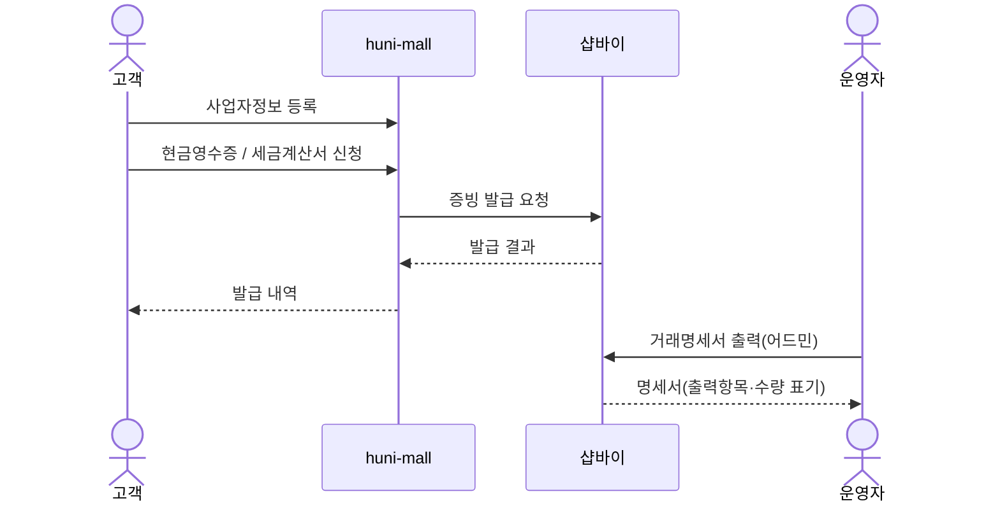
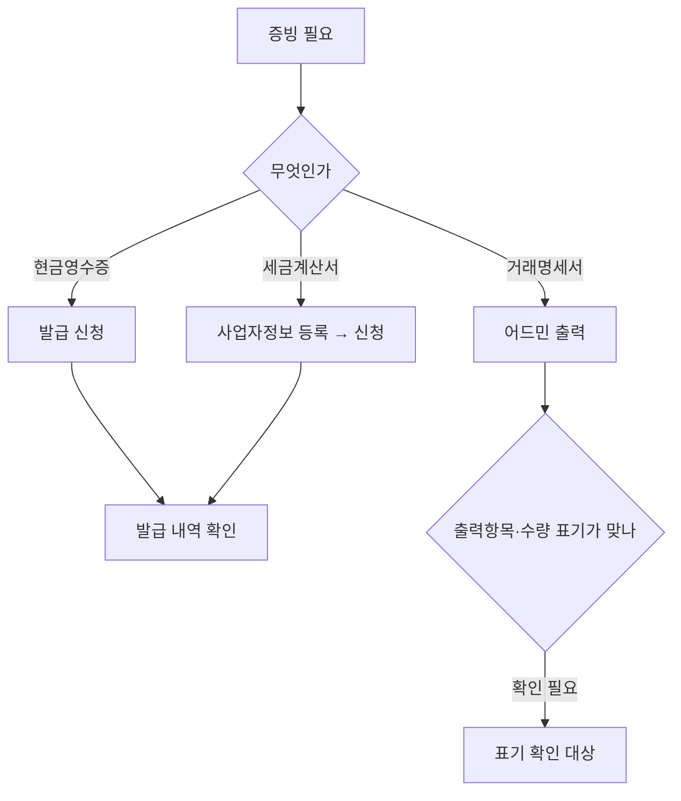

# P21 · 결제 증빙 발급

> t63 프로세스 정리 B — 탐색~결제 · L1 **결제** · L2 증빙

## 1. 한줄정의 · 시작/끝 · 등장인물

**한줄정의** — 결제가 끝난 손님이 현금영수증·세금계산서·거래명세서를 받는다.

- **시작**: 결제가 끝났거나 사업자 손님이 증빙을 요청한다
- **끝**: 증빙이 발급되어 내역에서 확인된다

| 등장인물 | 무엇인가 |
|---|---|
| 고객 | 몰을 쓰는 손님(회원·비회원) |
| huni-mall | 신규 독립몰(headless · Next.js 15 App Router) |
| 샵바이 | NHN 샵바이 — 회원·장바구니·주문·결제·배송의 커머스 SaaS |
| 운영자 | 후니 실무진(CS·상품·생산) |

**가로지르는 곳**
- t62 — 사업자정보는 B2B 회원(STD-B)과 겹친다
- t65 — 증빙과 정산(STD-FIN)의 대사는 t65

## 2. 흐름 (sequence)

## 3. 갈림길 (flowchart · 실패·비회원·취소 분기)

## 4. 단계표

| # | 단계 | 시스템 | 담당자 | 원장 row_id | 상태 | 근거 |
|---|---|---|---|---|---|---|
| 1 | 사업자정보 등록·관리 | 미확인 | 김동학 | `STD-PAY-017` | 부분 | 「미확인」 |
| 2 | 현금영수증 발급 | 미확인 | 김동학 | `STD-PAY-015` | 미착수 | huni-skin-shopby/src/components/mypage/document-section.tsx:1 (선행 카드 증거 · 실재 확인) |
| 3 | 세금계산서 발급 신청·내역 | 미확인 | 김동학 | `STD-PAY-016` | 미착수 | huni-skin-shopby/src/components/mypage/document-section.tsx:1 (선행 카드 증거 · 실재 확인) |
| 4 | 거래명세서 출력 | 미확인 | 김동학 | `STD-PAY-018` | 부분 | 「미확인」 |
| 5 | 거래명세서 어드민 출력항목·수량 표기 확인(A-4) | 미확인 | 최숙진 | `STD-PAY-030` | 미착수 | 「미확인」 |

## 5. 빠진 곳

**나 행은 있는데 코드 0** — 2건

| row_id | 내용 | 진단 |
|---|---|---|
| `STD-PAY-017` | 사업자정보 등록·관리 | 코드·명세를 뒤졌으나 구현을 찾지 못했다 |
| `STD-PAY-018` | 거래명세서 출력 | 코드·명세를 뒤졌으나 구현을 찾지 못했다 |

**다 코드는 있는데 연결 안 됨** — 2건

| row_id | 내용 | 진단 |
|---|---|---|
| `STD-PAY-015` | 현금영수증 발급 | 코드는 있는데 원장 상태가 「미착수」다 |
| `STD-PAY-016` | 세금계산서 발급 신청·내역 | 코드는 있는데 원장 상태가 「미착수」다 |

**라 결정 미정** — 1건

| row_id | 내용 | 진단 |
|---|---|---|
| `STD-PAY-030` | 거래명세서 어드민 출력항목·수량 표기 확인(A-4) | 사람이 정해야 끝나는 안건 — 코드가 없는 것이 결함이 아니다 |

## 6. 채우는 방법

| 누가 | 무엇을 | 선행 |
|---|---|---|
| 김동학 | 사업자정보 등록·관리 | 코드·명세를 뒤졌으나 구현을 찾지 못했다 |
| 김동학 | 현금영수증 발급 | 코드는 있는데 원장 상태가 「미착수」다 |
| 김동학 | 세금계산서 발급 신청·내역 | 코드는 있는데 원장 상태가 「미착수」다 |
| 김동학 | 거래명세서 출력 | 코드·명세를 뒤졌으나 구현을 찾지 못했다 |
| 최숙진 | 거래명세서 어드민 출력항목·수량 표기 확인(A-4) | 사람이 정해야 끝나는 안건 — 코드가 없는 것이 결함이 아니다 |

## 7. 확인 못 한 것

현금영수증·세금계산서를 샵바이가 대행하는지 외부 연동이 필요한지 명세로 확정하지 않았다.

---
> 이 문서의 상태·근거는 원장 `08_system-screen/t56/rejudge.csv` 와 이 카드의 증거 수집본에서 기계로 채웠다. 「미확인」은 코드·원장·명세를 뒤졌으나 **찾지 못했다**는 뜻이지, 없다는 뜻이 아니다.
