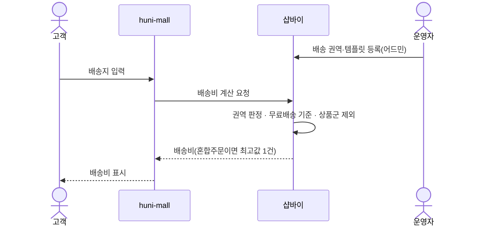
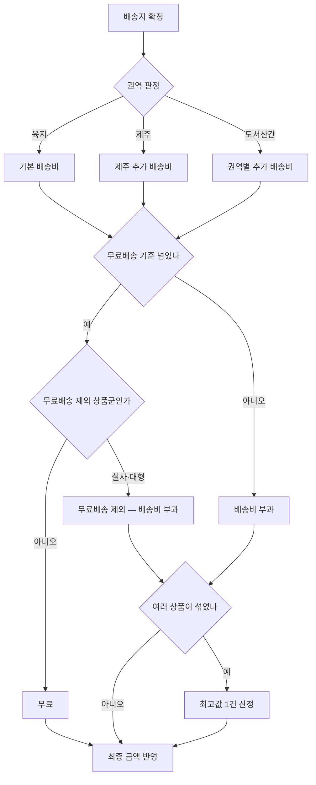

# P22 · 배송비 계산

> t63 프로세스 정리 B — 탐색~결제 · L1 **배송** · L2 배송비

## 1. 한줄정의 · 시작/끝 · 등장인물

**한줄정의** — 주문서에서 배송지와 상품 구성을 보고 배송비를 매긴다.

- **시작**: 주문서에 배송지가 들어온다
- **끝**: 배송비가 최종 금액에 붙는다(P15·P19 로 이어짐)

| 등장인물 | 무엇인가 |
|---|---|
| 고객 | 몰을 쓰는 손님(회원·비회원) |
| huni-mall | 신규 독립몰(headless · Next.js 15 App Router) |
| 샵바이 | NHN 샵바이 — 회원·장바구니·주문·결제·배송의 커머스 SaaS |
| 운영자 | 후니 실무진(CS·상품·생산) |

**가로지르는 곳**
- P15 — 배송지가 정해져야 이 계산이 돈다
- P19 — 배송비가 붙은 금액이 결제 금액이다

## 2. 흐름 (sequence)

## 3. 갈림길 (flowchart · 실패·비회원·취소 분기)

## 4. 단계표

| # | 단계 | 시스템 | 담당자 | 원장 row_id | 상태 | 근거 |
|---|---|---|---|---|---|---|
| 1 | 배송 권역·템플릿 관리 | shopby | 최숙진 | `STD-SHP-007` | 부분 | docs/shopby/shopby-api/delivery-server-public.yml:460-475 · docs/shopby/shopby-api/delivery-server-public.yml:803-820 |
| 2 | 기본 배송비 부과 | huni-mall | 최숙진 | `STD-SHP-001` | 부분 | huni-skin-shopby/src/components/checkout/checkout-data.ts:32-37 |
| 3 | 무료배송 기준금액 적용 | huni-mall | 최숙진 | `STD-SHP-002` | 부분 | huni-skin-shopby/src/components/checkout/checkout-data.ts:35 |
| 4 | 제주 추가 배송비 | shopby | 최숙진 | `STD-SHP-003` | 미착수 | docs/shopby/shopby-api/delivery-server-public.yml:16-30 · huni-skin-shopby/src/components/checkout/checkout-data.ts:35 |
| 5 | 도서산간 권역별 추가 배송비 | shopby | 최숙진 | `STD-SHP-004` | 미착수 | docs/shopby/shopby-api/delivery-server-public.yml:332-345 · docs/shopby/shopby-api/delivery-server-public.yml:16-30 |
| 6 | 특정 상품군 무료배송 제외(실사·대형) | 미확인 | 최숙진 | `STD-SHP-005` | 미착수 | 「미확인」 — 찾지 못했다(huni-skin-shopby/src 전수 grep '무료배송 제외' 0건 · delivery-server-public.yml 'exclude'·'freeCondition' 관련 필드 미발견) |
| 7 | 혼합주문 배송비 산정(최고값 1건) | shopby | 최숙진 | `STD-SHP-006` | 작동 | docs/shopby/shopby-api/product-server-public.yml:1397 |
| 8 | 금지 설정 4종 확인(A-14/U-1): 수량비례·중량 배송비 / 최대구매수량 / 즉시할인 | webadmin | 최숙진 | `STD-SHP-017` | 부분 | _workspace/huni-launch-runway/08_system-screen/t51/merged.csv:404 |

## 5. 빠진 곳

**나 행은 있는데 코드 0** — 1건

| row_id | 내용 | 진단 |
|---|---|---|
| `STD-SHP-005` | 특정 상품군 무료배송 제외(실사·대형) | 상품별 deliveryTemplateNo(product-server-public.yml:1397)로 템플릿을 달리 설정하면 구현 가능하나, 명시적 '무료배송 제외' 필드/코드는 확인 못함 |

**다 코드는 있는데 연결 안 됨** — 6건

| row_id | 내용 | 진단 |
|---|---|---|
| `STD-SHP-007` | 배송 권역·템플릿 관리 | 배송비 템플릿 조회(GET /deliveries/template-groups, GET /deliveries/templates/{templateNo}) API 확인. 등록/수정은 샵바이 셀러어드민 UI(코드 범위 밖) |
| `STD-SHP-001` | 기본 배송비 부과 | 택배 옵션 고정 배송비 3,000원 표시(SHIP_OPTIONS). 실제 청구액은 Shopby 주문서 API(deliveryAmount)가 서버측 결정, 몰 코드는 안내용 상수 |
| `STD-SHP-002` | 무료배송 기준금액 적용 | '10만원이상시 무료배송' 안내문구만 존재, 임계값 판정 로직은 몰에 없음(Shopby 배송비 템플릿이 서버에서 판정) |
| `STD-SHP-003` | 제주 추가 배송비 | 제주 등 지역별 추가배송비는 샵바이 GET /areafees API(어드민 설정)로 관리, huni-mall 코드엔 제주 전용 로직 없음(안내문만) |
| `STD-SHP-004` | 도서산간 권역별 추가 배송비 | 권역별(도서산간) 추가배송비는 샵바이 areas/areafees API 조합으로 어드민 설정, huni-mall 코드 없음 |
| `STD-SHP-017` | 금지 설정 4종 확인(A-14/U-1): 수량비례·중량 배송비 / 최대구매수량 / 즉시할인 | t51 선행조사가 샵바이 셀러어드민 실화면(service.shopby.co.kr/delivery/condition/group/list)에서 배송비유형 '무료'(수량/중량 아님)·즉시할인 0·최대구매수량 0 을 gstack 으로 실측 확인(2026-09-16). 코드 아닌 라이브 설정 확인 항목 |

## 6. 채우는 방법

| 누가 | 무엇을 | 선행 |
|---|---|---|
| 최숙진 | 배송 권역·템플릿 관리 | 코드는 있는데 원장 상태가 「부분」다 |
| 최숙진 | 기본 배송비 부과 | 코드는 있는데 원장 상태가 「부분」다 |
| 최숙진 | 무료배송 기준금액 적용 | 코드는 있는데 원장 상태가 「부분」다 |
| 최숙진 | 제주 추가 배송비 | 코드는 있는데 원장 상태가 「미착수」다 |
| 최숙진 | 도서산간 권역별 추가 배송비 | 코드는 있는데 원장 상태가 「미착수」다 |
| 최숙진 | 특정 상품군 무료배송 제외(실사·대형) | 코드·명세를 뒤졌으나 구현을 찾지 못했다 |
| 최숙진 | 금지 설정 4종 확인(A-14/U-1): 수량비례·중량 배송비 / 최대구매수량 / 즉시할인 | 코드는 있는데 원장 상태가 「부분」다 |

## 7. 확인 못 한 것

금지 설정 4종(수량비례·중량 배송비 / 최대구매수량 / 즉시할인, STD-SHP-017)이 실제 어드민에서 꺼져 있는지 실화면으로 확인하지 않았다.

---
> 이 문서의 상태·근거는 원장 `08_system-screen/t56/rejudge.csv` 와 이 카드의 증거 수집본에서 기계로 채웠다. 「미확인」은 코드·원장·명세를 뒤졌으나 **찾지 못했다**는 뜻이지, 없다는 뜻이 아니다.
