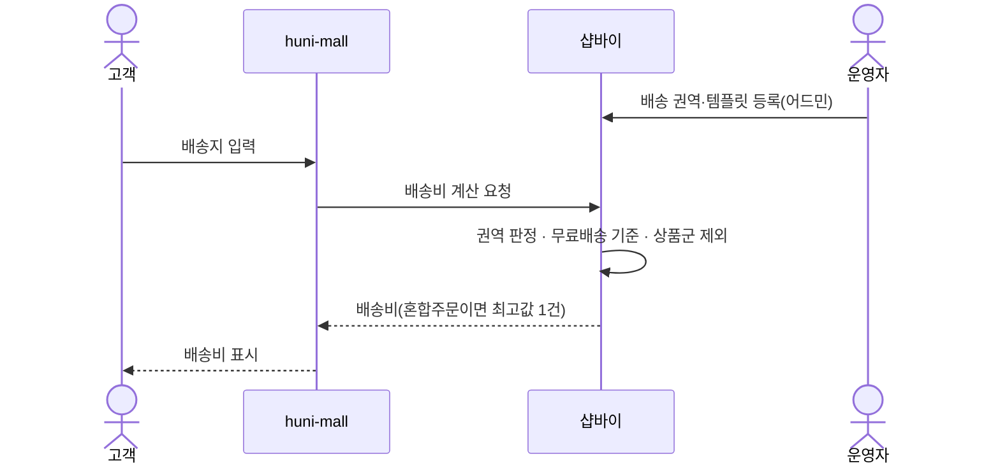
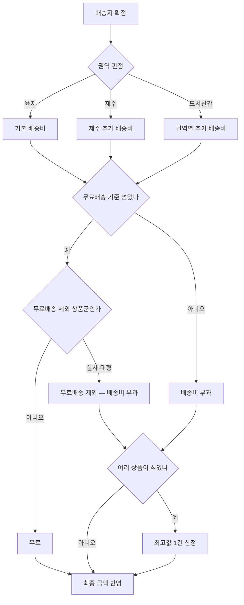

# P22 · 배송비 계산

> t63 프로세스 정리 B — 탐색~결제 · L1 **배송** · L2 배송비

## 1. 한줄정의 · 시작/끝 · 등장인물

**한줄정의** — 주문서에서 배송지와 상품 구성을 보고 배송비를 매긴다.

- **시작**: 주문서에 배송지가 들어온다
- **끝**: 배송비가 최종 금액에 붙는다(P15·P19 로 이어짐)

| 등장인물 | 무엇인가 |
|---|---|
| 고객 | 몰을 쓰는 손님(회원·비회원) |
| huni-mall | 신규 독립몰(headless · Next.js 15 App Router) |
| 샵바이 | NHN 샵바이 — 회원·장바구니·주문·결제·배송의 커머스 SaaS |
| 운영자 | 후니 실무진(CS·상품·생산) |

**가로지르는 곳**
- P15 — 배송지가 정해져야 이 계산이 돈다
- P19 — 배송비가 붙은 금액이 결제 금액이다

## 2. 흐름 (sequence)

## 3. 갈림길 (flowchart · 실패·비회원·취소 분기)

## 4. 단계표

| # | 단계 | 시스템 | 담당자 | 원장 row_id | 상태 | 근거 |
|---|---|---|---|---|---|---|
| 1 | 배송 권역·템플릿 관리 | 미확인 | 최숙진 | `STD-SHP-007` | 부분 | 「미확인」 |
| 2 | 기본 배송비 부과 | 미확인 | 최숙진 | `STD-SHP-001` | 부분 | 「미확인」 |
| 3 | 무료배송 기준금액 적용 | 미확인 | 최숙진 | `STD-SHP-002` | 부분 | 「미확인」 |
| 4 | 제주 추가 배송비 | 미확인 | 최숙진 | `STD-SHP-003` | 미착수 | 「미확인」 |
| 5 | 도서산간 권역별 추가 배송비 | 미확인 | 최숙진 | `STD-SHP-004` | 미착수 | 「미확인」 |
| 6 | 특정 상품군 무료배송 제외(실사·대형) | 미확인 | 최숙진 | `STD-SHP-005` | 미착수 | 「미확인」 |
| 7 | 혼합주문 배송비 산정(최고값 1건) | 미확인 | 최숙진 | `STD-SHP-006` | 작동 | 「미확인」 |
| 8 | 금지 설정 4종 확인(A-14/U-1): 수량비례·중량 배송비 / 최대구매수량 / 즉시할인 | 미확인 | 최숙진 | `STD-SHP-017` | 부분 | 「미확인」 |

## 5. 빠진 곳

**나 행은 있는데 코드 0** — 6건

| row_id | 내용 | 진단 |
|---|---|---|
| `STD-SHP-007` | 배송 권역·템플릿 관리 | 코드·명세를 뒤졌으나 구현을 찾지 못했다 |
| `STD-SHP-001` | 기본 배송비 부과 | 코드·명세를 뒤졌으나 구현을 찾지 못했다 |
| `STD-SHP-002` | 무료배송 기준금액 적용 | 코드·명세를 뒤졌으나 구현을 찾지 못했다 |
| `STD-SHP-003` | 제주 추가 배송비 | 코드·명세를 뒤졌으나 구현을 찾지 못했다 |
| `STD-SHP-004` | 도서산간 권역별 추가 배송비 | 코드·명세를 뒤졌으나 구현을 찾지 못했다 |
| `STD-SHP-005` | 특정 상품군 무료배송 제외(실사·대형) | 코드·명세를 뒤졌으나 구현을 찾지 못했다 |

**라 결정 미정** — 2건

| row_id | 내용 | 진단 |
|---|---|---|
| `STD-SHP-006` | 혼합주문 배송비 산정(최고값 1건) | 사람이 정해야 끝나는 안건 — 코드가 없는 것이 결함이 아니다 |
| `STD-SHP-017` | 금지 설정 4종 확인(A-14/U-1): 수량비례·중량 배송비 / 최대구매수량 / 즉시할인 | 사람이 정해야 끝나는 안건 — 코드가 없는 것이 결함이 아니다 |

## 6. 채우는 방법

| 누가 | 무엇을 | 선행 |
|---|---|---|
| 최숙진 | 배송 권역·템플릿 관리 | 코드·명세를 뒤졌으나 구현을 찾지 못했다 |
| 최숙진 | 기본 배송비 부과 | 코드·명세를 뒤졌으나 구현을 찾지 못했다 |
| 최숙진 | 무료배송 기준금액 적용 | 코드·명세를 뒤졌으나 구현을 찾지 못했다 |
| 최숙진 | 제주 추가 배송비 | 코드·명세를 뒤졌으나 구현을 찾지 못했다 |
| 최숙진 | 도서산간 권역별 추가 배송비 | 코드·명세를 뒤졌으나 구현을 찾지 못했다 |
| 최숙진 | 특정 상품군 무료배송 제외(실사·대형) | 코드·명세를 뒤졌으나 구현을 찾지 못했다 |
| 최숙진 | 혼합주문 배송비 산정(최고값 1건) | 사람이 정해야 끝나는 안건 — 코드가 없는 것이 결함이 아니다 |
| 최숙진 | 금지 설정 4종 확인(A-14/U-1): 수량비례·중량 배송비 / 최대구매수량 / 즉시할인 | 사람이 정해야 끝나는 안건 — 코드가 없는 것이 결함이 아니다 |

## 7. 확인 못 한 것

금지 설정 4종(수량비례·중량 배송비 / 최대구매수량 / 즉시할인, STD-SHP-017)이 실제 어드민에서 꺼져 있는지 실화면으로 확인하지 않았다.

---
> 이 문서의 상태·근거는 원장 `08_system-screen/t56/rejudge.csv` 와 이 카드의 증거 수집본에서 기계로 채웠다. 「미확인」은 코드·원장·명세를 뒤졌으나 **찾지 못했다**는 뜻이지, 없다는 뜻이 아니다.
