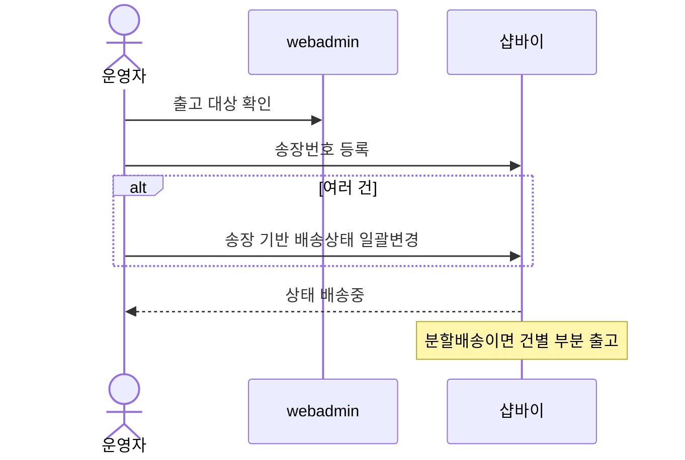
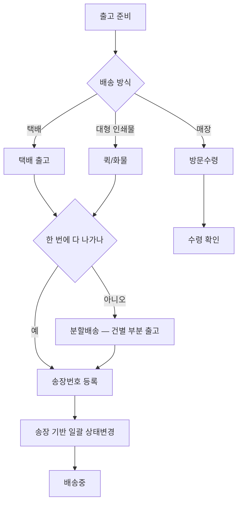

# P23 · 배송 방식·출고 처리

> t63 프로세스 정리 B — 탐색~결제 · L1 **배송** · L2 배송방식 · 추적(판매자 쪽)

## 1. 한줄정의 · 시작/끝 · 등장인물

**한줄정의** — 물건이 어떻게 나가는지 정하고, 운영자가 송장을 넣어 배송중으로 바꾼다.

- **시작**: 생산이 끝나 출고 준비가 된다
- **끝**: 송장이 붙고 주문 상태가 배송중으로 바뀐다(P24 로 이어짐)

| 등장인물 | 무엇인가 |
|---|---|
| 운영자 | 후니 실무진(CS·상품·생산) |
| 샵바이 | NHN 샵바이 — 회원·장바구니·주문·결제·배송의 커머스 SaaS |
| webadmin | 후니 자체 관리서버(Django) — 상품·옵션·가격·위젯빌더 |
| MES | 후니 생산관리(TS.BackOffice.Huni) |

**가로지르는 곳**
- t64 — 출고·추적의 운영자 쪽(STD-ADO·MFG)은 t64 담당. STD-SHP-012·013 은 두 카드가 만나는 경계 행이다
- P17 — 상태 변화가 손님 조회 화면에 나타난다

## 2. 흐름 (sequence)

## 3. 갈림길 (flowchart · 실패·비회원·취소 분기)

## 4. 단계표

| # | 단계 | 시스템 | 담당자 | 원장 row_id | 상태 | 근거 |
|---|---|---|---|---|---|---|
| 1 | 택배 배송 | 미확인 | 최숙진 | `STD-SHP-008` | 작동 | 「미확인」 |
| 2 | 퀵/화물 배송(대형 인쇄물) | 미확인 | 최숙진 | `STD-SHP-009` | 미착수 | 「미확인」 |
| 3 | 매장 방문수령 | 미확인 | 최숙진 | `STD-SHP-010` | 미착수 | 「미확인」 |
| 4 | 분할배송(건별 부분 출고) | 미확인 | 최숙진 | `STD-SHP-011` | 미착수 | 「미확인」 |
| 5 | 송장번호 등록(판매자) | 미확인 | 서희항 | `STD-SHP-012` | 부분 | 「미확인」 |
| 6 | 송장 기반 배송상태 일괄변경 | 미확인 | 서희항 | `STD-SHP-013` | 부분 | 「미확인」 |

## 5. 빠진 곳

**나 행은 있는데 코드 0** — 6건

| row_id | 내용 | 진단 |
|---|---|---|
| `STD-SHP-008` | 택배 배송 | 코드·명세를 뒤졌으나 구현을 찾지 못했다 |
| `STD-SHP-009` | 퀵/화물 배송(대형 인쇄물) | 코드·명세를 뒤졌으나 구현을 찾지 못했다 |
| `STD-SHP-010` | 매장 방문수령 | 코드·명세를 뒤졌으나 구현을 찾지 못했다 |
| `STD-SHP-011` | 분할배송(건별 부분 출고) | 코드·명세를 뒤졌으나 구현을 찾지 못했다 |
| `STD-SHP-012` | 송장번호 등록(판매자) | 코드·명세를 뒤졌으나 구현을 찾지 못했다 |
| `STD-SHP-013` | 송장 기반 배송상태 일괄변경 | 코드·명세를 뒤졌으나 구현을 찾지 못했다 |

## 6. 채우는 방법

| 누가 | 무엇을 | 선행 |
|---|---|---|
| 최숙진 | 택배 배송 | 코드·명세를 뒤졌으나 구현을 찾지 못했다 |
| 최숙진 | 퀵/화물 배송(대형 인쇄물) | 코드·명세를 뒤졌으나 구현을 찾지 못했다 |
| 최숙진 | 매장 방문수령 | 코드·명세를 뒤졌으나 구현을 찾지 못했다 |
| 최숙진 | 분할배송(건별 부분 출고) | 코드·명세를 뒤졌으나 구현을 찾지 못했다 |
| 서희항 | 송장번호 등록(판매자) | 코드·명세를 뒤졌으나 구현을 찾지 못했다 |
| 서희항 | 송장 기반 배송상태 일괄변경 | 코드·명세를 뒤졌으나 구현을 찾지 못했다 |

## 7. 확인 못 한 것

분할배송이 샵바이 기능으로 되는지 별도 개발이 필요한지 명세로 확정하지 않았다.

---
> 이 문서의 상태·근거는 원장 `08_system-screen/t56/rejudge.csv` 와 이 카드의 증거 수집본에서 기계로 채웠다. 「미확인」은 코드·원장·명세를 뒤졌으나 **찾지 못했다**는 뜻이지, 없다는 뜻이 아니다.
