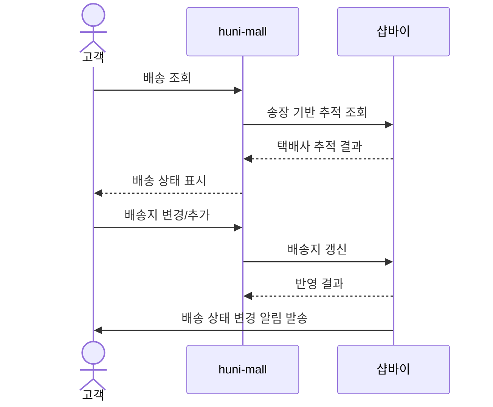
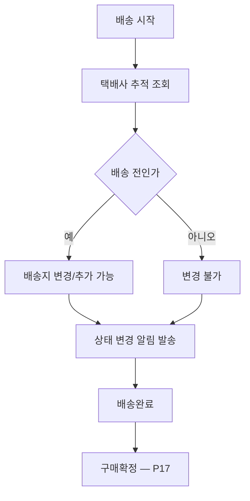

# P24 · 배송 추적·변경·알림

> t63 프로세스 정리 B — 탐색~결제 · L1 **배송** · L2 추적 · 알림

## 1. 한줄정의 · 시작/끝 · 등장인물

**한줄정의** — 손님이 어디쯤 왔는지 보고, 필요하면 배송지를 바꾸고, 상태가 바뀔 때 알림을 받는다.

- **시작**: 주문이 배송 단계에 들어간다
- **끝**: 배송완료가 손님에게 알려진다(P17 구매확정으로 이어짐)

| 등장인물 | 무엇인가 |
|---|---|
| 고객 | 몰을 쓰는 손님(회원·비회원) |
| huni-mall | 신규 독립몰(headless · Next.js 15 App Router) |
| 샵바이 | NHN 샵바이 — 회원·장바구니·주문·결제·배송의 커머스 SaaS |

**가로지르는 곳**
- P17 — 배송완료가 구매확정의 전제다
- t64 — 출고 이후 추적값의 원천은 t64 가 다루는 출고 처리다

## 2. 흐름 (sequence)

## 3. 갈림길 (flowchart · 실패·비회원·취소 분기)

## 4. 단계표

| # | 단계 | 시스템 | 담당자 | 원장 row_id | 상태 | 근거 |
|---|---|---|---|---|---|---|
| 1 | 고객 배송 조회(택배사 추적) | huni-mall | 김동학 | `STD-SHP-014` | 부분 | huni-skin-shopby/src/lib/api/hooks/use-my-orders.ts:164-165 · huni-skin-shopby/src/lib/api/hooks/use-my-orders.ts:293-294 · huni-skin-shopby/src/components/mypage/order-detail-section.tsx:66-70 |
| 2 | 배송지 변경/추가 | huni-mall | 김동학 | `STD-SHP-015` | 부분 | huni-skin-shopby/src/lib/api/hooks/use-shipping-address.ts:89-130 · huni-skin-shopby/src/components/checkout/address-modal.tsx:1-177 |
| 3 | 배송 상태 변경 알림 발송 | shopby | 최숙진 | `STD-SHP-016` | 미착수 | docs/shopby/shopby-api/manage-server-public.yml:1115-1120 |
| 4 | 배송지 변경 가능 시점 정책(출고 전까지) | shopby | 최숙진 | — | **원장 행 없음** | 「미확인」 |

## 5. 빠진 곳

**가 원장에 행 없음** — 1건

| row_id | 내용 | 진단 |
|---|---|---|
| — | 배송지 변경 가능 시점 정책(출고 전까지) | 언제까지 배송지를 바꿀 수 있는지 정책이 원장에 없다 |

**다 코드는 있는데 연결 안 됨** — 3건

| row_id | 내용 | 진단 |
|---|---|---|
| `STD-SHP-014` | 고객 배송 조회(택배사 추적) | 마이페이지 주문상세에 택배사명+송장번호 텍스트 표시. 택배사 추적 페이지로의 딥링크는 없음(부분) |
| `STD-SHP-015` | 배송지 변경/추가 | 배송지 추가(POST)/수정(PUT)/삭제/기본설정 뮤테이션 구현, 체크아웃 중 주소록 모달로 연결 |
| `STD-SHP-016` | 배송 상태 변경 알림 발송 | 배송상태 변경 알림은 샵바이 플랫폼의 카카오 알림톡/SMS 기능(수동 전송 API 확인). huni-mall 자체의 알림 트리거 코드는 찾지 못했다(src 전수 grep '알림톡'·'배송 알림' 0건) |

## 6. 채우는 방법

| 누가 | 무엇을 | 선행 |
|---|---|---|
| 최숙진 | 배송지 변경 가능 시점 정책(출고 전까지) | 원장 735행에 행을 새로 섞지 않는다 — 이 제안으로만 남긴다 |
| 김동학 | 고객 배송 조회(택배사 추적) | 코드는 있는데 원장 상태가 「부분」다 |
| 김동학 | 배송지 변경/추가 | 코드는 있는데 원장 상태가 「부분」다 |
| 최숙진 | 배송 상태 변경 알림 발송 | 코드는 있는데 원장 상태가 「미착수」다 |

## 7. 확인 못 한 것

알림 채널(문자·알림톡·메일)이 무엇으로 나가는지, 발송 주체가 샵바이인지 확인하지 않았다.

---
> 이 문서의 상태·근거는 원장 `08_system-screen/t56/rejudge.csv` 와 이 카드의 증거 수집본에서 기계로 채웠다. 「미확인」은 코드·원장·명세를 뒤졌으나 **찾지 못했다**는 뜻이지, 없다는 뜻이 아니다.
