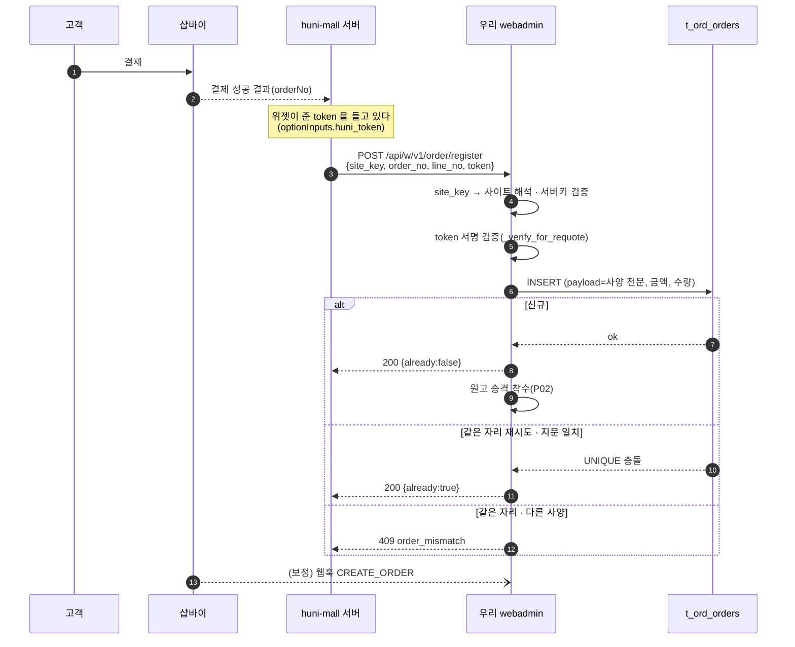
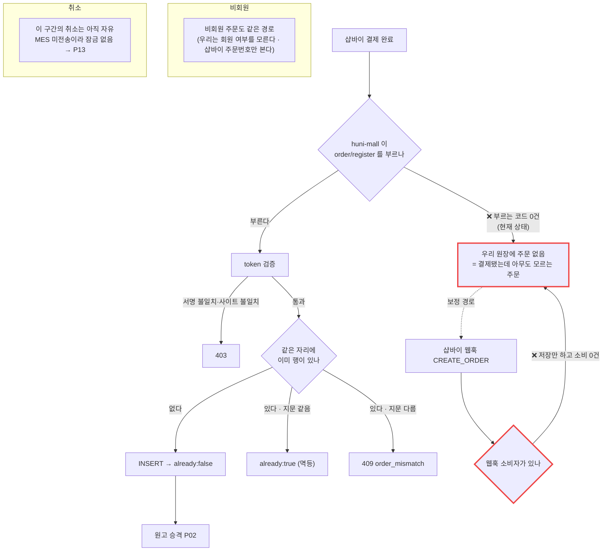

# P01 · 주문접수 — S2S 주문등록

> L0 후니 몰 전체 › L1 운영자·주문운영 › L2 주문 › **L3 P01 주문접수-S2S등록**
> cross: **t63**(탐색~결제 — 부르는 쪽이 t63 범위에 있다)

## 1. 한 줄 정의 · 시작/끝 · 등장인물

**한 줄 정의.** 고객이 샵바이에서 결제를 마친 직후, 자사몰(huni-mall) 서버가 우리에게 그 주문을 등록해서 **무엇을 만들어야 하는지(사양 전문)와 어떤 파일로 만드는지(원고 목록)가 우리 원장에 박히기까지**.

- **시작** — 샵바이가 주문을 생성한 직후(입금대기 `DEPOSIT_WAIT` 또는 결제완료 `PAY_DONE`).
- **끝** — 우리 `t_ord_orders` 에 그 주문 한 줄이 서고, 원고 승격(P02)이 시작될 수 있는 상태.

| 등장인물 | 이 프로세스에서 하는 일 |
|---|---|
| 고객 | 결제한다. 이 프로세스를 직접 보지 않는다 |
| **huni-mall**(독립몰 · Next.js) | 결제 성공 직후 `POST /api/w/v1/order/register` 를 **서버에서** 부른다 |
| 샵바이 | 주문·결제의 공식 원장. 웹훅 `CREATE_ORDER` 를 보낸다(보정 경로) |
| **우리**(webadmin 위젯 API) | token 을 검증해 사양 전문을 펼쳐 `t_ord_orders` 에 보관한다 |
| MES | 아직 등장하지 않는다(P06 에서) |
| 운영자 | 실패했을 때만 등장한다(보류 주문 확인) |

## 2. 시퀀스

## 3. 분기 — 실패 · 비회원 · 취소

## 4. 단계표

| # | 단계 | 시스템 | 담당자 | 원장 row_id | 상태 | 근거 |
|---|---|---|---|---|---|---|
| 1 | 결제 성공 직후 `order/register` 호출 | huni-mall | 김동학 | `T4-1` *(cross t63)* | 부분 | **부르는 쪽 0건** — `huni-mall/src/**` 에서 `order/register`·`orderRegister` grep 0건. `/api/w/v1` 호출은 `huni-mall/src/lib/printly/huni.ts:9` 의 requote 프록시 하나뿐 |
| 2 | 주문 등록 API 수신 | 우리 | 서희항 | `STD-MFG-001` | 부분 | `raw/webadmin/webadmin/config/urls.py:268` → `raw/webadmin/webadmin/catalog/widget_api.py:5590` `api_order_register` |
| 2a | site_key 해석 · 서버키 검증 | 우리 | 서희항 | `STD-MFG-001` | 부분 | `widget_api.py:5600`(`_site`) · `:5622`(`_server_key_err`) |
| 2b | order_no·line_no 필수·상한 검사 | 우리 | 서희항 | `STD-MFG-001` | 부분 | `widget_api.py:5637-5646` |
| 2c | token 또는 item_id 양자택일 | 우리 | 서희항 | `STD-MFG-001` | 부분 | `widget_api.py:5652-5660` · 계약 설명 `catalog/cart_items.py:17` |
| 3 | 서명 token 검증 | 우리 | 서희항 | `STD-MFG-003` | 부분 | `widget_api.py:5662`(`_verify_for_requote`) · site_cd 불일치 403 `:5667` |
| 4 | 사양 전문 보관(`t_ord_orders`) | 우리 | 서희항 | `STD-MFG-003` | 부분 | `widget_api.py:5709-5721`(`payload=payload` 포함 create) |
| 5 | 멱등 — 재시도 `already:true` | 우리 | 서희항 | `STD-MFG-002` | 부분 | `widget_api.py:5732`(신규 false) · `:5747`(지문 일치 true) · 지문 `:5309-5324` |
| 6 | 같은 자리 다른 사양 409 | 우리 | 서희항 | `STD-MFG-002` | 부분 | `widget_api.py:5741-5743` `order_mismatch` |
| 7 | 원고 승격 착수 | 우리 | 서희항 | → P02 | 부분 | `widget_api.py:5340`(`_promote_artwork`) · 호출 `:5731`·`:5746` |
| 8 | (보정) 샵바이 웹훅 수신 후 소비 | 우리 | 서희항 | `STD-MFG-136` | 미착수 | 수신·저장은 `catalog/shopby_hook.py:81`·`:124`. **소비자 없음** — `HOOK_DONE`(`:43-46`) 사용처 0건, `"PAID"` 문자열 webadmin 전체 0건 |
| 9 | 계약 확정(엔드포인트·페이로드·서버키) | — | 서희항+신우진 | `BLK-S1-5` *(cross t63)* | 미착수 | 선행 입력 · 원장 |
| 10 | 운영 변수 4종 설정 여부 | — | 서희항+신우진 | `BLK-S2-1` *(cross t63)* | 미착수 | 선행 입력 · 원장 |

> 설계 정본: `raw/webadmin/docs/order-to-mes-process.md` §6.5(다리는 `handoff_id` 가 아니라 **token**) · §8.0 SF-1.

## 5. 빠진 곳

### 가. 원장에 행이 없다
- **없음.** 이 프로세스의 단계는 전부 원장 행으로 덮인다(`STD-MFG-001~003`·`136` + cross `T4-1`·`BLK-S1-5`·`BLK-S2-1`).

### 나. 행은 있는데 코드가 0이다
| row_id | 무엇이 0인가 |
|---|---|
| `STD-MFG-136` | 웹훅을 **읽어서** 주문 상태를 전이시키는 소비자. 수신·저장(`shopby_hook.py`)까지만 있고 그 뒤가 없다 |

### 다. 코드는 있는데 연결이 안 됐다
| 무엇 | 실태 |
|---|---|
| `POST /api/w/v1/order/register` | **제공자는 운영 라이브**(설계 정본 §11 0단계 `[x]`)인데 **부르는 쪽이 0건**이다. huni-mall 은 결제완료 화면에서 샵바이 주문조회만 한다(`huni-mall/src/components/order/order-complete-view.tsx`) |
| 위젯 token | huni-mall 이 `optionInputs` 의 `huni_order`/`huni_token` 을 **파싱해 표시까지는 한다**(`huni-mall/src/lib/api/widget-order.ts`). 그 값을 register 로 넘기는 한 줄이 없다 |

→ **이 프로세스의 단 하나의 실질 공백은 「한 줄 호출」이다.** 서버 코드·DB·멱등·409 가 전부 준비돼 있다.

### 라. 결정이 안 됐다
| 항목 | 무엇을 정해야 하나 | 원장 |
|---|---|---|
| `order/register` 계약 | 엔드포인트·페이로드·서버키를 huni-mall 개발자에게 확정 전달 | `BLK-S1-5` |
| 운영 변수 4종 | `WAPI_SERVER_KEY_REQUIRED`·`SHOPBY_WEBHOOK_SECRET` 등 **설정 여부**(값 아님) | `BLK-S2-1` |

## 6. 채우는 방법

| 순 | 누가 | 무엇을 | 선행 |
|---|---|---|---|
| 1 | 서희항+신우진 | `order/register` 계약 1장(엔드포인트·필드·서버키 전달 방법) 확정 | 없음 — 코드가 이미 계약이다 |
| 2 | 김동학 | huni-mall 결제 성공 핸들러에서 서버-투-서버 호출 1건 추가 | 1 |
| 3 | 서희항 | 운영 변수 4종 설정 여부 확인 | 없음 |
| 4 | 서희항 | 웹훅 소비자(보정 경로) 구현 — 저장된 `t_ord_webhooks` 를 읽어 상태 전이 | 3 |
| 5 | 신우진 | 실주문 1건으로 결제→등록 관측(스모크) | 2 |

## 7. 확인 못 한 것

- `t_ord_orders` 모델 정의 본문(`models.py` 의 `TOrdOrders` 클래스)은 직접 열지 않았다 — 필드 사용처(`widget_api.py:5709-5721`)로만 확인했다.
- `shopby_hook.shopby_webhook` 의 **URL 라우팅 등록 위치**는 확인하지 못했다(함수 docstring 의 경로 표기만 봤다).
- 샵바이 콘솔에 웹훅 URL 이 실제로 등록돼 있는지는 **콘솔 접속이 필요**해 확인하지 않았다(`BLK-S2-2` → P09).
- 라이브 호출 실측(실주문)은 하지 않았다 — 읽기전용 조사다.
