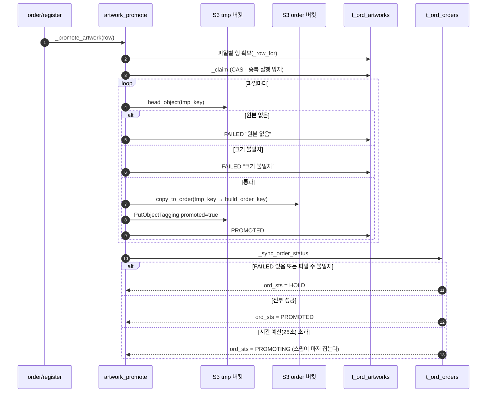
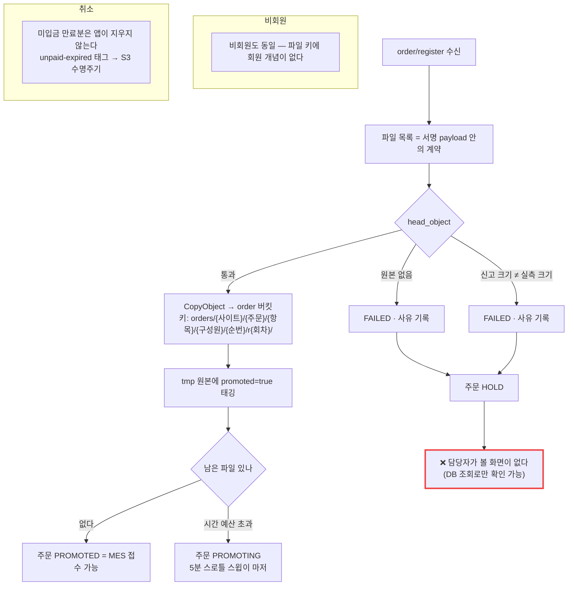

# P02 · 원고 승격 — tmp → order 버킷

> L0 후니 몰 전체 › L1 원고·파일 › L2 생산연계 › **L3 P02 원고승격-보관** · cross **t63**

## 1. 한 줄 정의 · 시작/끝 · 등장인물

**한 줄 정의.** 주문이 등록된 순간, 고객이 위젯에서 올려 둔 원고를 **30일이면 지워지는 임시 버킷에서 주문 버킷으로 옮겨** 생산이 가져갈 수 있게 지키기까지.

- **시작** — `order/register` 수신(P01 7단계). 웹훅은 보정 경로다.
- **끝** — 주문 상태가 `PROMOTED`(전부 성공) 또는 `HOLD`(하나라도 실패)로 확정.

| 등장인물 | 하는 일 |
|---|---|
| 고객 | 이미 업로드를 끝냈다. 여기서는 등장하지 않는다 |
| **우리**(webadmin) | `CopyObject` 로 옮기고, 실존·크기를 재고, 결과를 `t_ord_artworks` 에 적는다 |
| S3 | tmp 버킷(30일 만료) · order 버킷(웹↔MES 인수인계) |
| 운영자 | `HOLD` 가 났을 때 확인해야 한다 — **그 화면이 없다** |
| MES | 나중에 order 버킷에서 가져간다(P06) |

**왜 결제 전에도 옮기나.** 파일을 지키는 것은 생산이 아니다. 입금대기 상태에서도 승격은 하고, MES 전송만 막는다(설계 정본 §3.2).

## 2. 시퀀스

## 3. 분기 — 실패 · 비회원 · 취소

## 4. 단계표

| # | 단계 | 시스템 | 담당자 | 원장 row_id | 상태 | 근거 |
|---|---|---|---|---|---|---|
| 1 | 승격 진입 | 우리 | 서희항 | `STD-MFG-004` | 부분 | `raw/webadmin/webadmin/catalog/widget_api.py:5340`(`_promote_artwork`) · 호출 `:5731`·`:5746` |
| 2 | 파일별 행 확보 · CAS 점유 | 우리 | 서희항 | `STD-MFG-004` | 부분 | `catalog/artwork_promote.py:105`(`_row_for`) · `:129`(`_claim`) |
| 3 | `CopyObject` tmp→order | 우리 | 서희항 | `STD-MFG-004` | 부분 | `artwork_promote.py:179`(`S3.copy_to_order`) · `:220`(`promote_order`) · `:161`(`_promote_one`) |
| 4 | 실존·크기 실측 대조(fail-closed) | 우리 | 서희항 | `STD-MFG-005` | 부분 | `artwork_promote.py:164-173` — `head_object` → `S3ObjectMissing` 이면 "원본 없음", 크기 다르면 "크기 불일치" |
| 5 | 실패 시 주문 보류(HOLD)+사유 | 우리 | 서희항 | `STD-MFG-006` | 부분 | `artwork_promote.py:198-217`(`_sync_order_status`) · 예외 경로 `:263-264` · 상수 `:50-56` |
| 6 | 담당자용 보류 주문 목록 화면 | 우리 | 서희항 | `STD-MFG-007` | 미착수 | **찾지 못했다** — `catalog/admin.py` 에 `TOrdOrders` 등록 0건, `ord_sts`/HOLD 로 거는 화면 0건. 설계 정본 §11 1단계에도 `[ ] (남음)` |
| 7 | 회차 `r{n}` 키 규약 | 우리 | 서희항 | `STD-MFG-008` | 부분 | `catalog/s3_artwork.py:135-166` `build_order_key(..., rev=1)` — 포맷 `:166`, 회차 설명 `:151-153` |
| 8 | 재업로드 누적 보관 | 우리 | 서희항 | `STD-MFG-008` | 부분 | `catalog/models.py:1096-1134` `TOrdArtworks` · `unique_together=('ord','rev_no','tmp_key')` `:1134` |
| 9 | MES 넘길 파일 목록 산출(최신 회차) | 우리 | 서희항 | `STD-MFG-009` | 부분 | `artwork_promote.py:319-329`(`latest_artworks`, `order_by("-rev_no")`) · 스윕 `:306-307` |
| 10 | 실파일 1건 종단 + 웹훅 소비자 | 우리 | 서희항 | `T4-2` | 구현-미검증 | 승격은 구현됨. **웹훅 소비자는 없다**(P01 8단계 참조) |
| 11 | 주문 이후 파일 업로드 경로 | huni-mall | 서희항 | `STD-ART-006` *(cross t63)* | 부분 | 재업로드 화면은 P04 |

> 설계 정본: `raw/webadmin/docs/order-to-mes-process.md` §4(파일의 여정) · §11 1단계(2026-08-18 완료 체크리스트).

## 5. 빠진 곳

### 가. 원장에 행이 없다
| 무엇 | 왜 필요한가 |
|---|---|
| **order 버킷 보존기간 확정** | 설계 정본 §12-9 의 ★ 미결(제안 1년)인데 원장 행이 없다 |
| **미입금 만료분 `unpaid-expired` 태그 규칙** | 같은 §12-9. 앱이 지우지 않는 원칙이라 S3 수명주기에 의존하는데 규칙이 미확정이고 행이 없다 |

### 나. 행은 있는데 코드가 0이다
| row_id | 무엇이 0인가 |
|---|---|
| `STD-MFG-007` | 보류(HOLD) 주문 목록 화면. **상태를 만드는 코드는 있는데 그 상태를 보는 화면이 없다** |

### 다. 코드는 있는데 연결이 안 됐다
| 무엇 | 실태 |
|---|---|
| 승격 전체 | **P01 이 안 불리면 이 프로세스가 통째로 실행되지 않는다.** 승격은 `order/register` 요청 안에서 수행된다(크론·워커가 없어 lazy 패턴) |
| 스윕 | 5분 스로틀 스윕도 요청에 얹혀 있다. 요청이 0이면 스윕도 0이다 |

### 라. 결정이 안 됐다
| 항목 | 무엇을 정해야 하나 |
|---|---|
| Lightsail 이전 후 크론·워커 실행 형태 | `BLK-S2-5`(원장) — 지금의 "요청에 얹은 lazy 승격"을 유지할지 워커로 뺄지 |
| order 버킷 보존기간 | AWS 담당자 협의(설계 §12-9) |

## 6. 채우는 방법

| 순 | 누가 | 무엇을 | 선행 |
|---|---|---|---|
| 1 | 김동학 | P01 호출 1건 추가 | — |
| 2 | 서희항 | 보류 주문 목록 화면 1개(`ord_sts=HOLD` 목록 + 사유 + 재시도 버튼) | 없음 — DB 는 이미 있다 |
| 3 | 서희항+신우진 | 크론·워커 실행 형태 결정(`BLK-S2-5`) | 인프라 이전(F1~F3) |
| 4 | 서희항 | 보존기간·태그 규칙을 AWS 담당자와 확정하고 원장 행으로 세움 | 없음 |
| 5 | 신우진 | 실파일 1건 종단 관측 | 1 |

## 7. 확인 못 한 것

- `S3.copy_to_order`·`S3.build_order_key` 의 내부(`s3_artwork.py` 전체)는 보지 않았다 — 호출부와 포맷 문자열만 봤다.
- 라이브 S3 버킷의 실제 객체·수명주기 설정은 **AWS 콘솔 접속이 필요**해 확인하지 않았다.
- `tests/test_artwork_promote.py` 가 통과하는지는 실행하지 않았다(읽기전용 조사).
